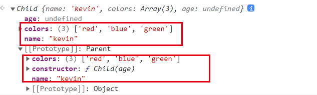

# JavaScript 继承

## 1. 原型链继承

``` js
function Parent () {
  this.name = 'kevin';
}

Parent.prototype.getName = function () {
  console.log(this.name);
}

function Child () {}

// 子类原型指向父类实例
Child.prototype = new Parent();

var child1 = new Child();

console.log(child1.getName()) // kevin
```

问题：

1.引用类型的属性被所有实例共享，举个例子：

``` js
function Parent () {
  this.names = ['kevin', 'daisy'];
}

function Child () {}

Child.prototype = new Parent();

var child1 = new Child();

child1.names.push('yayu');

console.log(child1.names); // ["kevin", "daisy", "yayu"]

var child2 = new Child();

console.log(child2.names); // ["kevin", "daisy", "yayu"]
```

2.在创建 `Child` 的实例时，不能向 `Parent` 传参.

---

## 2.借用构造函数(经典继承)

使用父类的构造函数来增强子类实例，等同于复制父类的实例给子类（不使用原型）

``` js
function Parent () {
  this.names = ['kevin', 'daisy'];
}

function Child () {
  // 创建子类实例时调用 Parent 构造函数，于是 Child 的每个实例都会将 Parent 中的属性复制一份。
  Parent.call(this);
}

var child1 = new Child();

child1.names.push('yayu');

console.log(child1.names); // ["kevin", "daisy", "yayu"]

var child2 = new Child();

console.log(child2.names); // ["kevin", "daisy"]
```

优点：

1.避免了引用类型的属性被所有实例共享

2.可以在 Child 中向 Parent 传参

举个例子：

``` js
function Parent (name) {
  this.name = name;
}

function Child (name) {
  Parent.call(this, name);
}

var child1 = new Child('kevin');

console.log(child1.name); // kevin

var child2 = new Child('daisy');

console.log(child2.name); // daisy
```

缺点：

- 方法都在构造函数中定义，每次创建实例都会创建一遍方法。
- 只能继承父类的实例属性和方法，不能继承原型属性/方法 (因为是直接调用，并绑定this，并不是new，所以不会继承原型方法属性)

``` js
function Parent (name) {
  this.name = name;
}

Parent.prototype.fn = function(){
  console.log(this.name);
}

function Child (name) {
  Parent.call(this, name);
}

var child = new Child('tom');

child.name // tom
child.fn // undefined
```

---

## 3.组合继承

原型链继承和经典继承双剑合璧。

``` js
function Parent () {
  this.name = kevin;
  this.colors = ['red', 'blue', 'green'];
}

Parent.prototype.getName = function () {
  console.log(this.name)
}

function Child (age) {
  // 继承属性, 此时实例属性优先于原型链上的实例属性，引用类型属性不会被共享
  // 第二次调用 Parent
  Parent.call(this);
    
  this.age = age;

}

// 继承原型和实例，此时实例中引用数据类型会被共享
// 第一次调用 Parent
Child.prototype = new Parent();
// 重写constructor, 指回子类自己
Child.prototype.constructor = Child;

var child1 = new Child('18');

child1.colors.push('black');

console.log(child1.name); // kevin
console.log(child1.age); // 18
console.log(child1.colors); // ["red", "blue", "green", "black"]

var child2 = new Child('20');

console.log(child2.name); // kevin
console.log(child2.age); // 20
console.log(child2.colors); // ["red", "blue", "green"]
```

优点：融合原型链继承和构造函数的优点，是 JavaScript 中最常用的继承模式。

缺点：

- 并未解决借用构造函数继承，每次创建实例都会创建一遍方法的问题
  
- 两次调用父类（`Child.prototype = new Parent(); Parent.call(this)`）会导致子类实例会存在两份相同的属性/方法



## 4.原型式继承

利用一个空对象作为中介，将某个对象直接赋值给空对象构造函数的原型。

``` js
// object()对传入其中的对象执行了一次浅复制，将构造函数F的原型直接指向传入的对象。
function object(obj){
  function F(){}
  F.prototype = obj;
  return new F();
}
```

就是 ES5 `Object.create` 的模拟实现，将传入的对象作为创建的对象的原型。

缺点：

- 无法传递参数
- 包含引用类型的属性值始终都会共享相应的值，这点跟原型链继承一样。

``` js
var person = {
  name: 'kevin',
  friends: ['daisy', 'kelly']
}

var person1 = createObj(person);
var person2 = createObj(person);

person1.name = 'person1';
console.log(person2.name); // kevin

person1.friends.push('taylor');
console.log(person2.friends); // ["daisy", "kelly", "taylor"]
```

注意：修改 `person1.name` 的值，`person2.name` 的值并未发生改变，并不是因为 `person1` 和 `person2` 有独立的 `name` 值，而是因为 `person1.name = 'person1'`，给 `person1` 添加了 `name` 值，并非修改了原型上的 `name` 值。

``` js
person1.__proto__ // {name: 'kevin', friends: Array(2)}
```

## 5. 寄生式继承

核心：在原型式继承的基础上，增强对象，返回构造函数

``` js
function createObj(o) {
  var clone = Object.create(o);
  // 增强对象
  clone.sayName = function () {
    console.log(this.name);
  }
  return clone;
}
```

``` js
var person = {
  name: 'kevin',
  friends: ['daisy', 'kelly']
}

var person1 = createObj(person);

person1.sayName(); // kevin
```

缺点：同原型式继承

## 6. 寄生组合式继承

为了方便理解，在这里重复一下组合继承的代码：

``` js
function Parent (name) {
  this.name = name;
  this.colors = ['red', 'blue', 'green'];
}

Parent.prototype.getName = function () {
  console.log(this.name)
}

function Child (name, age) {
  Parent.call(this, name);
  this.age = age;
}

Child.prototype = new Parent();

var child1 = new Child('kevin', '18');

console.log(child1)
```

组合继承最大的缺点是会调用两次父构造函数。

一次是设置子类型实例的原型的时候：

``` js
Child.prototype = new Parent();
```

一次在创建子类型实例的时候：

``` js
var child1 = new Child('kevin', '18');
```

回想下 new 的模拟实现，其实在这句中，我们会执行：

``` js
Parent.call(this, name);
```

在这里，我们又会调用了一次 `Parent` 构造函数。

所以，在这个例子中，如果我们打印 `child1` 对象，我们会发现 `Child.prototype` 和 `child1` 都有一个属性为 `colors`，属性值为`['red', 'blue', 'green']`。

那么我们该如何精益求精，避免这一次重复调用呢？

如果我们不使用 `Child.prototype = new Parent()` ，而是间接的让 `Child.prototype` 访问到 `Parent.prototype` 呢？

看看如何实现：

``` js
function Parent (name) {
  this.name = name;
  this.colors = ['red', 'blue', 'green'];
}

Parent.prototype.getName = function () {
  console.log(this.name)
}

function Child (name, age) {
  Parent.call(this, name);
  this.age = age;
}

// 关键的三步
var F = function () {};

F.prototype = Parent.prototype;

Child.prototype = new F();


var child1 = new Child('kevin', '18');

console.log(child1);
```

最后我们封装一下这个继承方法：

``` js
function object(o) {
  function F() {}
  F.prototype = o;
  return new F();
}

function prototype(child, parent) {
  // var prototype = Object.create(parent.prototype);
  var prototype = object(parent.prototype);
  prototype.constructor = child;
  child.prototype = prototype;
}

// 当我们使用的时候：
prototype(Child, Parent);
```

引用《JavaScript高级程序设计》中对寄生组合式继承的夸赞就是：

这种方式的高效率体现它只调用了一次 `Parent` 构造函数，并且因此避免了在 `Parent.prototype` 上面创建不必要的、多余的属性。与此同时，原型链还能保持不变；因此，还能够正常使用 `instanceof` 和 `isPrototypeOf` 。开发人员普遍认为寄生组合式继承是引用类型最理想的继承范式。

## 7.混入方式继承多个对象

``` js
function MyClass() {
  SuperClass.call(this);
  OtherSuperClass.call(this);
}

// 继承一个类
MyClass.prototype = Object.create(SuperClass.prototype);
// 混合其它
Object.assign(MyClass.prototype, OtherSuperClass.prototype);
// 重新指定constructor
MyClass.prototype.constructor = MyClass;

MyClass.prototype.myMethod = function() {
  // do something
};
```

`Object.assign` 会把 `OtherSuperClass` 原型上的函数拷贝到 `MyClass` 原型上，使 `MyClass` 的所有实例都可用 `OtherSuperClass` 的方法。

## 8. ES6类继承extends

`extends` 关键字主要用于类声明或者类表达式中，以创建一个类，该类是另一个类的子类。其中 `constructor` 表示构造函数，一个类中只能有一个构造函数，有多个会报出 `SyntaxError` 错误,如果没有显式指定构造方法，则会添加默认的 `constructor` 方法，使用例子如下。

``` js
class Rectangle {
    // constructor
    constructor(height, width) {
        this.height = height;
        this.width = width;
    }
    
    // Getter
    get area() {
        return this.calcArea()
    }
    
    // Method
    calcArea() {
        return this.height * this.width;
    }
}

const rectangle = new Rectangle(10, 20);
console.log(rectangle.area);
// 输出 200

-----------------------------------------------------------------
// 继承
class Square extends Rectangle {

  constructor(length) {
    super(length, length);
    
    // 如果子类中存在构造函数，则需要在使用“this”之前首先调用 super()。
    this.name = 'Square';
  }

  get area() {
    return this.height * this.width;
  }
}

const square = new Square(10);
console.log(square.area);
// 输出 100
```

extends 继承的核心代码如下，其实现和上述的寄生组合式继承方式一样

``` js
function _inherits(subType, superType) {
  
  // 创建对象，创建父类原型的一个副本
  // 增强对象，弥补因重写原型而失去的默认的constructor 属性
  // 指定对象，将新创建的对象赋值给子类的原型
  subType.prototype = Object.create(superType && superType.prototype, {
    constructor: {
      value: subType,
      enumerable: false,
      writable: true,
      configurable: true
    }
  });
  
  if (superType) {
    Object.setPrototypeOf 
      ? Object.setPrototypeOf(subType, superType) 
      : subType.__proto__ = superType;
  }
}
```

## 总结

1. 函数声明和类声明的区别

函数声明会提升，类声明不会。首先需要声明你的类，然后访问它，否则像下面的代码会抛出一个 `ReferenceError`。

``` js
let p = new Rectangle(); 
// ReferenceError

class Rectangle {}
```

2. ES5继承和ES6继承的区别

- ES5的继承实质上是先创建子类的实例对象，然后再将父类的方法添加到 `this` 上（`Parent.call(this)`）.

- ES6的继承有所不同，实质上是先创建父类的实例对象 `this`，然后再用子类的构造函数修改 `this`。因为子类没有自己的 `this` 对象，所以必须先调用父类的`super()` 方法，否则新建实例报错。

## 参考文献

[JavaScript深入之继承的多种方式和优缺点](https://github.com/mqyqingfeng/Blog/issues/16)

[JavaScript常用八种继承方案](https://juejin.cn/post/6844903696111763470)

[MDN-Class](https://developer.mozilla.org/zh-CN/docs/Web/JavaScript/Reference/Classes)

[MDN-Object.create()](https://developer.mozilla.org/zh-CN/docs/Web/JavaScript/Reference/Global_Objects/Object/create)
