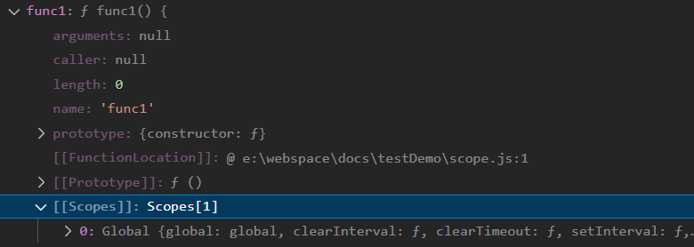
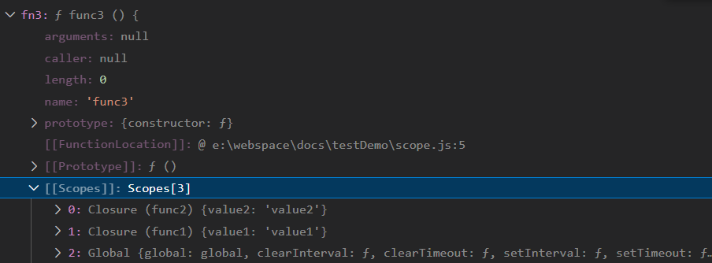

# JavaScript 作用域、上下文、作用域链


先看个例子

``` js
var name = 'tom';
```

在JS执行过程中，可以看作如下：

``` js
var name;     // 编译阶段
name = 'tom';   // 执行阶段
```

> JS编译主要分为两个阶段，编译阶段和执行阶段，让我们首先来看下这两个阶段分别做了那些事情：

- 编译阶段

  这个阶段的主角就是**编译器**，编译器会找遍当前作用域，查看是否有`name` 字段，有则无操作，无则创建变量，然后编译器会为引擎生成运行时所需要的代码，程序就进入了执行阶段

- 执行阶段

  JS引擎，运行的时候会先找遍当前作用域，查看是否有 `name` 的变量，如果有的话，直接赋值; 如果没有的话，那就是当前作用域没有，则会向父级作用域查找，一层又一层（ 当然如果是还有父层的话 ），如果最终还是找不到的话，则抛出异常。

  上面提到的向父级一级一级查找，就是所谓的作用域链了。总结而言就是，**作用域套作用域，也就有了所谓的作用域链**

## 1. 作用域

在 JavaScript 中, 作用域（`scope`，或译有效范围）就是变量和函数的可访问范围，即作用域控制着变量和函数的可见性和生命周期

### 1.1 全局作用域（Global Scope）

- 不在任何函数内定义的变量就具有全局作用域。

- 实际上，JavaScript默认有一个全局对象 `window`，全局作用域的变量实际上被绑定到 `window` 的一个属性。

  ```js
  var name = 'tom';
  
  name                  // 'tom'
  window.name           // 'tom'
  name === window.name  // true
  ```

- `window` 对象的内置属性都拥有全局作用域，例如 `window.name`、`window.location`、`window.top` 等。

全局作用域有个弊端：如果我们写了很多行 JS 代码，变量定义都没有用函数包括，那么它们就全部都在全局作用域中。这样就会 污染全局命名空间, 容易引起命名冲突。

这就是为何 jQuery、Zepto 等库的源码，所有的代码都会放在`(function(){....})()`中。因为放在里面的所有变量，都不会被外泄和暴露，不会污染到外面，不会对其他的库或者 JS 脚本造成影响。这是函数作用域的一个体现。

### 1.2 局部作用域（Local Scope）

- JavaScript 的作用域是通过函数来定义的，在一个函数中定义的变量只对这个函数内部可见，称为函数（局部）作用域。

?> 作用域是分层的，内层作用域可以访问外层作用域的变量，反之则不行。

!> 值得注意的是：块语句（大括号“`｛｝`”中间的语句），如 `if` 和 `switch` 条件语句或 `for` 和 `while` 循环语句，不像函数，它们不会创建一个新的作用域。在块语句中定义的变量将保留在它们已经存在的作用域中。

### 1.3 块级作用域（Block Scope）

块级作用域可通过新增命令 `let` 和 `const` 声明，所声明的变量在指定块的作用域外无法被访问。块级作用域在如下情况被创建：

- 在一个函数内部

- 在一个代码块（由一对花括号包裹）内部

!> 需要注意的是，`let / const` 并不存在变量提升

暂时性死区

``` js
var name = 'tom';

{
  name = 'jerry';
  let name;  //Uncaught ReferenceError: Cannot access 'name' before initialization
}
```

记住 ES6 中的一个特性，如果区块中存在 `let` 和 `const` 命令，这个区块对这些命令声明的变量，从一开始就形成了**封闭作用域**。因为JS清楚地感知到了 `name` 是用 `let` 声明在当前这个代码块内的，所以会给这个变量 `name` 加上了**暂时性死区**的限制。

### 词法(静态)/动态作用域

!> js中的作用域是**词法作用域**，即由 **函数声明时** 所在的位置决定的。词法作用域是指在编译阶段就产生的，一整套函数标识符的访问规则。（区别于词法作用域，**动态作用域** 是在 **函数执行时** 确认的，只关心它们从何处调用。js的没有动态作用域，但js的 `this` 很像动态作用域)

如下例子：

``` js
var name = 'tom';

function getName() {
  console.log(name);
}

function fn() {
  var name = 'jerry';
  getName();
}

fn();
```

词法作用域（即JavaScript环境）

- 首先在 `getName()` 中查找变量 `name`， 没有找到；
- 顺着**作用域链**查找全局作用域，`name = 'tom'`;
- 控制台打印：`tom`;

动态作用域

- 首先在 `getName()` 中查找变量 `name`， 没有找到；
- 顺着**调用栈**在调用 `getName` 方法的地方- `fn()` 查找，`name = 'jerry'`;
- 控制台打印：`jerry`

!> 词法作用域是定义时确定的，基于代码中的作用域嵌套；动态作用域是在运行时确定的，基于调用栈；

---

## 2. 闭包

先看一个例子

``` js
function func1() {
  const value1 = 'value1';
  function func2() {
    const value2 = 'value2';
    function func3 () {
      const value3 = 'value3';
    }
    return func3;
  }
  return func2;
}

const fn2 = func1();
const fn3 = fn2();
fn3();
```

当调用 `fn` 的时候 `func1` 已经执行完了，这时候销不销毁？ 于是 JavaScript 就设计了闭包的机制。

- 父作用域要不要销毁？

  答案是不行的，父作用域中有很多东西与子函数无关，但是销毁了父作用域不能影响子函数，所以要再创建个对象，要把子函数内引用（`refer`）的父作用域的变量打包里来，给子函数打包带走。

- 怎么让子函数打包带走？

  设计个独特的属性，比如 \[\[Scopes\]\] ，用这个来放函数打包带走的用到的环境。并且这个属性得是一个栈，因为函数有子函数、子函数可能还有子函数，每次打包都要放在这里一个包，所以就要设计成一个栈结构，就像饭盒有多层一样。  

?> 我们所考虑的这个解决方案：销毁父作用域后，把用到的变量包起来，打包给子函数，放到一个属性上。这就是闭包的机制。



其实还是有闭包的，闭包最少会包含全局作用域。

但是为啥 `value1、value2、value3` 都没有？ `value1`是因为不是外部的，只有外部变量的时候才会生成，而 `value1、value2` 并未使用；如果我们改动下代码，打印下这 3 个变量。

```js
function func1() {
  const value1 = 'value1';
  function func2() {
    const value2 = 'value2';
    function func3 () {
      const value3 = 'value3';
      console.log(value1);
      console.log(value2);
      console.log(value3);
    }
    return func3;
  }
  return func2;
}

const fn2 = func1();
const fn3 = fn2();
fn3();
```



如图，`value1`和`value2`均被打包到 \[\[Scopes\]\] 里，`value3` 并非外部引用，故不需要打包。

?> 闭包是返回函数的时候扫描函数内的标识符引用，把用到的本作用域的变量打成 `Closure` 包，放到 \[\[Scopes\]\] 里。

这里思考一个问题： 调试代码的时候为什么遇到过某个变量明明在作用域内能访问到，但就是没有相关信息呢？

``` js
(function(){
  function doSomething(value, fn){
    fn(value);
  }

  function logName(name) {
    console.log(name);
    debugger
  }

  doSomething('tom', logName);
})()
```

断点处的 `doSomething` 为 `undefined`，明明 `doSomething` 可以访问到的呀？

原因是这个 `logName` 的函数是一个回调函数，明显是在另一个函数内调用的，就需要在创建的时候打包带走这个环境内的东西，根据只打包必要的环境的原则（不浪费内存），`doSomething` 没有被引用（refer），自然就不打包了。

所以我们只要访问一下 `doSomething` 就能够在调试的时候访问到了。

``` js
(function(){
  function doSomething(value, fn){
    fn(value);
  }

  function logName(name) {
    console.log(name);
    console.log(doSomething);
    debugger
  }

  doSomething('tom', logName);
})()
```

**eval**

再来思考一个问题： 闭包需要扫描函数内的标识符，做静态分析，那 `eval` 怎么办，他有可能内容是从网络记载的，从磁盘读取的等等，内容是动态的。用静态去分析动态是不可能没 `bug` 的。怎么办？

没错，`eval` 确实没法分析外部引用，也就没法打包闭包，这种就特殊处理一下，打包整个作用域就好了。

!> 因为没法静态分析动态内容所以全部打包成闭包了，本来闭包就是为了不保存全部的作用域链的内容，结果 `eval` 导致全部保存了，所以尽量不要用 `eval`。会导致闭包保存内容过多。

?> 但是 JS 引擎只处理了直接调用，也就是说直接调用 `eval` 才会打包整个作用域，如果不直接调用 `eval`，就没法分析引用，也就没法形成闭包了。
这种特殊情况有的时候还能用来完成一些黑魔法，比如利用不直接调用 `eval` 不会生成闭包，会在全局上下文执行的特性。

**给闭包下个定义**

?> 闭包是在函数创建的时候，让函数打包带走的根据函数内的外部引用来过滤作用域链剩下的链。它是在函数创建的时候生成的作用域链的子集，是打包的外部环境。`eval`因为没法分析内容，所以直接调用会把整个作用域打包（所以尽量不要用 `eval`，容易在闭包保存过多的无用变量），而不直接调用则没有闭包。

过滤规则：

- 全局作用域不会被过滤掉，一定包含。所以在何处调用函数都能访问到。
- 其余作用域会根据是否内部有变量被当前函数所引用而过滤掉一些。不是每个返回的子函数都会生成闭包。
- 被引用的作用域也会过滤掉没有被引用的 `binding` （变量声明）。只把用到的变量打个包。

---

## 3. 执行上下文

> JavaScript解释阶段便会确定作用域规则，因此作用域在函数定义时就已经确定了，而不是在函数调用时确定，但是执行上下文是函数执行之前创建的。执行上下文最明显的就是this的指向是执行时确定的。而作用域访问的变量是编写代码的结构确定的。

?> 作用域和执行上下文之间最大的区别是： 执行上下文在运行时确定，随时可能改变；作用域在定义时就确定，并且不会改变。

一个作用域下可能包含若干个上下文环境。有可能从来没有过上下文环境（函数从来就没有被调用过）；有可能有过，现在函数被调用完毕后，上下文环境被销毁了；有可能同时存在一个或多个（闭包）。同一个作用域下，**不同的调用会产生不同的执行上下文环境，继而产生不同的变量的值。**

### 3.1 执行上下文的类型

JavaScript 中有三种执行上下文类型。

- **全局执行上下文** — 这是默认或者说基础的上下文，任何不在函数内部的代码都在全局上下文中。它会执行两件事：创建一个全局的 `window` 对象（浏览器的情况下），并且设置 `this` 的值等于这个全局对象。一个程序中只会有一个全局执行上下文。

- **函数执行上下文** — 每当一个函数被调用时, 都会为该函数创建一个新的上下文。每个函数都有它自己的执行上下文，不过是在函数被调用时创建的。函数上下文可以有任意多个。每当一个新的执行上下文被创建，它会按定义的顺序执行一系列步骤。

- **Eval** 函数执行上下文 — 执行在 `eval` 函数内部的代码也会有它属于自己的执行上下文。

### 3.2 执行栈

?> **执行栈**，也就是在其它编程语言中所说的“调用栈”，是一种拥有 **LIFO（后进先出）数据结构的栈**，被用来存储代码运行时创建的所有执行上下文。

当 JavaScript 引擎第一次遇到你的脚本时，它会创建一个全局的执行上下文并且压入当前执行栈。每当引擎遇到一个函数调用，它会为该函数创建一个新的执行上下文并压入栈的顶部。

引擎会执行那些执行上下文位于栈顶的函数。当该函数执行结束时，执行上下文从栈中弹出，控制流程到达当前栈中的下一个上下文。

``` js
let a = 'Hello World!';

function first() {
  console.log('Inside first function');
  second();
  console.log('Again inside first function');
}

function second() {
  console.log('Inside second function');
}

first();
console.log('Inside Global Execution Context');
```


上述代码的执行上下文栈。

在浏览器加载时，JavaScript 引擎创建了一个**全局执行上下文**并把它压入当前执行栈。当遇到 `first()` 函数调用时，JavaScript 引擎为该函数创建一个新的执行上下文并把它压入当前执行栈的顶部。

当从 `first()` 函数内部调用 `second()` 函数时，JavaScript 引擎为 `second()` 函数创建了一个**新的执行上下文**并把它压入当前执行栈的顶部。当 `second()` 函数执行完毕，它的执行上下文会从当前栈弹出，并且控制流程到达下一个执行上下文，即 `first()` 函数的执行上下文。

当 `first()` 执行完毕，它的执行上下文从栈弹出，控制流程到达全局执行上下文。一旦所有代码执行完毕，JavaScript 引擎从当前栈中移除全局执行上下文。

### 3.3 创建执行上下文

创建执行上下文有两个阶段：1) 创建阶段 和 2) 执行阶段。

#### 3.3.1 创建阶段

在 JavaScript 代码执行前，执行上下文将经历创建阶段。在创建阶段会发生三件事：

- `this` 值的决定，即我们所熟知的 **This 绑定**。
- 创建词法环境组件。
- 创建变量环境组件。

所以执行上下文在概念上表示如下：

``` ini
ExecutionContext = {
  ThisBinding = <this value>,
  LexicalEnvironment = { ... },
  VariableEnvironment = { ... },
}
```

1）This 绑定：

在全局执行上下文中，`this` 的值指向全局对象。(在浏览器中，`this` 引用 `Window` 对象)。

在函数执行上下文中， `this` 的值取决于该函数是如何被调用的。如果它被一个引用对象调用，那么 `this` 会被设置成那个对象，否则 `this` 的值被设置为全局对象或者 `undefined`（在严格模式下）;

2）词法环境

> **词法环境**是一种规范类型，基于 ECMAScript 代码的词法嵌套结构来定义**标识符**和**具体变量**和**函数**的关联。一个词法环境由**环境记录器**和一个可能的引用外部词法环境的空值组成。

?> 简单来说词法环境是一种持有**标识符—变量映射**的结构。（这里的标识符指的是变量/函数的名字，而变量是对实际对象\[包含函数类型对象\]或原始数据的引用）。

现在，在词法环境的内部有两个组件：(1) 环境记录器和 (2) 一个外部环境的引用。

- **环境记录器**是存储变量和函数声明的实际位置。
- **外部环境的引用**意味着它可以访问其父级词法环境（作用域）。

词法环境有两种类型：

- 全局环境（在全局执行上下文中）是没有外部环境引用的词法环境。全局环境的外部环境引用是 `null`。它拥有内建的 `Object/Array/`等、在环境记录器内的原型函数（关联全局对象，比如 `window` 对象）还有任何用户定义的全局变量，并且 `this` 的值指向全局对象。

- 在函数环境中，函数内部用户定义的变量存储在环境记录器中。并且引用的外部环境可能是全局环境，或者任何包含此内部函数的外部函数。

!> 注意 — 对于函数环境，声明式环境记录器还包含了一个传递给函数的 `arguments` 对象（此对象存储索引和参数的映射）和传递给函数的参数的 `length`。

抽象地讲，词法环境在伪代码中看起来像这样：

``` yml
GlobalExectionContext = {
  LexicalEnvironment: {
    EnvironmentRecord: {
      Type: "Object",
      // 在这里绑定标识符
    }
    outer: <null>
  }
}

FunctionExectionContext = {
  LexicalEnvironment: {
    EnvironmentRecord: {
      Type: "Declarative",
      // 在这里绑定标识符
    }
    outer: <Global or outer function environment reference>
  }
}
```

3）变量环境：

它同样是一个词法环境，其环境记录器持有**变量声明语句**在执行上下文中创建的绑定关系。

如上所述，变量环境也是一个词法环境，所以它有着上面定义的词法环境的所有属性。

在 ES6 中，词法环境组件和变量环境的一个不同就是前者被用来存储函数声明和变量（`let 和 const`）绑定，而后者只用来存储 `var` 变量绑定。
我们看点样例代码来理解上面的概念：

``` js
let a = 20;
const b = 30;
var c;

function multiply(e, f) {
  var g = 20;
  return e * f * g;
}

c = multiply(20, 30);
```

执行上下文伪代码如下：

``` yml
GlobalExectionContext = {

  ThisBinding: <Global Object>,

  LexicalEnvironment: {
    EnvironmentRecord: {
      Type: "Object",
      // 在这里绑定标识符
      a: < uninitialized >,
      b: < uninitialized >,
      multiply: < func >
    }
    outer: <null>
  },

  VariableEnvironment: {
    EnvironmentRecord: {
      Type: "Object",
      // 在这里绑定标识符
      c: undefined,
    }
    outer: <null>
  }
}

FunctionExectionContext = {
  ThisBinding: <Global Object>,

  LexicalEnvironment: {
    EnvironmentRecord: {
      Type: "Declarative",
      // 在这里绑定标识符
      Arguments: {0: 20, 1: 30, length: 2},
    },
    outer: <GlobalLexicalEnvironment>
  },

VariableEnvironment: {
    EnvironmentRecord: {
      Type: "Declarative",
      // 在这里绑定标识符
      g: undefined
    },
    outer: <GlobalLexicalEnvironment>
  }
}
```

注意 — 只有遇到调用函数 `multiply` 时，函数执行上下文才会被创建。

可能你已经注意到 `let` 和 `const` 定义的变量并没有关联任何值，但 `var` 定义的变量被设成了 `undefined`。

这是因为在创建阶段时，引擎检查代码找出变量和函数声明，虽然函数声明完全存储在环境中，但是变量最初设置为 `undefined`（var 情况下），或者未初始化（`let` 和 `const` 情况下）。

这就是为什么你可以在声明之前访问 `var` 定义的变量（虽然是 `undefined`），但是在声明之前访问 `let` 和 `const` 的变量会得到一个引用错误。

这就是我们说的变量声明提升。

## 总结

一个执行上下文定义了一个函数执行时的环境，多次调用一个函数会导致创建多个执行上下文。

**作用域** 是在函数声明的时候就确定的一套变量访问规则，而**执行上下文**是函数执行时才产生的一系列变量的环境。也就是说作用域定义了执行上下文中的变量的访问规则，执行上下文在这个作用域规则的前提下进行变量查找，函数引用等具体操作。

每次函数调用时，都会产生一个新的**执行上下文环境**，JavaScript引擎会以栈的方式来处理它们，这个栈，我们称其为**函数调用栈(call stack)**。栈底永远都是**全局上下文**，而栈顶就是当前处于活动状态的正在执行的上下文，也称为**活动对象（running execution context）**，区别与底下被挂起的上下文（变量对象）。

- 原始值大小固定，因此保存在栈内存上

- 从一个变量到另一个变量复制原始值会创建该值的第二个副本

- 引用值是对象，存储在堆内存上

- 包含引用值的变量实际上只包含指向相应对象的一个指针，而不是对象本身

- 从一个变量到另一个变量复制引用值只会复制指针，因此结果是两个变量都指向同一个对象

- `typeof` 操作符可以确定值的原始类型，而 `instanceof` 操作符用于确保值的引用类型

- 任何变量（不管包含的是原始值还是引用值）都存在于某个执行上下文中（也称为作用域）。这个上下文（作用域）决定了变量的生命周期，以及它们可以访问代码的哪些部分

- 执行上下文分`全局上下文`、`函数上下文`和`块级上下文`

- 代码执行流每进入一个新上下文，都会创建一个`作用域链`，用于搜索变量和函数

- 函数或块的`局部上下文`不仅可以访问自己作用域内的变量，而且也可以访问任何`包含上下文`乃至`全局上下文`中的变量

- 全局上下文只能访问`全局上下文`中的变量和函数，不能直接访问局部上下文中的任何数据

- 变量的执行上下文用于确定什么时候`释放内存`

- `JavaScript` 是使用垃圾回收的编程语言，开发者不需要操心内存分配和回收。`JavaScript` 的垃圾回收程序可以总结如下

- 离开作用域的值会被自动标记为可回收，然后在垃圾回收期间被删除

- 主流的垃圾回收算法是标记清理，即先给当前不使用的值加上标记，再回来回收它们的内存

- 引用计数是另一种垃圾回收策略，需要记录值被引用了多少次。`JavaScript` 引擎不再使用这种算法，但某些旧版本的 IE 仍然会受这种算法的影响，原因是 `JavaScript` 会访问非原生`JavaScript` 对象（如 DOM 元素

- 引用计数在代码中存在循环引用时会出现问题

- 解除变量的引用不仅可以消除循环引用，而且对垃圾回收也有帮助。为促进内存回收，全局对象、全局对象的属性和循环引用都应该在不需要时解除引用;

## 参考文献

[JavaScript 的静态作用域链与“动态”闭包链](https://juejin.cn/post/6957913856488243237)
