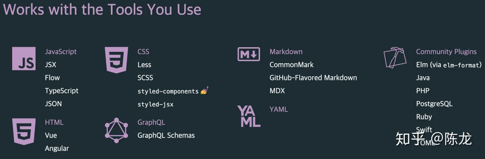
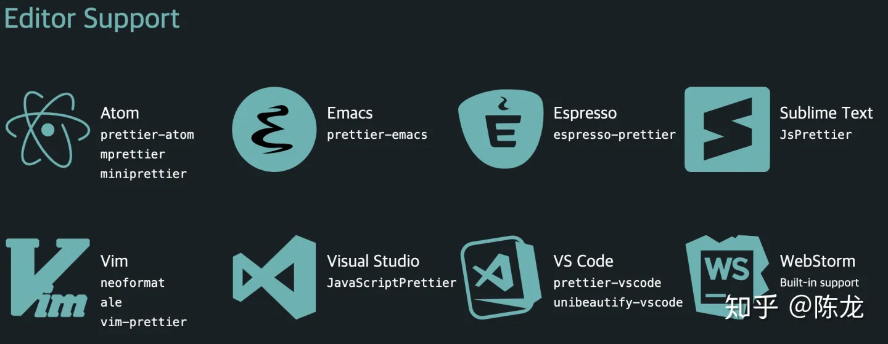
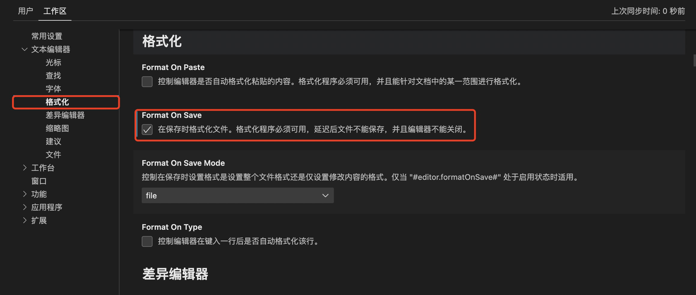
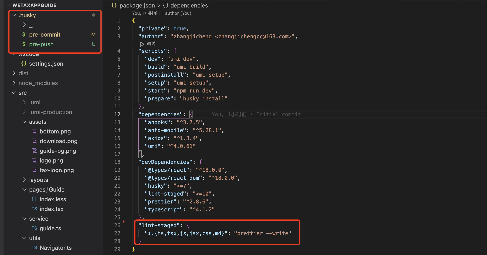

# Prettier

## 什么是Prettier？

`Prettier` 在自己官网首页列出这么三点：

- An opinionated code formatter
- Supports many languages
- Integrates with most editors
- Has few options

官方首先告诉你，`Prettier` 是一个 `Opinionated` 的代码格式化工具。所以要掌握 `Prettier` 的精髓就是要理解这个单词。

> Prettier 说自己是一个 Opinionated code formatter，就是说：你必须认同我的观点，按照我说的做。否则你就别用我，硬着头皮用就会处处不爽！

支持多种语言和多种编辑器这里就不说了，如图





至于 **Has few options**，其实就是 `Opinionated` 的最直接体现。除了必要的设置项，不会再给你们更多。给你设置项越多，你们越乱，你们就会继续争吵！

## 使用

``` shell
$ npm install prettier --save-dev --save-exact

$ npx prettier --write <filename>
```

## vscode 配置

安装插件 `Prettier - Code formatter`

手动格式化

- Mac：CMD + Shift + P -> Format Document
- WIndows：Ctlr + Shift + P -> Format Document

保存文件自动格式化

打开配置文件

- Mac：CMD + ,
- Windows：Ctrl + ,



## 整合 Git

和 Git 整合，有四种方法：

- lint-staged
- pretty-quick
- pre-commit
- precise-commits

其中除了 `pre-commit` 之外，都是 `npm` 的 `module`，需要先 `npm install ...`。我们只介绍 `lint-staged` 用法。当你需要 `Prettier` 和其他 `Linters` 一起用的时候，也用 `lint-staged`。

### husky

[husky](https://github.com/typicode/husky)，没错就是哈士奇的英文。


二哈在这里的作用就是咬住 Git 的 [hooks](https://githooks.com/) 不放。我们这里只关心 pre-commit 这一个 hook。

> 注意，husky 不同版本差异较大，很多教程给的都是旧版，只适用 v4.x， 如下配置

``` json
// package.json
"husky": {
  "hooks": {
    "pre-commit": "lint-staged"
  }
},
{
  "lint-staged": {
    "*.{ts,tsx,js,jsx,css,md}": "prettier --write"
  }
}
```

**上面的配置，需要安装 husky 的 v4.x版本才能生效**

目前最新是 v7+，关于新老版本，新版比老版多了一个步骤，并且配置也有所不同

- 老版本：安装 ——> 配置
- 新版本：安装 ——> 启用 ——> 生成 .husky相关配置

关于新版安装配置如下：

``` bash
$ npm install husky --save-dev
# 手动启用husky
$ npx husky install
# 生成husky配置文件（执行完这一步，根目录会有一个 .husky目录, 里面就是相应的hooks）
$ npx husky add .husky/pre-commit "npx lint-staged"  
```



?> 上面的配置方法有一个问题：我们不可能每次 `install` 之后都需要手动去启用 husky, 可以在 `package.json` 添加配置：`scripts": { "prepare": "husky install" }`,它的作用是：在husky安装完之后，自动关联启用。

继续配置 package.json

``` json
{
  "scripts": {
    // ...
    "prepare": "husky install"
  },
  "lint-staged": {
    "*.{ts,tsx,js,jsx,css,md}": "prettier --write"
  }
}
```

### lint-staged

> [lint-staged](https://www.npmjs.com/package/lint-staged) 能够让 lint 只检测暂存区的文件，所以速度很快.

上面已经涉及到 lint-staged 的使用了，这里完善一下

通常 lint-staged 和 husky 都是配合使用的，所以也可以不必像上文那样手动安装，在我们安装 lint-staged 时可以同时安装 husky，如下

``` shell
# 先别运行这两行，下面会有更简单的办法
# $ npm install husky -D
# $ npm install lint-staged -D

# 这一行就可以安装husky和lint-stage，并且配置好husky。
$ npx mrm lint-staged
```

`mrm` 之后, 项目根目录会自动生成 `.husky` 目录，同时 package.json 也会增加相应配置

``` json
{
  // ...
  "scripts": {
    // ...
    "prepare": "husky install"
  },
  "devDependencies": {
    // ...
    "husky": ">=7",
    "lint-staged": ">=10",
    "prettier": "^2.8.6"
  },
  "lint-staged": {
    "*.{ts,tsx,js,jsx,css,md}": "prettier --write"
  }
}

```

现在你可以修改 js、css、json、md 文件，把他们搞乱！然后 `git add .`，然后再 `git commit -m 'Test Prettier'`试试了。

### eslint

关于 eslint，这里不做详细说明，会有单独文章用来介绍

首先安装 eslint

``` shell
$ npm install eslint -D

$ npx eslint --init
```

根据项目选择即可，会生成 `.eslintrc.*` 配置文件

eslint + husky + lint-staged 进行项目校验，其实很简单，和上面配置基本相同，只是添加了 eslint 的命令而已

``` diff
// package.json
{
  "lint-staged": {
    "*.{ts,tsx,js,jsx,css,md}": "prettier --write",
+    "*.{js,jsx,ts,tsx,json,css,scss,md}": [
+      "eslint --fix"
+    ]
  }
}
```

## Prettier 和各种 Linters 是什么关系？如何配合使用？

各种 Linters 是按照规则(Rules)去检查代码的，遇到不符合规则的代码就会提示你，有的规则还能自动帮你解决冲突。

这些规则分为两类：

- Formatting rules
- Code-quality rules

> Prettier 并不会取代各种 Linters，而是能避免你的代码和这些 Linters 定义的 `Formatting rules` 冲突; Linters 检查出来违反 `Code-quality rules` 的情况后还需要你自己根据业务逻辑和语法手动修改。Prettier 帮你格式化代码，但是不会帮你挑出潜在的错误。

> ESLint 是一款 Lint 工具，包含了代码质量检查等等。而 Prettier 仅仅只是一个代码风格的约束工具，对于代码可能产生的 Bug 等并不关心。虽然说 ESLint 其实也具备一定的代码风格的格式化能力，但是在实践中，我们一般采用 ESlint 来做代码质量的约束，用 Prettier 来做代码风格的约束。

通常，两者不必整合，各自做自己的工作，但有时会出现两者规则冲突的情况

我们可以通过手动修改两者规则，来解决冲突；这里我们介绍另外一种整合的方法

Prettier 和 Linters 的整合需要做两件事：

- 禁用 Linters 自己的 Formatting rules，让 Prettier 接管这些职责。这些配置有现成的 [Config](https://github.com/prettier/eslint-config-prettier)，Linters 的配置继承这个 Config 就可以了。
- 让 Linters 执行时首先能够调用 Prettier 格式化带啊，然后再检查 Code-quality 类规则。这是 由 Linters 的 [Plugin](https://github.com/prettier/eslint-plugin-prettier) 实现的。

prettier 官方提供了 [eslint-config-prettier](https://github.com/prettier/eslint-config-prettier) 和 [eslint-plugin-prettier](https://github.com/prettier/eslint-plugin-prettier), 来处理上文的两个功能。

- eslint-config-prettier 这个工具其实就是禁用掉了一些不必要的以及和 Prettier 相冲突的 ESLint 规则。
- eslint-plugin-prettier 这个插件的主要作用就是将 prettier 作为 ESLint 的规则来使用，相当于代码不符合 Prettier 的标准时，会报一个 ESLint 错误，同时也可以通过 eslint --fix 来进行格式化。

具体配置如下：

``` shell
$ npm i --save-dev prettier
$ npm i --save-dev eslint-plugin-prettier eslint-config-prettier
```

修改 .eslintrc.*

``` json
{
  "extends": ["prettier"], // 继承 eslint-config-prettier 配置
  "plugins": ["prettier"], // 引用 eslint-plugin-prettier 插件
  "rules": {
    "prettier/prettier": "error"
  }
}
```

上面的配置可以简化如下

``` diff
{
+  "extends": ["plugin:prettier/recommended"],
-  "extends": ["prettier"],
-  "plugins": ["prettier"],
-  "rules": {
-    "prettier/prettier": "error",
-    "arrow-body-style": "off",
-    "prefer-arrow-callback": "off"
-  }
}
```

## 参考文献

[prettier 官网](https://prettier.io/)

[Prettier看这一篇就行了](https://zhuanlan.zhihu.com/p/81764012)

[prettier-playground](https://prettier.io/playground/)

[husky 文档](https://typicode.github.io/husky/#/)

[vsCode配置Eslint+Prettier结合使用详细配置步骤，规范化开发](https://blog.csdn.net/qq_36784628/article/details/125483886?spm=1001.2101.3001.6661.1&utm_medium=distribute.pc_relevant_t0.none-task-blog-2%7Edefault%7ECTRLIST%7ERate-1-125483886-blog-122727900.235%5Ev27%5Epc_relevant_multi_platform_whitelistv3&depth_1-utm_source=distribute.pc_relevant_t0.none-task-blog-2%7Edefault%7ECTRLIST%7ERate-1-125483886-blog-122727900.235%5Ev27%5Epc_relevant_multi_platform_whitelistv3&utm_relevant_index=1)
