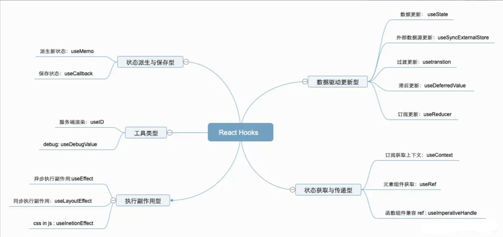

<!--
 * @Author: zhangjicheng
 * @Date: 2021-05-26 17:01:14
 * @LastEditTime: 2022-07-26 11:52:58
 * @LastEditors: zhangjicheng
 * @Description: 
 * @FilePath: \Note\src\4_框架\React\ReactHook\20210526_ReactHook.md
 * 可以输入预定的版权声明、个性签名、空行等
-->

# REACT HOOK

React 16.8.0 是第一个支持 Hook 的版本。

- 只在最顶层使用 Hook
  > React 怎么知道哪个 state 对应哪个 useState？答案是 React 靠的是 Hook 调用的顺序
- 只在 React 函数中调用 Hook

在 React 的世界中，不同的 hooks 使命也是不同的，我这里对 React hooks 按照功能分类，分成了 数据更新驱动，状态获取与传递，执行副作用，状态派生与保存，和工具类型， 具体功能划分和使用场景如下：

|分类|hooks|功能|React18新增|跨端支持(RN)|
|-|-|-|-|-|
|数据更新驱动|useState|数据更新驱动|×|√|
|-|useReducer|订阅状态，创建reducer，更新视图|×|√|
|-|useSyncExternalStore|`concurrent`模式下，订阅外部数据源，更新视图|√|×|
|-|useTransition|`concurrent`模式下，过渡更新任务|√|×|
|-|useDeferredValue|`concurrent`模式下，更新状态滞后|√|×|
|执行副作用|useEffect|异步状态下，视图更新后，执行副作用|×|√|
|-|useLayoutEffect|同步状态下，视图更新前，执行副作用|×|√|
|-|useInsertionEffect|用于处理 css in js 缺陷问题|√|×|
|状态获取与传递|useContext|订阅并获取 react context 上下文，用于跨层级状态转递|×|√|
|-|useRef|获取元素或组件实例|×|√|
|-|useImperativeHandle|用于函数组件能够被ref获取|×|√|
|状态派生与保存|useMemo|派生并缓存新的状态，常做性能优化使用|×|√|
|-|useCallback|缓存状态，常用于缓存提供给子代组件的 `callback` 回调函数|×|√|
|工具 hooks|useID|服务器渲染|√|×|
|-|useDebugValue|devtool debug|×|×|

## 参考文献

[React 官网](https://zh-hans.reactjs.org/docs/faq-internals.html)

[「React 进阶」 React 全部 Hooks 使用大全 （包含 React v18 版本 ）](https://juejin.cn/post/7118937685653192735)
