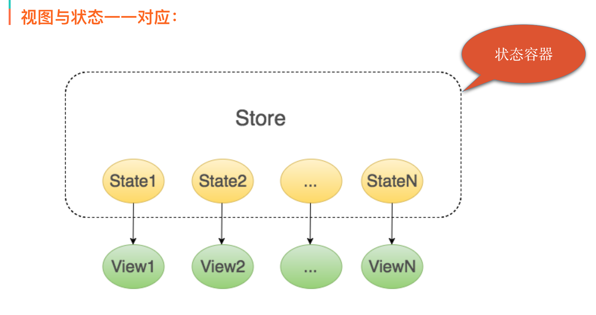
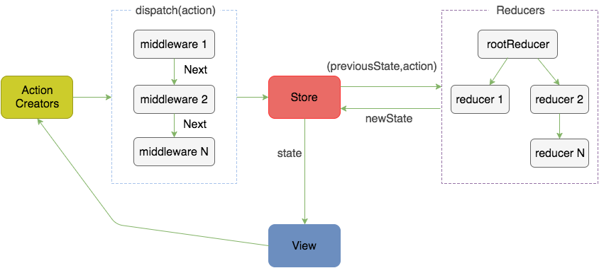
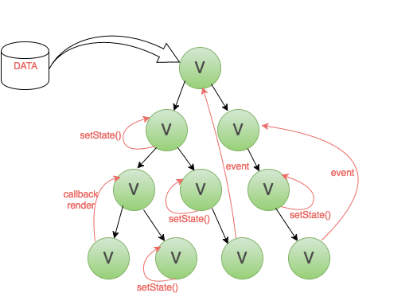
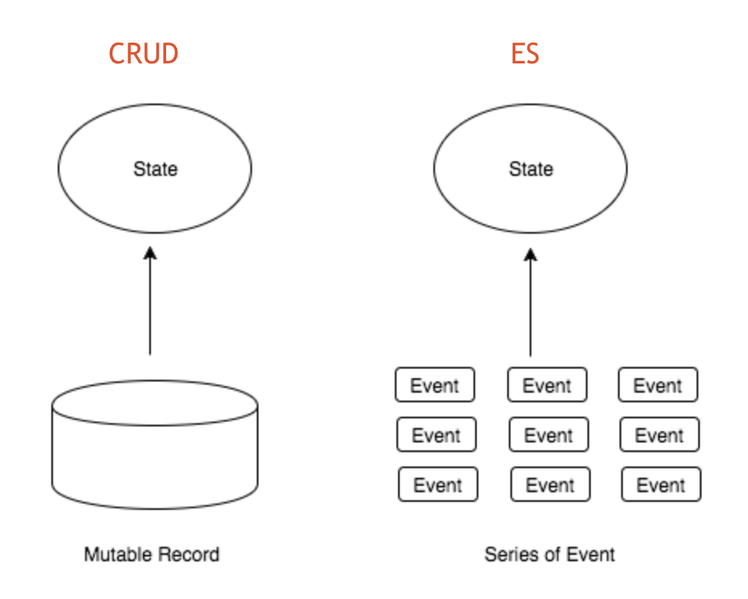
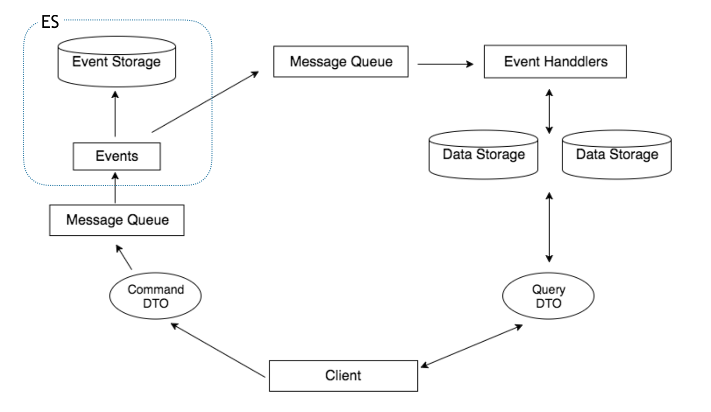
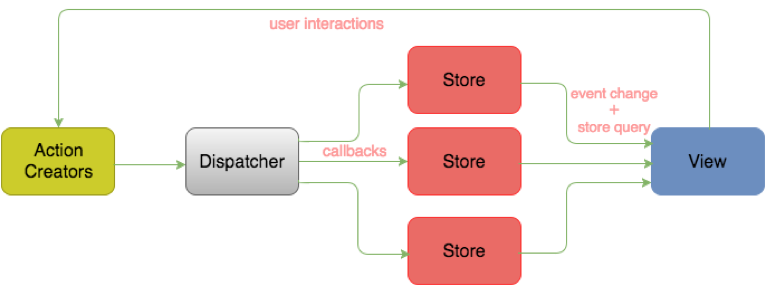
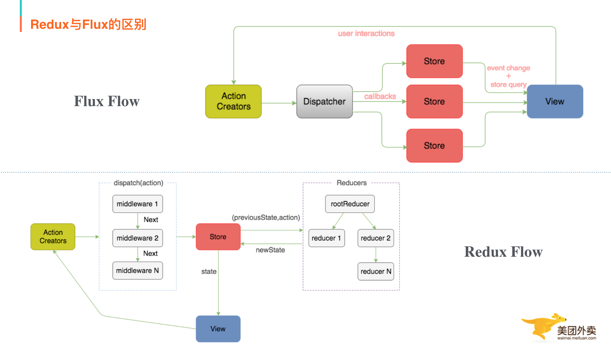

<!--
 * @Author: your name
 * @Date: 2021-06-29 18:09:25
 * @LastEditTime: 2021-06-30 17:09:39
 * @LastEditors: Please set LastEditors
 * @Description: In User Settings Edit
 * @FilePath: \Note\src\4_框架\20210629_Redux.md
-->

# Redux

## Redux是什么？

> Redux是JavaScript状态容器，能提供可预测化的状态管理。

它认为：

- Web应用是一个状态机，视图与状态是一一对应的。
- 所有的状态，保存在一个对象里面。

我们先来看看 **“状态容器”**、**“视图与状态一一对应”** 以及 **“一个对象”** 这三个概念的具体体现。

如上图，`Store` 是 `Redux` 中的状态容器，它里面存储着所有的状态数据，每个状态都跟一个视图一一对应。

`Redux` 也规定，一个 `State` 对应一个 `View`。只要 `State` 相同，`View` 就相同，知道了 `State`，就知道 `View` 是什么样，反之亦然。

比如，当前页面分三种状态：`loading`（加载中）、`success`（加载成功）或者 `error`（加载失败），那么这三个就分别唯一对应着一种视图。

现在我们对“状态容器”以及“视图与状态一一对应”有所了解了，那么Redux是怎么实现可预测化的呢？我们再来看下Redux的工作流程。

首先，我们看下几个核心概念：

- Store：保存数据的地方，你可以把它看成一个容器，整个应用只能有一个Store。
- State：Store对象包含所有数据，如果想得到某个时点的数据，就要对Store生成快照，这种时点的数据集合，就叫做State。
- Action：State的变化，会导致View的变化。但是，用户接触不到State，只能接触到View。所以，State的变化必须是View导致的。Action就是View发出的通知，表示State应该要发生变化了。
- Action Creator：View要发送多少种消息，就会有多少种Action。如果都手写，会很麻烦，所以我们定义一个函数来生成Action，这个函数就叫Action Creator。
- Reducer：Store收到Action以后，必须给出一个新的State，这样View才会发生变化。这种State的计算过程就叫做Reducer。Reducer是一个函数，它接受Action和当前State作为参数，返回一个新的State。
- dispatch：是View发出Action的唯一方法。

然后我们过下整个工作流程：

1. 首先，用户（通过View）发出Action，发出方式就用到了dispatch方法。
2. 然后，Store自动调用Reducer，并且传入两个参数：当前State和收到的Action，Reducer会返回新的State。
3. State一旦有变化，Store就会调用监听函数，来更新View。

到这儿为止，一次用户交互流程结束。可以看到，在整个流程中数据都是单向流动的，这种方式保证了流程的清晰。

## 为什么要用Redux？

前端复杂性的根本原因是大量无规律的交互和异步操作。

变化和异步操作的相同作用都是改变了当前View的状态，但是它们的无规律性导致了前端的复杂，而且随着代码量越来越大，我们要维护的状态也越来越多。

我们很容易就对这些状态何时发生、为什么发生以及怎么发生的失去控制。那么怎样才能让这些状态变化能被我们预先掌握，可以复制追踪呢？

这就是Redux设计的动机所在。

Redux试图让每个State变化都是可预测的，将应用中所有的动作与状态都统一管理，让一切有据可循。

如上图所示，如果我们的页面比较复杂，又没有用任何数据层框架的话，就是图片上这个样子：交互上存在父子、子父、兄弟组件间通信，数据也存在跨层、反向的数据流。

这样的话，我们维护起来就会特别困难，那么我们理想的应用状态是什么样呢？看下图：

架构层面上讲，我们希望UI跟数据和逻辑分离，UI只负责渲染，业务和逻辑交由其它部分处理，从数据流向方面来说, 单向数据流确保了整个流程清晰。

我们之前的操作可以复制、追踪出来，这也是Redux的主要设计思想。

综上，Redux可以做到：

- 每个State变化可预测。
- 动作与状态统一管理。

## Redux思想追溯

Redux作者在Redux.js官方文档Motivation一章的最后一段明确提到：

> Following in the steps of Flux, CQRS, and Event Sourcing , Redux attempts to make state mutations predictable by imposing certain restrictions on how and when updates can happen.

我们就先了解下`Flux`、`CQRS`、`ES（Event Sourcing 事件溯源）`这几个概念。

### 什么是ES？

- 不是保存对象的最新状态，而是保存对象产生的事件。
- 通过事件追溯得到对象最新状态。

举个例子：我们平常记账有两种方式，直接记录每次账单的结果或者记录每次的收入/支出，那么我们自己计算的话也可以得到结果，ES就是后者。

与传统增删改查关系式存储的区别：

- 传统的增删是以结果为导向的数据存储，ES是以过程为导向存储。
- CRUD是直接对库进行操作。
- ES是在库里存了一系列事件的集合，不直接对库里记录进行更改。

优点：

- 高性能：事件是不可更改的，存储的时候并且只做插入操作，也可以设计成独立、简单的对象。所以存储事件的成本较低且效率较高，扩展起来也非常方便。
- 简化存储：事件用于描述系统内发生的事情，我们可以考虑用事件存储代替复杂的关系存储。
- 溯源：正因为事件是不可更改的，并且记录了所有系统内发生的事情，我们能用它来跟踪问题、重现错误，甚至做备份和还原。

缺点：

- 事件丢失：因为ES存储都是基于事件的，所以一旦事件丢失就很难保证数据的完整性。
- 修改时必须兼容老结构：指的是因为老的事件不可变，所以当业务变动的时候新的事件必须兼容老结构。

### CQRS（Command Query Responsibility Segregation）是什么？

顾名思义，“命令与查询职责分离”–>”读写分离”。

整体的思想是把Query操作和Command操作分成两块独立的库来维护，当事件库有更新时，再来同步读取数据库。

看下Query端，只是对数据库的简单读操作。然后Command端，是对事件进行简单的存储，同时通知Query端进行数据更新，这个地方就用到了ES。

优点：

- CQ两端分离，各自独立。
- 技术代码和业务代码完全分离。

缺点：

- 强依赖高性能可靠的分布式消息队列。

### Flux是什么？

Flux是一种架构思想，下面过程中，数据总是“单向流动”，任何相邻的部分都不会发生数据的“双向流动”，这保证了流程的清晰。Flux的最大特点，就是数据的“单向流动”。

1. 用户访问View。
2. View发出用户的Action。
3. Dispatcher收到Action，要求Store进行相应的更新。
4. Store更新后，发出一个“change”事件。

#### CQRS与Flux

**相同**：当数据在write side发生更改时，一个更新事件会被推送到read side，通过绑定事件的回调，read side得知数据已更新，可以选择是否重新读取数据。

**差异**：在CQRS中，write side和read side分属于两个不同的领域模式，各自的逻辑封装和隔离在各自的Model中，而在Flux里，业务逻辑都统一封装在Store中。

#### Redux与Flux

Redux是Flux思想的一种实现，同时又在其基础上做了改进。Redux还是秉承了Flux单向数据流、Store是唯一的数据源的思想。

对比：

1. Redux只有一个Store。  
Flux中允许有多个Store，但是Redux中只允许有一个，相较于Flux，一个Store更加清晰，容易管理。Flux里面会有多个Store存储应用数据，并在Store里面执行更新逻辑，当Store变化的时候再通知controller-view更新自己的数据；Redux将各个Store整合成一个完整的Store，并且可以根据这个Store推导出应用完整的State。  
同时Redux中更新的逻辑也不在Store中执行而是放在Reducer中。单一Store带来的好处是，所有数据结果集中化，操作时的便利，只要把它传给最外层组件，那么内层组件就不需要维持State，全部经父级由props往下传即可。子组件变得异常简单。

2. Redux中没有Dispatcher的概念。  
Redux去除了这个Dispatcher，使用Store的Store.dispatch()方法来把action传给Store，由于所有的action处理都会经过这个Store.dispatch()方法，Redux聪明地利用这一点，实现了与Koa、RubyRack类似的Middleware机制。Middleware可以让你在dispatch action后，到达Store前这一段拦截并插入代码，可以任意操作action和Store。很容易实现灵活的日志打印、错误收集、API请求、路由等操作。
