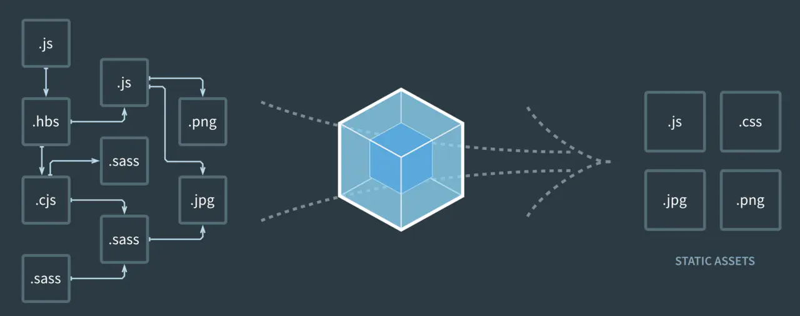

<!--
 * @Author: zhangjicheng
 * @Date: 2021-04-08 15:26:33
 * @LastEditTime: 2021-04-08 20:08:19
 * @LastEditors: zhangjicheng
 * @Description: webpack4.x 基本概念
 * @FilePath: \my-note\src\_webpack\2.基本概念.md
 * 可以输入预定的版权声明、个性签名、空行等
-->
# 基本概念

> webpack 本质上是一个打包工具，它会根据代码的内容解析模块依赖，帮助我们把多个模块的代码打包。借用 webpack 官网的图片：


如上图，webpack 会把我们项目中使用到的多个代码模块（可以是不同文件类型），打包构建成项目运行仅需要的几个静态文件。webpack 有着十分丰富的配置项，提供了十分强大的扩展能力，可以在打包构建的过程中做很多事情。在深入 webpack 的配置之前，我们需要先了解一下 webpack 中的几个核心概念。

## 1. entry

如上图所示，在多个代码模块中会有一个起始的 `.js` 文件，这个便是 `webpack` 构建的入口，即 `entry`。`webpack` 会读取这个文件，并从它开始解析依赖，在内部构件一个依赖图，这个依赖图会引用项目中使用到的各个模块，然后进行打包，生成一个或者多个 `bundle` 文件。

我们常见的项目中，如果是单页面应用，那么入口只有一个；如果是多个页面的项目，那么通常是一个页面会对应一个构建入口。

入口可以使用 entry 字段来进行配置：

``` js
module.exports = {
  entry: './src/index.js' 
}

// 上述配置等同于
module.exports = {
  entry: {
    main: './src/index.js'
  }
}
```

### 2. output

`webpack` 的输出即指 `webpack` 最终构建出来的静态文件，可以看看上面 `webpack` 官方图片右侧的那些文件。当然，`webpack` 构建生成的文件名、路径等都是可以配置的，在配置文件中使用 `output` 字段来进行设置：

``` js
module.exports = {
  // ...
  output: {
    path: path.resolve(__dirname, 'dist'),
    filename: 'bundle.js',
  },
}

// 或者使用 entry 的名称
module.exports = {
  entry: {
    main: './src/index.js' // main 为 entry 的名称
  },
  output: {
    filename: '[name].js', // 使用 [name] 来引用 entry 名称，在这里即为 main
    path: path.join(__dirname, '/dist/[hash]'),
    // 路径中使用 hash，每次构建时会有一个不同 hash 值，可以用于避免发布新版本时浏览器缓存导致代码没有更新
    // 文件名中也可以使用 hash
  },
}
```

### 3. loader
我们在前端构建中会遇见需要使用各式各样的文件，例如 css、图片、html等。`webpack` 中提供一种处理多种文件格式的机制，便是使用 `loader`。我们可以把 `loader` 理解为是一个转换器，负责把某种文件格式的内容转换成 `webpack` 可以支持打包的模块。

举个例子，在没有添加额外插件的情况下，`webpack` 会默认把所有依赖打包成 js 文件，如果入口文件依赖一个 `.hbs` 的模板文件以及一个 `.css` 的样式文件，那么我们需要 `handlebars-loader` 来处理 `.hbs` 文件，需要 `css-loader` 来处理 `.css` 文件（这里其实还需要 `style-loader`，后续详解），最终把不同格式的文件都解析成 js 代码，以便打包后在浏览器中运行。

当我们需要使用不同的 `loader` 来解析处理不同类型的文件时，我们可以在 `module.rules` 字段下来配置相关的规则，例如使用 `Babel` 来处理 `.js` 文件：

``` js
module: {
  // ...
  rules: [
    {
      test: /\.jsx?/, // 匹配文件路径的正则表达式，通常我们都是匹配文件类型后缀
      include: [
        path.resolve(__dirname, 'src') // 指定哪些路径下的文件需要经过 loader 处理
      ],
      use: { // 指定使用的 loader
        loader: 'babel-loader', // babel-loader 可以使用 babel 来将 ES6 代码转译为浏览器可以执行的的 ES5 代码
        options: {
          presets: ['@babel/preset-env'],
        },
      },
    },
  ],
}
```

### 4. plugin

在 `webpack` 的构建流程中，`plugin` 用于处理更多其他的一些构建任务。可以这么理解，模块代码转换的工作由 `loader` 来处理，除此之外的其他任何工作都可以交由 `plugin` 来完成。通过添加我们需要的 `plugin`，可以满足更多构建中特殊的需求。例如，使用 `copy-webpack-plugin` 来复制其他不需要 `loader` 处理的文件，只需在配置中通过 `plugins` 字段添加新的 `plugin` 即可：

``` bash
npm install copy-webpack-plugin --save-dev
# 插件通常为第三方的 npm package，都需要安装后才能使用
```

``` js
const CopyPlugin = require('copy-webpack-plugin');

module.exports = {
  // ...

  plugins: [
    new CopyPlugin([
      { from: 'src/public', to: 'public' },
    ]),
  ],
};
```
> plugin 理论上可以干涉 webpack 整个构建流程，可以在流程的每一个步骤中定制自己的构建需求。

### 5. mode

`mode`，构建模式是 `webpack v4` 引入的新概念，用于方便快捷地指定一些常用的默认优化配置，`mode` 可以是 `development，production，none` 其中的一个，我们之前已经在配置文件中添加了相应的配置：
``` js
module.exports = {
  mode: 'development', // 指定构建模式为 development
  // ...
}
```
顾名思义，`development` 模式用于开发时使用，`production` 模式用于线上生产时使用，`none` 则是不需要任何默认优化配置时使用。

对比 development 和 production 两种模式：
- 这两个模式会使用 DefinePlugin 来将 `process.env.NODE_ENV` 的值分别设置为 `"development"` 和 `"production"`，方便开发者在项目业务代码中判断当前构建模式。
- `production` 模式会启用 TerserPlugin 来压缩 JS 代码，让生成的代码文件更小。
- `development` 模式会启用 devtools: 'eval' 配置，提升构建和再构建的速度。