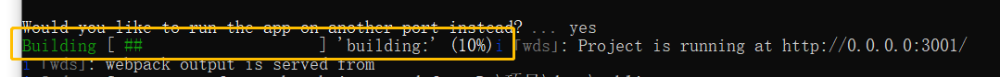
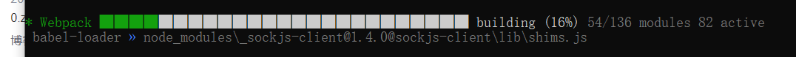

<!--
 * @Author: zhangjicheng
 * @Date: 2021-04-14 16:31:33
 * @LastEditTime: 2021-08-06 09:48:58
 * @LastEditors: Please set LastEditors
 * @Description: 
 * @FilePath: \my-note\src\_webpack\7.使用plugin.md
 * 可以输入预定的版权声明、个性签名、空行等
-->

# 使用 plugin

> plugin 负责 webpack 除了模块化打包外其他多样性的构建任务处理，它们让 webpack 变得可扩展性极强。
> plugin 在 webpack 中的配置只是把实例添加到 plugins 字段的数组中。不过由于需要提供不同的功能，不同的 plugin 本身的配置比较多样化。

[社区优秀的plugin](https://github.com/webpack-contrib/awesome-webpack#webpack-plugins)

## 1. mode 和 plugin

> 前边我们介绍 mode 时提过，mode 不同值会影响 webpack 构建配置，其中有一个就是会启用 DefinePlugin 来设置 process.env.NODE_ENV 的值，方便代码中判断构建环境。

webpack --mode=development

除此之外，development 和 production 两个不同的 mode 之间还有其他 plugin 使用上的区别，这里详细介绍一下：

### development

  下会启用 NamedChunksPlugin 和 NamedModulesPlugin，这两个 plugin 官方文档并没有详细的介绍，主要作用是在 Hot Module Replacement（热模块替换，后续简称 HMR）开启时，模块变化时的提示内容显示 chunk 或者 module 名称，而不是 ID

### production

production 下会启动多个 plugins，分别是：

  1. FlagDependencyUsagePlugin 在构建时给使用的依赖添加标识，用于减少构建生成的代码量。
  2. FlagIncludedChunksPlugin 在构建时给 chunk 中所包含的所有 chunk 添加 id，用于减少不必要的 chunk。
  3. ModuleConcatenationPlugin 构建时添加作用域提升的处理，用于减少构建生成的代码量，详细参考：module-concatenation-plugin。
  4. NoEmitOnErrorsPlugin 编译时出错的代码不生成，避免构建出来的代码异常。
  5. OccurrenceOrderPlugin 按使用的次数来对模块进行排序，可以进一步减少构建代码量。
  6. SideEffectsFlagPlugin 在构建时给带有 Side Effects 的代码模块添加标识，用于优化代码量时使用。
  7. TerserPlugin 压缩 JS 代码，参考：[Terser](https://terser.org/)。

## 2. DefinePlugin

> DefinePlugin 是 webpack 内置的插件，可以使用 webpack.DefinePlugin 直接获取，前边也提过，在不同的 mode 中，会使用 DefinePlugin 来设置运行时的 process.env.NODE_ENV 常量。DefinePlugin 用于创建一些在编译时可以配置值，在运行时可以使用的常量，我们来看下如何使用它。

``` js
module.exports = {
  // ...
  plugins: [
    new webpack.DefinePlugin({
      PRODUCTION: JSON.stringify(true), // const PRODUCTION = true
      VERSION: JSON.stringify('5fa3b9'), // const VERSION = '5fa3b9'
      BROWSER_SUPPORTS_HTML5: true, // const BROWSER_SUPPORTS_HTML5 = 'true'
      TWO: '1+1', // const TWO = 1 + 1,
      CONSTANTS: {
        APP_VERSION: JSON.stringify('1.1.2') // const CONSTANTS = { APP_VERSION: '1.1.2' }
      }
    }),
  ],
}
```

有了上面的配置，就可以在应用代码文件中，访问配置好的常量了，如：

``` js
console.log("Running App version " + VERSION);

if(!BROWSER_SUPPORTS_HTML5) require("html5shiv");
```

上面配置的注释已经简单说明了这些配置的效果，这里再简述一下整个配置规则。

- 如果配置的值是字符串，那么整个字符串会被当成代码片段来执行，其结果作为最终变量的值，如上面的 "1+1"，最后的结果是 2
- 如果配置的值不是字符串，也不是一个对象字面量，那么该值会被转为一个字符串，如 true，最后的结果是 'true'
- 如果配置的是一个对象字面量，那么该对象的所有 key 会以同样的方式去定义
这样我们就可以理解为什么要使用 `JSON.stringify()` 了，因为 `JSON.stringify(true)` 的结果是 'true'，`JSON.stringify("5fa3b9")` 的结果是 "5fa3b9"。

社区中关于 DefinePlugin 使用得最多的方式是定义环境常量，例如 PRODUCTION = true 或者 __DEV__ = true 等。部分类库在开发环境时依赖这样的环境常量来给予开发者更多的开发调试反馈，例如 react 等。

## TerserPlugin

webpack mode 为 production 时会启用 TerserPlugin 来压缩 JS 代码，我们看一下如何使用的：

``` js
const TerserPlugin = require('terser-webpack-plugin');

module.exports = {
  // ...
  // TerserPlugin 的使用比较特别，需要配置在 optimization 字段中，属于构建代码优化的一部分
  optimization: {
    minimize: true, // 启用代码压缩
    minimizer: [new TerserPlugin({
      test: /\.js(\?.*)?$/i, // 只处理 .js 文件
      cache: true, // 启用缓存，可以加速压缩处理
    })], // 配置代码压缩工具
  },
}
```

> 在以前的版本 webpack 是使用 UglifyWebpackPlugin 来压缩 JS 代码，后边更换为 TerserPlugin 了，可以更好地处理新的 JS 代码语法。

## IgnorePlugin

> IgnorePlugin 和 DefinePlugin 一样，也是一个 webpack 内置的插件，可以直接使用 webpack.IgnorePlugin 来获取。

这个插件用于忽略某些特定的模块，让 webpack 不把这些指定的模块打包进去。例如我们使用 moment.js，直接引用后，里边有大量的 i18n 的代码，导致最后打包出来的文件比较大，而实际场景并不需要这些 i18n 的代码，这时我们可以使用 IgnorePlugin 来忽略掉这些代码文件，配置如下：

``` js
module.exports = {
  // ...
  plugins: [
    new webpack.IgnorePlugin(/^\.\/locale$/, /moment$/)
  ]
}
// IgnorePlugin 配置的参数有两个，第一个是匹配引入模块路径的正则表达式，第二个是匹配模块的对应上下文，即所在目录名。
```

## webpack-bundle-analyzer

[webpack-bundle-analyzer](https://github.com/webpack-contrib/webpack-bundle-analyzer)

> 这个 plugin 可以用于分析 webpack 构建打包的内容，用于查看各个模块的依赖关系和各个模块的代码内容多少，便于开发者做性能优化。

webpack-bundle-analyzer 是第三方的包，使用前需要安装，配置上很简单，仅仅引入 plugin 即可，在构建时可以在浏览器中查看分析结果：

``` bash
npm install -D webpack-bundle-analyzer
```

``` js
const BundleAnalyzerPlugin = require('webpack-bundle-analyzer').BundleAnalyzerPlugin;
// ...
module.exports = {
  // ...
  plugins: [
    new BundleAnalyzerPlugin()
  ]
}
```

## progress-bar-webpack-plugin [打包进度条]

``` bash
npm i -D progress-bar-webpack-plugin
```

``` js
module.exports = {
  // ...
  plugins: [
    new ProgressBarPlugin({
      complete: "█",
      format: `${chalk.green('Building')} [ ${chalk.green(':bar')} ] ':msg:' ${chalk.bold('(:percent)')}`,
      clear: true
    }),
    // ...
  ]
}
```



## webpackbar [打包进度条]

``` bash
npm i -D webpackbar
```

``` js
module.exports = {
  // ...
  plugins: [
    new WebpackBar(),
    // ...
  ]
}
```


