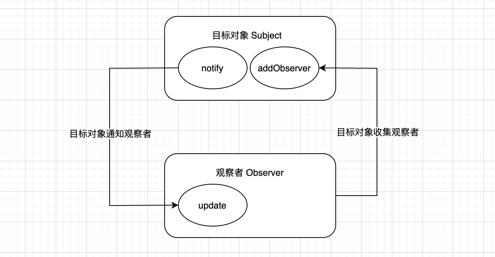

# 观察者模式

> 观察者模式是软件设计模式的一种。在此种模式中，一个目标对象管理所有相依于它的观察者对象，并且在它本身的状态改变时主动发出通知。这通常透过呼叫各观察者所提供的方法来实现。此种模式通常被用在即时事件处理系统。

观察者模式与发布订阅模式相比，耦合度更高，通常用来实现一些响应式的效果。在观察者模式中，只有两个主体，分别是目标对象 `Subject`，观察者 `Observer`。

- 观察者需 `Observer` 要实现 `update` 方法，供目标对象调用。`update` 方法中可以执行自定义的业务代码。
- 目标对象 `Subject` 也通常被叫做**被观察者或主题**，它的职能很单一，可以理解为，它只管理一种事件。`Subject` 需要维护自身的观察者数组 `observerList`，当自身发生变化时，通过调用自身的 `notify` 方法，依次通知每一个观察者执行 `update` 方法。



## 示例

``` js

// 观察者
class Observer {
  cb: () => unknown;

  constructor(cb) {
    this.cb = cb;
  }

  update() {
    this.cb();
  }
}

// 目标对象
class Subject {
  observers: Array<Observer>;

  constructor() {
    this.observers = [];
  }

  addObserver(observer) {
    this.observers.push(observer);
  }

  notify() {
    this.observers.forEach((observer) => observer.update());
  }
}

const observer1 = new Observer(() => console.log('notify 1'));
const observer2 = new Observer(() => console.log('notify 2'));
const observer3 = new Observer(() => console.log('notify 3'));

const subject = new Subject();
subject.addObserver(observer1);
subject.addObserver(observer2);
subject.addObserver(observer3);

subject.notify();
```
