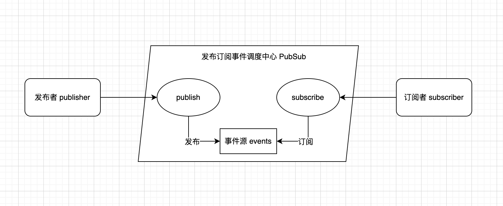

# 发布-订阅模式

> 在软件架构中，发布-订阅是一种消息范式，消息的发送者（称为发布者）不会将消息直接发送给特定的接收者（称为订阅者）。而是将发布的消息分为不同的类别，无需了解哪些订阅者（如果有的话）可能存在。同样的，订阅者可以表达对一个或多个类别的兴趣，只接收感兴趣的消息，无需了解哪些发布者（如果有的话）存在。

特点：

- 发布订阅模式中，对于发布者 `Publisher` 和订阅者 `Subscriber` 没有特殊的约束，他们好似是匿名活动，借助事件调度中心提供的接口发布和订阅事件，互不了解对方是谁。
- 松散耦合，灵活度高，常用作事件总线
- 易理解，可类比于DOM事件中的 `dispatchEvent` 和 `addEventListener`。

缺点：

- 当事件类型越来越多时，难以维护，需要考虑事件命名的规范，也要防范数据流混乱



## 示例

发布订阅模式最经典的用法就是事件监听

``` js
class EventEmitter {
  events: {};

  constructor() {
    this.events = {};
  }

  on(name: string, cb: (...args) => unknown) {
    const callbacks = this.events[name] || [];
    callbacks.push(cb);
    this.events[name] = callbacks;
  }

  emit(name: string, ...args) {
    const callbacks = this.events[name] || [];
    callbacks.forEach((cb) => cb(args));
  }

  off(name: string, cb: (...args) => unknown) {
    const callbacks = this.events[name] || [];
    this.events[name] = !!cb ? callbacks.filter(fn => fn !== cb && fn.initialCallback !== cb) : [];
  }

  once(name: string, cb: (...args) => unknown) {
    const one: any = (...args: string[]) => {
      cb(...args);
      this.off(name, one);
    };
    one.initialCallback = cb;
    this.on(name, one);
  }
}
```
