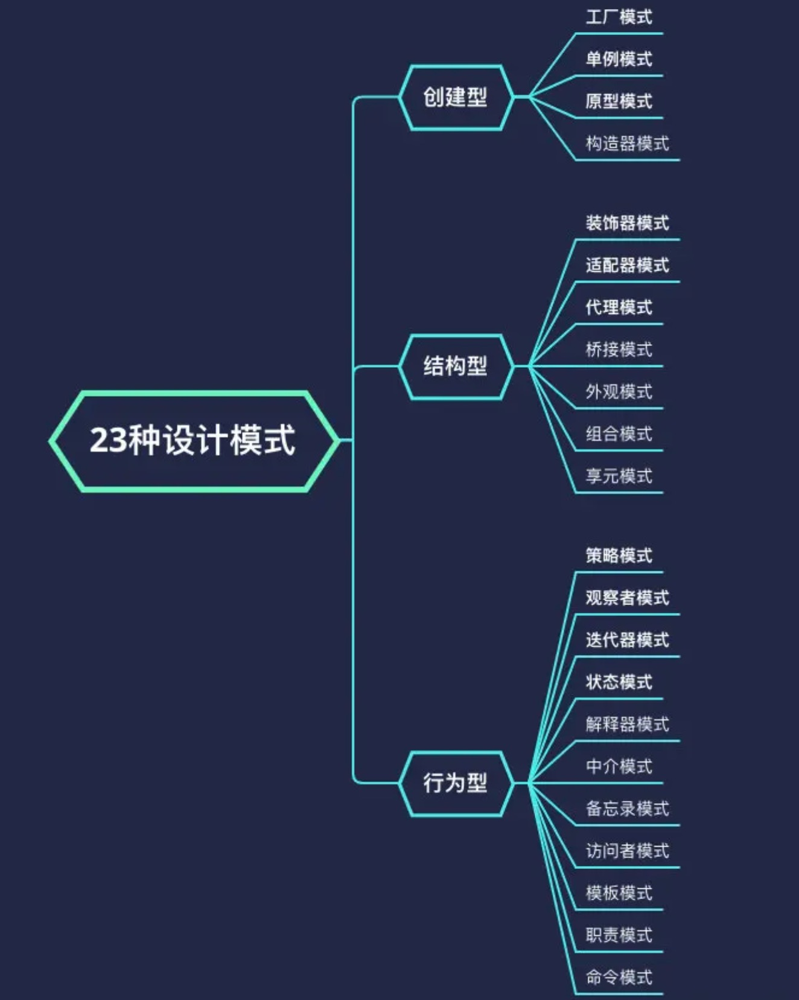

# 前端常用设计模式汇总

> 提到设计模式，相信知道的同学都会脱口而出，五大基本原则（SOLID）和 23 种设计模式。SOLID 所指的五大基本原则分别是：**单一功能原则、开放封闭原则、里式替换原则、接口隔离原则和依赖反转原则**。逐字逐句诠释这五大基本原则违背了写这篇文章的初衷，引用社区大佬的理解，SOLID 可以简单概括为六个字，即“**高内聚，低耦合**”：

- 高层模块不依赖底层模块，即为**依赖反转原则**。
- 内部修改关闭，外部扩展开放，即为**开放封闭原则**。
- 聚合单一功能，即为**单一功能原则**。
- 低知识要求，对外接口简单，即为**迪米特法则**。
- 耦合多个接口，不如独立拆分，即为**接口隔离原则**。
- 合成复用，子类继承可替换父类，即为**里式替换原则**。

23 种设计模式分为“创建型”、“行为型”和“结构型”。具体类型如下图:

;
