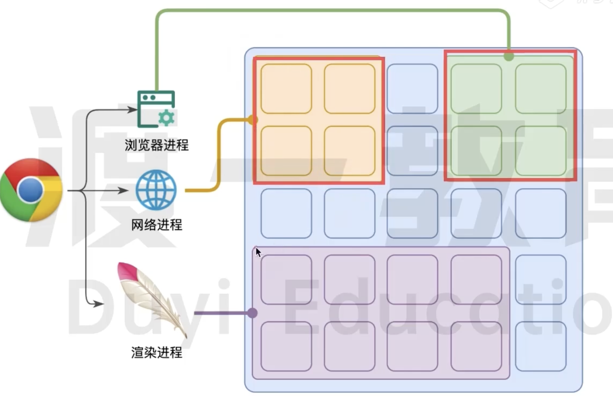
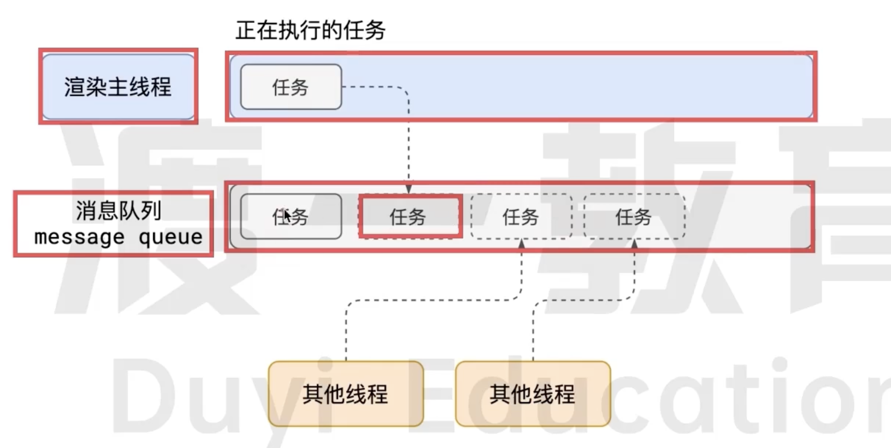
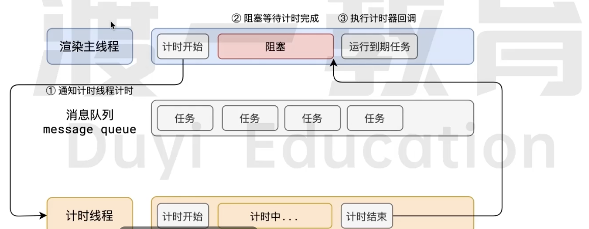
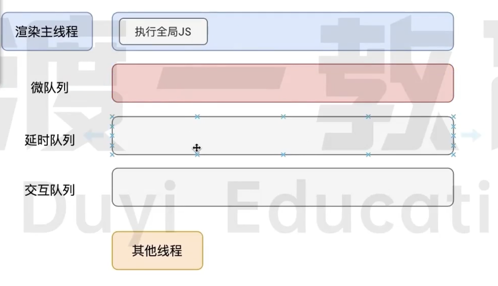
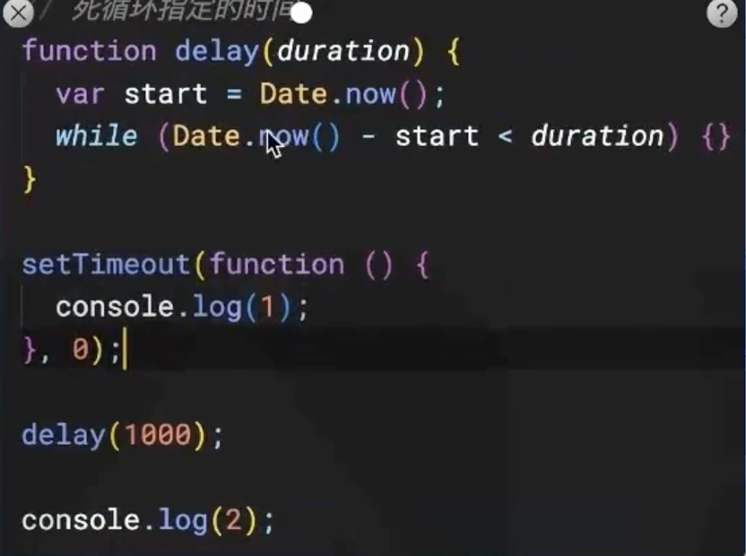

# JavaScript 事件循环

## 浏览器的进程模型

### 进程

> 每个应用至少有一个进程，进程之间相互独立，若需要通信，也需要双方同意

### 线程

有了进程后，我们可以运行代码  
运行代码的 「人」，我们称为线程  
一个进程至少需要一个线程，所以在进程开启后会自动创建一个线程，为**主线程**
若一个程序需要*同时*执行多块代码，则主线程需要启动多个线程来执行，所以给一个进程中可以包含多个线程

### 浏览器有哪些进程和线程

**浏览器是一个多线程多进程的应用程序**

浏览器内部工作极其复杂，为了减少连环崩溃的几率，当浏览器启动后，它会自动启动多个进程



其中，最主要的进程有：

腾讯

1. 浏览器进程

主要负责界面显示、用户交互、子进程管理等。浏览器进程内部会启动多个线程处理不同的任务。

2. 网络进程

负责加载网络资源。网络进程内部会启动多个线程来处理不同的网络任务。

3. 渲染进程（本节课重点讲解的进程）

渲染进程启动后，会开启一环渲染主线程，主线程负责执行 HTML、 CSS、JS 代码。

默认情况下，浏览器会为每个标签页开启一个新的渲染进程，以保证不同的标签页之间不相互影响。

> ? 将来该默认模式可能会有所改变，有兴趣的同学可参见 chrome官方说明文档

### 渲染主线程如何工作？

渲染主线程是如何工作的？

渲染主线程是浏览器中最繁忙的线程，需要它处理的任务包括但不限于：

解析 HTML

解析 CSs

计算样式

布局

处理图层

每秒把页面画 60次

，执行全局 JS 代码

7962 损行事件处理函数 Jyi Educo

，执行计时器的回调函数


要处理这么多的任务，主线程遇到了一个前所未有的难题：如何调度任务？

比如：

我正在执行一个 JS函数，执行到一半的时候用户点击了按钮，我该立即去执行点击事件的处理函数吗？

我正在执行一个 JS 函数，执行到一半的时候某个计时器到达了时间，我该立即去执行它的回调吗？

浏览器进程通知我”用户点击了按钮”，与此同时，某个计时器也到达了时间，我应该处理哪一个呢？

Holucation 渲染主线程想出了一个绝妙的主意来处理这个问题：排队



1. 在最开始的时候，渲染主线程会进入一个无限循环

2. 每一次循环会检查消息队列中是否有任务存在。如果有，就取出第一个任务热行，执行完一个后进入下一次循环；如果没有，则进入休眠状态。

3.其他所有线程（包括其他进程的线程）可以随时向消息队列添加任务。新任务会加到消息队列的末尾。在添加

新任务时，如果主线程是休眠状态，则会将其唤醒以继续循环拿取任务这样一来，就可以让每个任务有条不紊的、持续的进行下去了。1. 在最开始的时候，渲染主线程会进入一个无限循环

2. 每一次循环会检查消息队列中是否有任务存在。如果有，就取出第一个任务热行，执行完一个后进入下一次循环；如果没有，则进入休眠状态。

3.其他所有线程（包括其他进程的线程）可以随时向消息队列添加任务。新任务会加到消息队列的末尾。在添加

新任务时，如果主线程是休眠状态，则会将其唤醒以继续循环拿取任务这样一来，就可以让每个任务有条不紊的、持续的进行下去了。

## 若干解释

代码在执行过程中，会遇到一些无法立即处理的任务，比如：

计时完成后需要执行的任务 -- setTimeout、 setInterval

网络通信完成后需要执行的任务 -- XHR 、 Fetch

用户操作后需要执行的任务 - - addEventListener

如果让渲染主线程等待这些任务的时机达到，就会导致主线程长期处于「阳塞」的状态，从而导致浏览

器「卡死」



使用异步的方式，**主线程永不阻塞**

> ? 面试题：如何理解 JS 的异步？
>
> 参考答案：
>
> Js是一门单线程的语言，这是因为它运行在**浏览器的渲染主线程中**，而渲染主线程只有一个。
>
> ‘而渲染主线程承担着诸多的工作，渲染页面、执行 JS、解析CSS 都在其中运行。
>
> 如果使用同步的方式，就极有可能导致主线程产生阳塞，从而导致消息队列中的很多其他任务无法得到执行。
>
> 这样一来，一方面会导致繁忙的主线程白白的消耗时间，另一方面导致页面无法及时更新，给用户造成卡死现象。
>
> 所以浏览器采用异步的方式来避免。具体做法是当某些任务发生时，比如计时器、网络、事件监听，主线程将任务交给其他线程去处理，自身立即结束任务的执行，转而执行后续代码。当其他线程完成时，**将事先传递的回调函数包装成任务**这个，加入到消息队列的未尾排队，等待主线程调度执行。
>
> 在这种异步模式下，浏览器永不阳塞，从而最大限度的保证了单线程的流畅运行

### js 为何阻断渲染？

``` html
<html>
  <body>
    <h2>title</h2>
    <button>change</button>
  </body>
  <script>
  	var 
    	h2 = document.querySelector('h2'),
      buttom = document.querySelector('button');
    
    // 死循环指定的时间
    function delay(duration) {
      var start = Date.now();
      while (Date.now() - start < duration) {}
    }
    
    button.onClick = function() {
      h2.textContent = 'delay';
      delay(3000);
    }
  </script>
</html>
```

这段代码执行效果为：延迟3s，然后页面变成 ‘delay'

为什么不是先变成 ‘delay’？

``` bash
渲染主线程 【..., 死循环3s】
消息队列 【绘制，其他操作】 
```


### 任务有优先级吗？

任务没有优先级，在消息队列中先进先出

**但消息队列是有优先级的**

> 根据W3C最新解释：
>
> - 每个任务都有一个任务类型，同一个类型的任务必须在一个队列，不同类型的任务可以分属于不同的队列。在一次事件循环中，浏览器可以根据实际情况从不同的队列中取出任务执行。
>   - 浏览器必须准备好一个微任务队列，微任务队列中的任务优先所有其他任务执行。[html.spec.whatwg.org/multipage/webappapis.html # perform-a-microtask-checkpoint](html.spec.whatwg.org/multipage/webappapis.html # perform-a-microtask-checkpoint)

> ! 随着浏览器的复杂度急剧提升，W3C 不再使用 宏任务 队列的说法

在目前 chrome 的实现中，至少包含下面3种类型队列

- 延时队列：用于存放计时器到达后的回调任务，优先级「中」
- 交互队列：用于存放用户操作后产生的事件处理任务，优先级「高」 
- 微队列：用户存放需要最快执行的任务，优先级「最高」



添加微任务到队列中的主要方式 Promise MutationObserver

``` js
// 立即把一个函数添加到微队列
Promsie.resolve().then(函数)
```

测试



面试题：阐述一下 JS 的事件循环

参考答案：

事件循环又叫做消息循环，是浏览器渲染主线程的工作方式。

在 Chrome 的源码中，它开启一个不会结束的 for 循环，每次循环从消息队列中取出第一个任务执行，而其他线程只需要在合适的时候将任务加入到队列末尾即可。

过去把消息队列简单分为宏队列和微队列，这种说法目前已无法满足复杂的浏览器环境，取而代之的是一种更加灵活多变的处理方式。

根据 w3C 官方的解释，每个任务有不同的类型，同类型的任务必须在同一个队列，不同的任务可以属于不同的队列。不同任务队列有不同的优先级，在一次事件循环中，由浏览器自行决定取哪一个队列的任务。但浏览器必须有一个微队列，微队列的任务一定具有最高的优先级，必须优先调度执行。


面试题：JS 中的计时器能做到精确计时吗？为什么？

参考答案：

不行，因为： Fducotion

1. 计算机硬件没有原子钟，无法做到精确计时一

2. 操作系统的计时函数本身就有少量偏差，由于 Js的计时器最终调用的是操作系统的函数，也就携带了这

些偏差

3. 按照 W3C 的标准，浏览器实现计时器时，如果嵌套层级超过 5 层，则会带有 4 毫秒的最少时间，这样在计时时间少于 4 毫秒时又带来了偏差

4. 受事件循环的影响，计时器的回调函数只能在主线程空闲时运行，因此又带来了偏差
