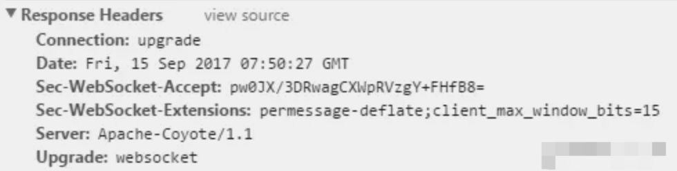
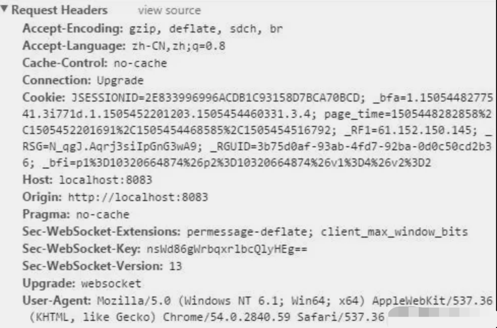

# JavaScript 实时通信

| #        | 轮询(Polling) | 长轮询(Long-Polling) | iframe流  | Websocket       | sse（Server-send event）   |
| -------- | ------------ | -------------------  | -------- | --------------- | ------------------------- |
| 通信协议  | http         | http                 |  http     | tcp             | http                      |
| 触发方式 | client(客户端) | client(客户端)        | Server | client、server(客户端、服务端)     | client、server(客户端、服务端)    |
| 优点     | 兼容性好容错性强，实现简单         | 比短轮询节约资源               | 兼容性好 | 全双工通讯协议，性能开销小、安全性高，可扩展性强 | 实现简便，开发成本低              |
| 缺点     | 安全性差，占较多的内存资源与请求数  | 安全性差，占较多的内存资源与请求数 | 操作复杂，需要维护iframe和特定的后端请求，且占用请求资源 | 传输数据需要进行二次解析，增加开发成本及难度     | 只适用高级浏览器                  |
| 延迟     | 非实时，延迟取决于请求间隔         | 同短轮询                       | 实时 | 实时                                             | 非实时，默认3秒延迟，延迟可自定义 |
|  是否双工| 否 |否        |否       |是     |否|

## 短链接轮询

前端用定时器，每间隔一段时间发送请求来获取数据是否更新，这种方式可兼容ie和支持高级浏览器。通常采取 `setInterval` 或者 `setTimeout` 实现。

通过递归的方法，在获取到数据后每隔一定时间再次发送请求，这样虽然无法保证两次请求间隔为指定时间，但是获取的数据顺序得到保证。

缺点：

1. 页面会出现‘假死’，`setTimeout` 在等到每次 **EventLoop**时，都要判断是否到指定时间，直到时间到再执行函数，一旦遇到页面有大量任务或者返回时间特别耗时，页面就会出现‘假死’，无法响应用户行为。
2. 当客户端按固定频率向服务器发起请求，数据可能并没有更新，浪费服务器资源。

## 长链接轮询

客户端像传统轮询一样从服务端请求数据，服务端会阻塞请求不会立刻返回，直到有数据或超时才返回给客户端，然后关闭连接，客户端处理完响应信息后再向服务器发送新的请求。

长轮询解决了频繁的网络请求浪费服务器资源可以及时返回给浏览器。

缺点：

- 保持连接会消耗资源。
- 服务器没有返回有效数据，程序超时。

## Iframe 流

iframe流方式是在页面中插入一个隐藏的 iframe，利用其src属性在服务器和客户端之间创建一条长连接，服务器向iframe传输数据（通常是HTML，内有负责插入信息的javascript），来实时更新页面。

前端实现步骤：

1、Iframe设置为不显示。

2、src设为请求的数据地址。

3、定义个父级函数用户让iframe子页面调用传数据给父页面。

4、定义onload事件，服务器timeout后再次重新加载iframe。

后端输出内容：

当有新消息时服务端会向iframe中输入一段js代码.：println("<script>父级函数('" + 数据 +"<br>')</script>”); 用于调用父级函数传数据。

优点：

iframe流方式的优点是浏览器兼容好，Google公司在一些产品中使用了iframe流，如 Google Talk。

缺点：

1. IE、Mozilla Firefox会显示加载没有完成，图标会不停旋转。
2. 服务器维护一个长连接会增加开销。

## web socket

[Web/WebSocket](https://developer.mozilla.org/zh-CN/docs/Web/API/WebSocket)

WebSocket是一种全新的协议，随着HTML5草案的不断完善，越来越多的现代浏览器开始全面支持WebSocket技术了，它将TCP的Socket（套接字）应用在了webpage上，从而使通信双方建立起一个保持在活动状态连接通道。

WebSocket协议是借用HTTP协议的 `101 switch protocol` (服务器根据客户端的指定，将协议转换成为 Upgrade首部所列的协议)                            来达到协议转换的，从HTTP协议切换成WebSocket通信协议。

通过在请求头中增加 upgrade：websocket 及通信密钥（Sec-WebSocket-Key），使双方握手成功，建立全双工通信。





websocket是纯事件驱动的，一旦 WebSocket 连接建立后，通过监听事件可以处理到来的数据和改变的连接状态。数据都以帧序列的形式传输。服务端发送数据后，消息和事件会异步到达。WebSocket编程遵循一个异步编程模型，只需要对WebSocket对象增加回调函数就可以监听事件。

``` js
const websocket = new WebSocket('ws://localhost:8080/websocket/chat');

websocket.onerror = function(err) {
  ...
}
  
websocket.onopen = function(res) {
  
}
  
websocket.onmessage = function(msg) {
  
}
```

## Server-sent Events (sse)

[Server-sent_events/Using_server-sent_events](https://developer.mozilla.org/zh-CN/docs/Web/API/Server-sent_events/Using_server-sent_events)

sse与长轮询机制类似，区别是每个连接不只发送一个消息。客户端发送一个请求，服务端保持这个连接直到有新消息发送回客户端，仍然保持着连接，这样连接就可以消息的再次发送，由服务器单向发送给客户端。

SSE本质是发送的不是一次性的数据包，而是一个数据流。可以使用 HTTP 301 和 307 重定向与正常的 HTTP 请求一样。服务端连续不断的发送，客户端不会关闭连接，如果连接断开，浏览器会尝试重新连接。如果连接被关闭，客户端可以被告知使用                                 HTTP 204 无内容响应代码停止重新连接。

?> sse只适用于高级浏览器，ie不支持。因为ie上的XMLHttpRequest对象不支持获取部分的响应内容，只有在响应完成之后才能获取其内容。

## 参考文献

[Web Socket](https://developer.mozilla.org/zh-CN/docs/Web/API/WebSocket)

[服务器发送事件](https://developer.mozilla.org/zh-CN/docs/Web/API/Server-sent_events)
