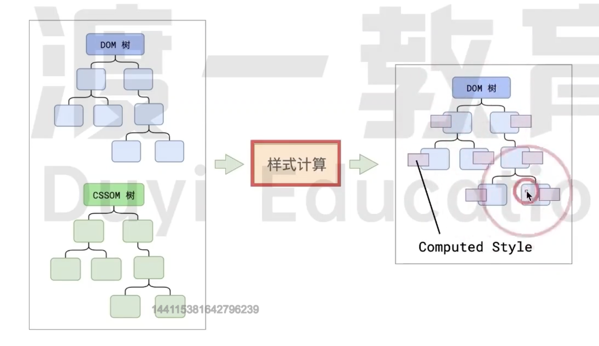

## 面试题

### 浏览器如何渲染页面

当浏览器的网络线程收到 HTML 文档后，会产生一个渲染任务，并将其传递给渲染主线程的消息队列。

在事件循环机制的作用下，渲染主线程取出消息队列中的渲染任务，开启渲染流程。

---

整个渲染流程分为多个阶段，分别是：HTML 解析、样式计算、布局、分层、绘制、分块、光栅化、 每个阶段都有明确的输入输出，上一个阶段的输出会成为下一个阶段的输入。

这样，整个渲染流程就形成了一套组织严密的生产流水线。

---

渲染的第一步是解析 HTML。

解析过程中遇到 CSS 解析 CSS，遇到JS执行 JS。为了提高解析效率，浏览器在开始解析前，会启动一个预解析的线程，率先下载 HTML 中的外部 CSS 文件和外部的 JS 文件。

如果主线程解析到 script 位置，会停止解析 HTML，转而等待 JS 文件下载好，并将全局代码解析执行完成后，才能继续解析 HTML。这是因为 JS 代码的执行过程可能会修改当前的 DOM 树，所以 DOM 树的生成必须暂停。这就是 JS 会阻塞 HTML 解析的根本原因。

如果主线程解析到 Link 位置，此时外部的 CSS 文件还没有下载解析好，主线程不会等待，继续解析后续的 HTML。这是因为下载和解析 CSS 的工作是在预解析线程中进行的。这就是 CSS 不会阻塞 HTML 解析的根本原因。

第一步完成后，会得到 DOM 树和 CSSOM 树，浏览器的默认样式、内部样式、外部样式、行内样式均会包含在 CSSOM 树中。

---

渲染的下一步是样式计算。

主线程会遍历得到的 DOM 树，依次为树中的每个节点计算出它最终的样式，称之为 Computed Style。

在这一过程中，很多预设值会变成绝对值，比如 red 会变成 rgb(255，0.0）；相对单位会变成绝对单位，比如 em 会变成 px

这一步完成后，会得到一棵带有样式的 DOM 树。

---

接下来是布局，布局完成后会得到布局树。

布局阶段会依次遍历 DOM 树的每一个节点，计算每个节点的几何信息。例如节点的宽高、相对包含块的位置。

大部分时候，DOM 树和布局树并非——对应。

比如 display：none 的节点没有几何信息，因此不会生成到布局树；又比如使用了伪元素选择器，虽然 DOM 树中不存在这些伪元素节点，但它们拥有几何信息，所以会生成到布局树中。还有匿名行盒、匿名块盒等等都会导致 DOM 树和布局树无法—一对应。

---

下一步是分层

主线程会使用一套复杂的策略对整个布局树中进行分层。

分层的好处在于，将来某一个层改变后，仅会对该层进行后续处理，从而提升效率。

滚动条、堆叠上下文、transform、opacity 等样式都会或多或少的影响分层结果，也可以通过 will-change 属性更大程度的影响分层结果。

---

再下一步是绘制 

主线程会为每个层单独产生绘制指令集，用于描述这一层的内容该如何画出来。

---

完成绘制后，5主线程将每个图层的绘制信息提交给合成线程，剩余工作将由合成线程完成。

合成线程首先对每个图层进行分块，将其划分为更多的小区域。

它会从线程池中拿取多个线程来完成分块工作。

---

分块完成后，进入光栅化阶段。

合成线程会将块信息交给 GPU 进程，以极高的速度完成光栅化。

GPU 进程会开启多个线程来完成光栅化，并且优先处理靠近视口区域的块。

光栅化的结果，就是一块一块的位图

---

最后一个阶段就是画了

合成线程拿到每个层、每个块的位图后，生成一个个「指引|（quad)」信息。一

指引会标识出每个位图应该画到屏幕的哪个位置，以及会考虑到旋转、缩放等变形。 notio

变形发生在合成线程，与渲染主线程无关，这就是 transform 效率高的本质原因。

合成线程会把 quad 提交给 GPU 进程，由 GPU 进程产生系统调用，提交给 GPU 硬件，完成最终的屏幕成像。

---

什么是 reflow？

reflow 的本质就是重新计算 layout 树。 含

当进行了会影响布局树的操作后，需要重新计算布局树，会引发 1ayout。

为了避免连续的多次操作导致布局树反复计算，浏览器会合并这些操作，当 JS代码全部完成后再进行统一计算。所以，改动属性造成的 reflow 是异步完成的。

也同样因为如此，当JS获取布局属性时，就可能造成无法获取到最新的布局信息。

浏览器在反复权衡下，最终决定获取属性立即 reflow。

---

### 渲染时间点

### 渲染流水线

#### 1. 解析HTML Parse HTML

Css Object Model

Document.styleSheet

Document.styleSheets[0].addRule('div', 'border: 2px solid #f00 !import');

 ### 布局

### 分层 layer（现代浏览器）

### 5. 绘制

### 6. 分块 Tiling

### 7. 光栅化

### 8.画 Draw

### 总结

