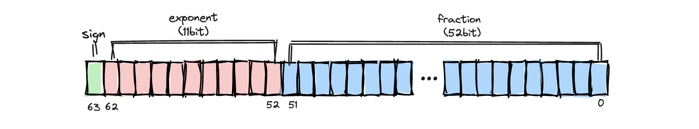
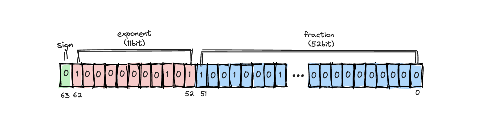

# 大整数相加

> ECMAScript 中最有意思的数据类型或许就是 Number 了。Number 类型使用IEEE 754 格式表示整数和浮点值（在某些语言中也叫双精度值）。      ---红宝书

> 在 JavaScript 中, Number 是一种 定义为 64位双精度浮点型（double-precision 64-bit floating point format） (IEEE 754)的数字数据类型。    ---MDN

Number 类型使用IEEE 754 格式。

IEEE 754规定了四种表示浮点数值的方式：单精确度（32位）、双精确度（64位）、延伸单精确度（43比特以上，很少使用）与延伸双精确度（79比特以上，通常以80位实现）。

Number类型使用的便是其中的**双精确度**（64位）。



- sign 符号位 0，1
- exponent 指数位 移码表示
- fraction 尾数位 源码表示

示例：

​100.25内存中存储方式

- 100.25 转2进制 `(100.25).toString(2)` => `'1100100.01'`
- 标准化 => `1.10010001*2^6`;
- 存储： `10010001` 放在尾数位置，`6` 放在指数位。指数位有11位，则移码是 `1023+6`，为 `10000000101`;



## 最大安全整数

[为什么JavaScript最大安全整数是2^53-1](https://juejin.cn/post/6880143057930190855)

`Max = (2-2**-52) * 2**1023 = Number.MAX_VALUE`

最大安全整数 指的也就是这个常量`Number.MAX_SAFE_INTEGER`

现在考虑，我们看两个数2^53与2^53+1。

- 2^53 我们尝试把它表示成二进制：1 53个0 ，规格化 1.0...00 * 2^53
- 那2^53+1呢？我们尝试把它表示成二进制：1 52个0 1 ,标准化 1.0...01 * 2^53

问题来了，尾数都有53位，但只要52个空！ 它的处理办法是 **忽略第53位** ,因此这两个数在计算机中表示的结果一样！

``` js
2**53 === 2**53+1    //true
```

此时就不安全了。显而易见，在2^53-1之后的数中，只要指数相同，并且尾数前52位相同，则这个两个数数值相同。

## 实现大数相加

思路：将 `number` 转为 `string`，按位相加

``` javascript
/**
 * 大数相加
 * @param a 
 * @param b 
 */
function add(a: number | string, b: number | string): string {
  a = ''+a;
  b = ''+b;
  const max = Math.max(a.length, b.length);
  a = a.padStart(max, '0');
  b = b.padStart(max, '0');
  let res = '', pre = 0;
  for (let i = max-1; i >= 0; i--) {
    const sum = +a[i] + +b[i] + pre;
    const [_pre, _cur] = (''+(sum/10)).split('.');
    res = _cur + res;
    pre = + _pre;
  }
  if (pre) res = pre + res;
  return res;
}
``````
