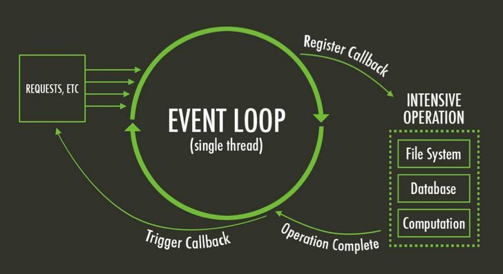
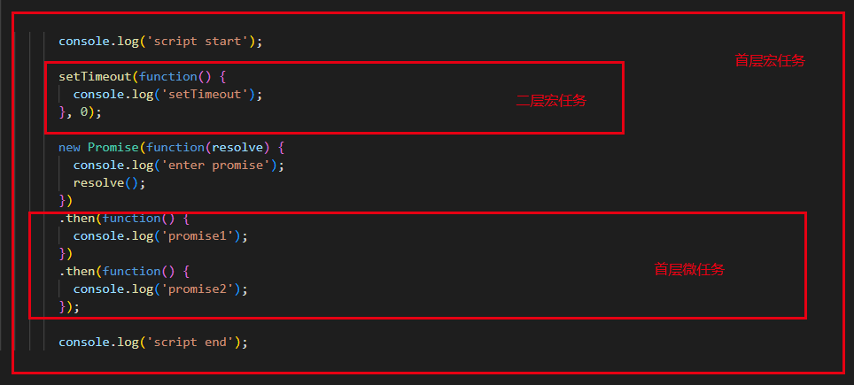
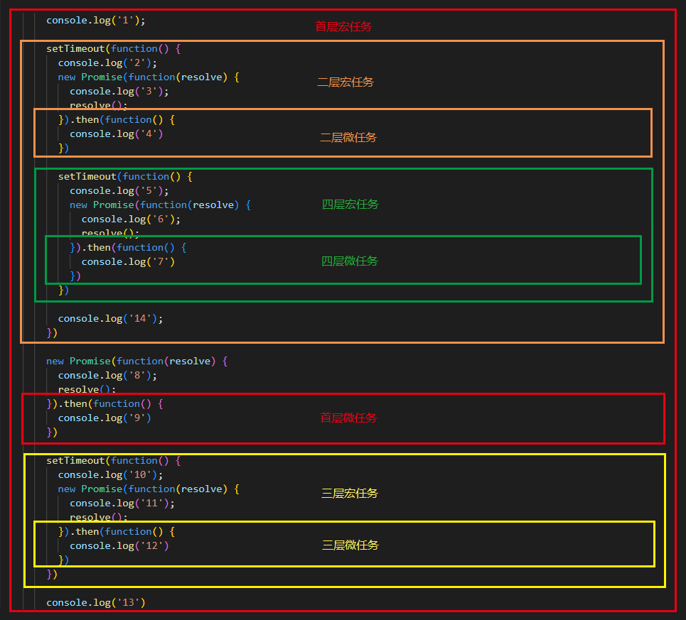
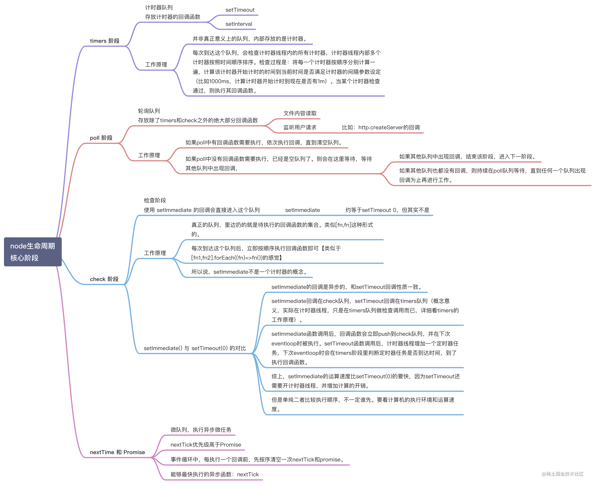

# JavaScript EventLoop



## javascript 单线程, 非阻塞

?> javascript从诞生之日起就是一门单线程的非阻塞的脚本语言。这是由其最初的用途来决定的：与浏览器交互。  
   单线程意味着，javascript代码在执行的任何时候，都只有一个主线程来处理所有的任务。

!> 单线程是必要的，也是 JavaScript 这门语言的基石，原因之一在其最初也是最主要的执行环境——浏览器中，我们需要进行各种各样的dom操作。试想一下 如果JavaScript 是多线程的，那么当两个线程同时对dom进行一项操作，例如一个向其添加事件，而另一个删除了这个dom，此时该如何处理呢？因此，为了保证不会 发生类似于这个例子中的情景，JavaScript 选择只用一个主线程来执行代码，这样就保证了程序执行的一致性。

**从一个例子开始**

``` js
console.log('script start');

setTimeout(function() {
  console.log('setTimeout');
}, 0);

new Promise(function(resolve) {
  console.log('enter promise');
  resolve();
})
.then(function() {
  console.log('promise1');
})
.then(function() {
  console.log('promise2');
});

console.log('script end');
```

打印顺序是什么？
正确答案是

``` output
script start
enter promise
script end
promise1
promise2
setTimeout
```

但是在不同浏览器上的结果却是让人懵逼的。

>Microsoft Edge, Firefox 40, iOS Safari 和 desktop Safari 8.0.8在 `promise1`，`promise2` 之前打印了 `setTimeout`，--虽然看起来像竞态条件。[目前大部分浏览器已经支持]
?> 每个线程都会有它自己的`event loop`(事件循环)，所以都能独立运行。然而所有同源窗口会共享一个`event loop`以同步通信。`event loop`会一直运行，来执行进入队列的**宏任务**。一个`event loop`有多种的**宏任务源**（event等等），这些**宏任务源**保证了在本任务源内的顺序。但是浏览器每次都会选择一个源中的一个宏任务去执行。这保证了浏览器给与一些宏任务（如用户输入）以更高的优先级。

## 浏览器环境下js引擎的事件循环机制

### 1.执行栈与事件队列

当 JavaScript 代码执行的时候会将不同的变量存于内存中的不同位置：**堆（heap）**和**栈（stack）**中来加以区分。其中，堆里存放着一些对象。而栈中则存放着一些基础类型变量以及对象的指针。

?> 当我们调用一个方法的时候，js会生成一个与这个方法对应的**执行环境（context）**，又叫**执行上下文**。这个执行环境中存在着这个方法的**私有作用域，上层作用域的指向，方法的参数**，这个作用域中定义的**变量**以及这个作用域的 **`this` 对象**。 而当一系列方法被依次调用的时候，因为js是单线程的，同一时间只能执行一个方法，于是这些方法被排队在一个单独的地方。这个地方被称为**执行栈**。

?> 当一个脚本第一次执行的时候，js引擎会解析这段代码，并将其中的同步代码按照执行顺序加入执行栈中，然后从头开始执行。如果当前执行的是一个方法，那么js会向执行栈中添加这个方法的执行环境，然后进入这个执行环境继续执行其中的代码。当这个执行环境中的代码 执行完毕并返回结果后，js会退出这个执行环境并把这个执行环境销毁，回到上一个方法的执行环境。。这个过程反复进行，直到执行栈中的代码全部执行完毕。

!> 一个方法执行会向执行栈中加入这个方法的执行环境，在这个执行环境中还可以调用其他方法，甚至是自己，其结果不过是在执行栈中再添加一个执行环境。这个过程可以是无限进行下去的，除非发生了栈溢出，即超过了所能使用内存的最大值。

以上的过程说的都是同步代码的执行。那么当一个异步代码（如发送ajax请求数据）执行后会如何呢？前文提过，js的另一大特点是**非阻塞**，实现这一点的关键在于下面要说的这项机制——**事件队列（Task Queue）**。

> js引擎遇到一个异步事件后并不会一直等待其返回结果，而是会将这个事件挂起，继续执行执行栈中的其他任务。当一个异步事件返回结果后，js会将这个事件加入**与当前执行栈不同的另一个队列**，我们称之为**事件队列**。被放入事件队列不会立刻执行其回调，而是等待当前执行栈中的所有任务都执行完毕， 主线程处于闲置状态时，主线程会去查找事件队列是否有任务。如果有，那么主线程会从中取出排在第一位的事件，并把这个事件对应的回调放入执行栈中，然后执行其中的同步代码...，如此反复，这样就形成了一个无限的循环。这个过程被称为 **事件循环（Event Loop）**。

### 2. 宏任务（macro task）、微任务（micro task）、事件表格（Event Table）

以上的事件循环过程是一个宏观的表述，实际上因为异步任务之间并不相同，因此他们的执行优先级也有区别。不同的异步任务被分为两类：**微任务（micro task）和宏任务（macro task）**。

宏任务：

基本上，我们将javascript中非微任务（MicroTask）的所有任务都归为宏任务，比如：

- script(整体代码)
- DOM操作
- 用户交互操作
- 所有的网路请求(Ajax)
- `setInterval()`
- `setTimeout()`
- `setImmediate()`
- ...

微任务:

- `new Promise()`
- `new MutaionObserver()`（监视 DOM 变动的API，详情参考[MDN](https://developer.mozilla.org/zh-CN/docs/Web/API/MutationObserver)）
- ~~`Object.observe`(废弃：监听标准对象的变化)~~
- `Process.nextTick`（Node环境，通常也被认为是微任务）

事件表格

**Event Table** 可以理解成一张事件->回调函数 对应表。

用来存储 JS 中的异步事件 (`request, setTimeout`, IO等) 及其对应的回调函数的列表。

当指定的事件完成(如 `ajax` 请求响应返回, `setTimeout` 延迟到指定时间)时，**Event Table** 会将这个回调函数移入**Event Queue**, 即**macrotask queue(宏任务队列) 或 microtask queue (微任务队列)**。

> 宏任务和微任务是相对而言的，根据代码执时循环的先后，将代码执行分层理解，在每一层（一次）的事件循环中，首先整体代码块看作一个宏任务，宏任务中的 `Promise（then、catch、finally）、MutationObserver、Process.nextTick` 就是该宏任务层的微任务；宏任务中的同步代码进入主线程中立即执行的，宏任务中的非微任务异步执行代码将作为下一次循环的宏任务时进入调用栈等待执行的；此时，调用栈中等待执行的队列分为两种，优先级较高先执行的本层循环**微任务队列（MicroTask Queue）**，和优先级低的下层循环执行的**宏任务队列（MacroTask Queue）**！

!> 注意：**每一次/层循环，都是首先从宏任务开始，微任务结束**;

### 3. 宏任务队列(macrotask queue)与微任务队列(microtask queue)

在一个事件循环中，异步事件返回结果后会被放到一个**任务队列**中。然而，根据这个异步事件的类型，这个事件实际上会被对应的**宏任务队列**或者**微任务队列**中去。

?> 在当前执行栈为空的时候，主线程会查看**微任务队列**是否有事件存在。如果不存在，那么再去**宏任务队列**中取出一个事件并把对应的回到加入当前执行栈；如果存在，则会依次执行队列中事件对应的回调，直到微任务队列为空，然后去宏任务队列中取出最前面的一个事件，把对应的回调加入当前执行栈...如此反复，进入循环。

!> tips: 当前执行栈执行完毕时会立刻先处理所有微任务队列中的事件，然后再去宏任务队列中取出一个事件。**同一次事件循环中，微任务永远在宏任务之前执行**。

?> 在最新标准中，它们被分别称为**task**与**jobs**。

- macrotask queue: 存在一定的优先级（用户I/O部分优先级更高）；异步执行，**同一事件循环中，只执行一个**。

- microtask queue: 整个事件循环当中，仅存在一个；执行为同步，**同一个事件循环中的microtask会按队列顺序，串行执行完毕**；

回到上面的例子



``` output
//首层宏任务代码执行输出
script start
enter promise
script end
//首层微任务队列代码执行输出
promise then 1
promise then 2
//第二层宏任务队列代码执行输出
setTimeout
```

## 案例分析

``` js
  console.log('1');

  setTimeout(function() {
    console.log('2');
    new Promise(function(resolve) {
      console.log('3');
      resolve();
    }).then(function() {
      console.log('4');
    })

    setTimeout(function() {
      console.log('5');
      new Promise(function(resolve) {
        console.log('6');
        resolve();
      }).then(function() {
        console.log('7');
      })
    })

    console.log('14');
  })

  new Promise(function(resolve) {
    console.log('8');
    resolve();
  }).then(function() {
    console.log('9');
  })

  setTimeout(function() {
    console.log('10');
    new Promise(function(resolve) {
      console.log('11');
      resolve();
    }).then(function() {
      console.log('12');
    })
  });

  console.log('13');
```

分析：



```output
首层宏任务:
1、8、13
首层微任务:
9
二层宏任务:
2、3、14
二层微任务:
4
三层宏任务:
10、11
三层微任务:
12
四层宏任务:
5、6
四层微任务:
7

-> 1 8 13 9 2 3 14 4 10 11 12 5 6 7
```

## node环境下js引擎的事件循环机制

> 在 Node 环境下，浏览器的 EventLoop 机制并不适用，切记不能混为一谈。这里借用网上很多博客上的一句总结：

?> Node 中的 Event Loop 是基于 libuv 实现的：libuv 是 Node 的新跨平台抽象层，libuv 使用异步，事件驱动的编程方式，核心是提供i/o的事件循环和异步回调。libuv 的API包含有时间，非阻塞的网络，异步文件操作，子进程等等。


这个图是整个 Node.js 的运行原理，从左到右，从上到下，Node.js 被分为了四层，分别是 应用层、V8引擎层、Node API层 和 LIBUV层。

- 应用层：   即 JavaScript 交互层，常见的就是 Node.js 的模块，比如 http，fs
- V8引擎层：  即利用 V8 引擎来解析JavaScript 语法，进而和下层 API 交互
- NodeAPI层：  为上层模块提供系统调用，一般是由 C 语言来实现，和操作系统进行交互 。
- LIBUV层： 是跨平台的底层封装，实现了 事件循环、文件操作等，是 Node.js 实现异步的核心 。

### Event Loop的6阶段

Node的Event loop一共分为6个阶段，每个细节具体如下：

- `timers`: 执行 `setTimeout` 和 `setInterval` 中到期的 `callback`。
- `pending callback`: 上一轮循环中少数的 `callback` 会放在这一阶段执行。
- `idle, prepare`: 仅在内部使用。
- `poll`: 最重要的阶段，执行 `pending callback`，在适当的情况下会阻塞在这个阶段。
- `check`: 执行 `setImmediate` 的 `callback`。
- `close callbacks`: 执行 `close` 事件的 `callback`，例如 `socket.on(‘close’[,fn])` 或者 `http.server.on('close, fn)`。

``` bash
   ┌───────────────────────────┐
┌─>│           timers          │
│  └─────────────┬─────────────┘
│  ┌─────────────┴─────────────┐
│  │     pending callbacks     │
│  └─────────────┬─────────────┘
│  ┌─────────────┴─────────────┐
│  │       idle, prepare       │
│  └─────────────┬─────────────┘      ┌───────────────┐
│  ┌─────────────┴─────────────┐      │   incoming:   │
│  │           poll            │<─────┤  connections, │
│  └─────────────┬─────────────┘      │   data, etc.  │
│  ┌─────────────┴─────────────┐      └───────────────┘
│  │           check           │
│  └─────────────┬─────────────┘
│  ┌─────────────┴─────────────┐
└──┤      close callbacks      │
   └───────────────────────────┘

注意：每个框被称为事件循环机制的一个阶段。
```

注意：上面六个阶段都不包括 `process.nextTick()`

!> 重点：在Node.js中，一次宏任务可以认为是包含上述6个阶段、微任务 microtask（`process.nextTick()`） 会在事件循环的各个阶段之间执行，也就是一个阶段执行完毕，就会去执行 microtask 队列的任务。

- node 的初始化
  - 初始化 node 环境。
  - 执行输入代码。
  - 执行 `process.nextTick` 回调。
  - 执行 microtasks。
- 进入 event-loop
  - 进入 timers 阶段
    - 检查 timer 队列是否有到期的 timer 回调，如果有，将到期的 timer 回调按照 timerId 升序执行。
    - 检查是否有 `process.nextTick` 任务，如果有，全部执行。
    - 检查是否有microtask，如果有，全部执行。
    - 退出该阶段。
  - 进入 IO callbacks 阶段。
    - 检查是否有 pending 的 I/O 回调。如果有，执行回调。
    - 检查是否有 `process.nextTick` 任务，如果有，全部执行。
    - 检查是否有microtask，如果有，全部执行。
    - 退出该阶段。
  - 进入 idle，prepare阶段：
    - 这两个阶段与我们编程关系不大，暂且按下不表。
  - 进入 poll  阶段
    - 首先检查是否存在尚未完成的回调，如果存在，那么分两种情况。
      - 第一种情况：
        - 如果有可用回调（可用回调包含到期的定时器还有一些IO事件等），执行所有可用回调。
        - 检查是否有 `process.nextTick` 回调，如果有，全部执行。
        - 检查是否有 microtask，如果有，全部执行。
        - 退出该阶段。
      - 第二种情况：
        - 如果没有可用回调。
        - 检查是否有 immediate 回调，如果有，退出 poll 阶段。如果没有，阻塞在此阶段，等待新的事件通知。
    - 如果不存在尚未完成的回调，退出poll阶段。
  - 进入 check 阶段。
    - 如果有immediate回调，则执行所有immediate回调。
    - 检查是否有 process.nextTick 回调，如果有，全部执行。
    - 检查是否有 microtask，如果有，全部执行。
    - 退出 **check** 阶段
  - 进入 closing 阶段。
    - 如果有immediate回调，则执行所有immediate回调。
    - 检查是否有 process.nextTick 回调，如果有，全部执行。
    - 检查是否有 microtask，如果有，全部执行。
    - 退出 **closing** 阶段
  - 检查是否有活跃的 handles（定时器、IO等事件句柄）。
    - 如果有，继续下一轮循环。
    - 如果没有，结束事件循环，退出程序。

细心的童鞋可以发现，在事件循环的每一个子阶段退出之前都会按顺序执行如下过程：

- 检查是否有 process.nextTick 回调，如果有，全部执行。
- 检查是否有 microtask，如果有，全部执行。
- 退出当前阶段。

每个循环阶段内容详解：

1. **timers阶段**  
    一个timer指定一个下限时间而不是准确时间，在达到这个下限时间后执行回调。在指定时间过后，timers会尽可能早地执行回调，但系统调度或者其它回调的执行可能会延迟它们。  
    注意：技术上来说，poll 阶段控制 timers 什么时候执行。  
    这个下限时间有个范围：[1, 2147483647]，如果设定的时间不在这个范围，将被设置为1

2. **I/O callbacks阶段**  
    这个阶段执行一些系统操作的回调。比如TCP错误，如一个TCP socket在想要连接时收到 `ECONNREFUSED`, 类unix系统会等待以报告错误，这就会放到 I/O callbacks 阶段的队列执行. 名字会让人误解为执行I/O回调处理程序, 实际上I/O回调会由poll阶段处理.  
    - 如果 poll 队列不空，event loop会遍历队列并同步执行回调，直到队列清空或执行的回调数到达系统上限；  
    - 如果 poll 队列为空，则发生以下两件事之一：
      - 如果代码已经被setImmediate()设定了回调, event loop将结束 poll 阶段进入 check 阶段来执行 check 队列（里面的回调 callback）。
      - 如果代码没有被setImmediate()设定回调，event loop将阻塞在该阶段等待回调被加入 poll 队列，并立即执行。
    - 但是，当event loop进入 poll 阶段，并且 有设定的timers，一旦 poll 队列为空（poll 阶段空闲状态）：event loop将检查timers,如果有1个或多个timers的下限时间已经到达，event loop将绕回 timers 阶段，并执行 timer 队列。

3. **check阶段**  
    这个阶段允许在 poll 阶段结束后立即执行回调。如果 poll 阶段空闲，并且有被 `setImmediate()` 设定的回调，event loop 会转到 check 阶段而不是继续等待。
    - `setImmediate()` 实际上是一个特殊的timer，跑在event loop中一个独立的阶段。它使用libuv的API来设定在 poll 阶段结束后立即执行回调。
    - 通常上来讲，随着代码执行，event loop 终将进入 poll 阶段，在这个阶段等待 incoming connection, request 等等。但是，只要有被`setImmediate()` 设定了回调，一旦 poll 阶段空闲，那么程序将结束 poll 阶段并进入 check 阶段，而不是继续等待 poll 事件们 （poll events）。

4. **close callbacks 阶段**  
    如果一个 `socket` 或 `handle` 被突然关掉（比如 `socket.destroy()`），close事件将在这个阶段被触发，否则将通过 `process.nextTick()` 触发

### process.nextTick()

上面提到，`process.nextTick()` 属于微任务，但是这里需要重点提及下：

`process.nextTick()` 虽然它是异步API的一部分，但未在图中显示。因为 `process.nextTick()` 从技术上讲，它不是事件循环的一部分；
当每个阶段完成后，如果存在 `nextTick`，就会清空队列中的所有回调函数，并且**优先于其他 microtask 执行（可以理解为微任务中优先级最高的）**

### nextTick

?> 由于 `nextTick` 具有插队的机制，`nextTick` 的递归会让事件循环机制无法进入下一个阶段. 导致I/O处理完成或者定时任务超时后仍然无法执行, 导致了其它事件处理程序处于饥饿状态. 为了防止递归产生的问题, Node.js 提供了一个 `process.maxTickDepth` (默认 1000)。

``` js
const fs = require('fs');
let counts = 0;

function wait (ms) {
  let date = Date.now();
  while (Date.now() - date < ms) {
    // do nothing
  }
}

function nextTick () {
  process.nextTick(() => {
    wait(20);
    console.log('nextTick');
    nextTick();
  });
}

const lastTime = Date.now();

setTimeout(() => {
  console.log('timers', Date.now() - lastTime + 'ms');
}, 0);

nextTick();
```

此时永远无法跳到`timer`阶段去执行`setTimeout里面的回调方法`, 因为在进入`timers`阶段前有不断的`nextTick`插入执行. 除非执行了1000次到了执行上限，所以上面这个案例会不断地打印出`nextTick`字符串

### setTimeout 与 setImmediate

**如果在一个`I/O周期`内进行调度**，`setImmediate()` 将始终在任何定时器（`setTimeout`、`setInterval`）之前执行.

- `setImmediate()` 被设计在 poll 阶段结束后立即执行回调；
- `setTimeout()` 被设计在指定下限时间到达后执行回调;

注意：

- 如果两者都在主模块中调用，那么执行先后取决于进程性能，当然也就是随机。

- 如果两者都不在主模块调用（被一个异步操作包裹），那么**`setImmediate的回调永远先执行`**。

我们来看两个例子：

``` js
setTimeout(function timeout () {
  console.log('timeout');
},0);

setImmediate(function immediate () {
  console.log('immediate');
});

// 打印随机
```

``` js
var fs = require('fs')

fs.readFile(__filename, () => {
  setTimeout(() => {
    console.log('timeout');
  }, 0);
  setImmediate(() => {
    console.log('immediate');
  });
});

// immediate 一定在 timeout 前
```

### nextTick 与 Promise

对于这两个，我们可以把它们理解成一个**微任务**。也就是说，它其实**不属于事件循环的一部分**。 那么他们是在什么时候执行呢？ **不管在什么地方调用，他们都会在其所处的事件循环最后，事件循环进入下一个循环的阶段前执行**。

``` js
setTimeout(() => {
  console.log('timeout0');

  new Promise((resolve, reject) => { 
    resolve('resolved');
  }).then(res => 
    console.log(res);
  );

  new Promise((resolve, reject) => {
    setTimeout(() => {
      resolve('timeout resolved')
    })
  }).then(res => 
    console.log(res);
  );

  process.nextTick(() => {
    console.log('nextTick1');
    process.nextTick(() => {
      console.log('nextTick2');
    });
  });

  process.nextTick(() => {
    console.log('nextTick3');
  });

  console.log('sync');

  setTimeout(() => {
    console.log('timeout2');
  }, 0);

}, 0);
```

``` output
timeout0
sync
nextTick1
nextTick2
nextTick3
resolved
timeout2
timeout resolved
```

timers阶段执行外层setTimeout的回调，遇到同步代码先执行，也就有timeout0、sync的输出。遇到process.nextTick及Promise后入微任务队列，依次nextTick1、nextTick3、nextTick2、resolved入队后出队输出。之后，在下一个事件循环的timers阶段，执行setTimeout回调输出timeout2以及微任务Promise里面的setTimeout，输出timeout resolved。（这里要说明的是 **微任务nextTick优先级要比Promise要高**）

最后附上一张nodejs 事件循环导图



## 参考文献

[Tasks, microtasks, queues and schedules](https://jakearchibald.com/2015/tasks-microtasks-queues-and-schedules/?utm_source=html5weekly)

[JS事件循环(Event Loop)](https://blog.csdn.net/chenrongwei92/article/details/120877134)

[[js进阶]全面理解Event Loop这一篇就够了](https://blog.csdn.net/qq_31967985/article/details/110310685)

[详解JavaScript中的Event Loop（事件循环）机制](https://zhuanlan.zhihu.com/p/33058983)

[Node.js 事件循环，定时器和 process.nextTick()](https://nodejs.org/zh-cn/docs/guides/event-loop-timers-and-nexttick/)

[Node.js 事件循环](https://learnku.com/articles/38802)
