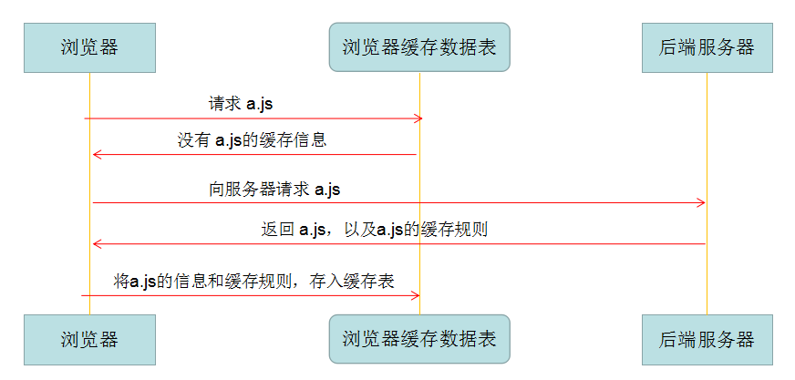
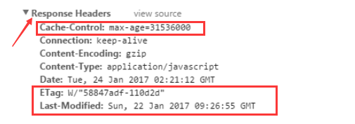
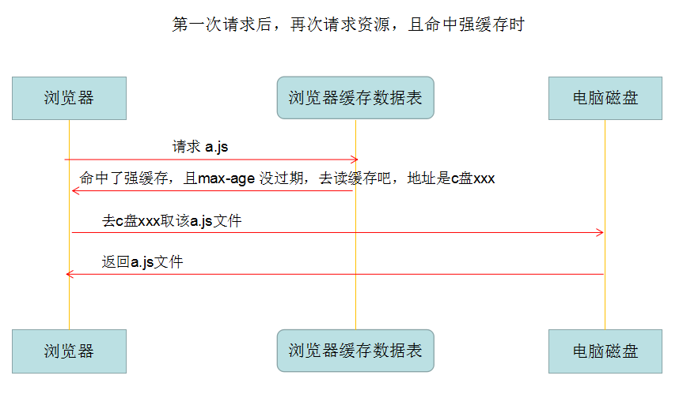
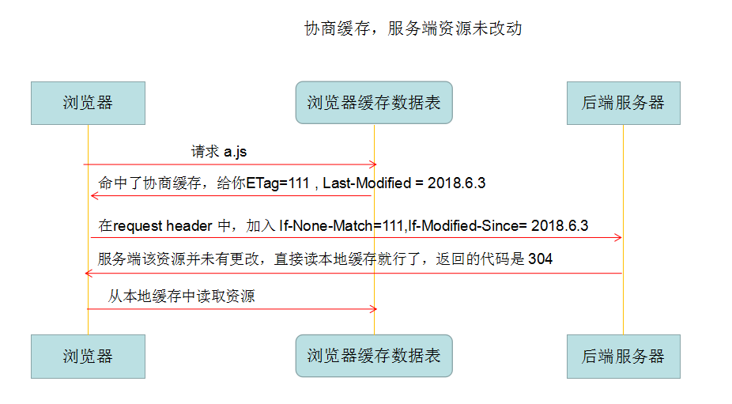
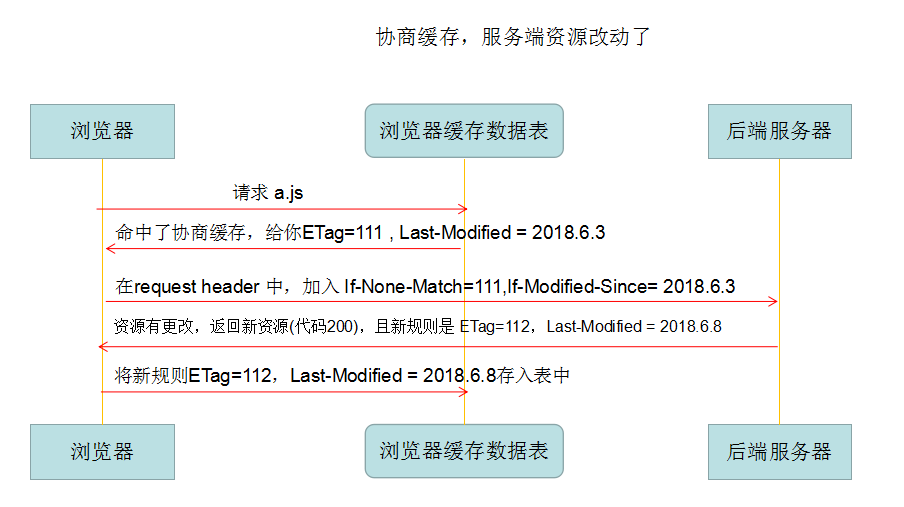
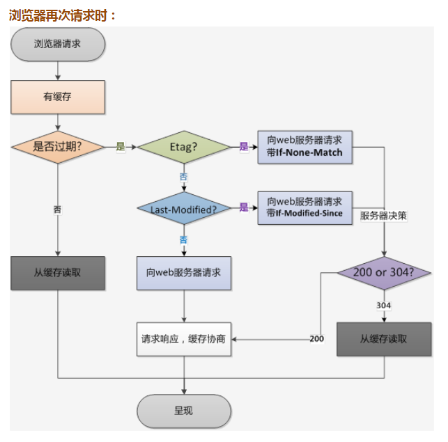

# 浏览器缓存

<!--  -->

> 浏览器缓存 是浏览器将用户请求过的静态资源（html、css、js），存储到电脑本地磁盘中，当浏览器再次访问时，就可以直接从本地加载了，不需要再去服务端请求了。

缓存优点

- 减少了冗余的数据传输，节省网费
- 减少服务器的负担，提升网站性能
- 加快了客户端加载网页的速度

缓存缺点

- 资源如果有更改但是客户端不及时更新会造成用户获取信息滞后，如果老版本有bug的话，情况会更加糟糕。

## 1. 缓存流程



上面所说的 缓存规则，就是声明所请求的这个资源，要采取哪种缓存策略？缓存多长时间？等等。。。而这个规则，是在http的header中的返回来的。



## 2. 强缓存

简单粗暴，如果资源没过期，就取缓存，如果过期了，则请求服务器。

命中情况下请求不会到达后端。

控制强制缓存的字段分别是 `Expires` 和 `Cache-Control`，其中 `Cache-Control` 优先级比 `Expires` 高。（Expires 基本淘汰）

`Cache-Control、Expires` 都是缓存到期时间，`Cache-Control` 是相对值，`Expires` 是绝对值，即再次发送请求时，如果时间没到期，强制缓存生效。

Cache-Control 的几个取值含义：

- private： 仅浏览器可以缓存
- public： 浏览器和代理服务器都可以缓存（对于private和public，前端可以认为一样，不用深究）
- max-age=xxx 过期时间 秒（重要）
- no-cache  不进行强缓存（重要）
- no-store   不强缓存，也不协商缓存，基本不用，缓存越多才越好呢
- immutable  资源永远不变（防止用户点击刷新按钮去刷新页面）




强缓存总结:

- cache-control: max-age=xxxx，public
客户端和代理服务器都可以缓存该资源；
客户端在xxx秒的有效期内，如果有请求该资源的需求的话就直接读取缓存, Status Code:200 ，如果用户做了刷新操作，就向服务器发起http请求

- cache-control: max-age=xxxx，private
只让客户端可以缓存该资源；代理服务器不缓存
客户端在xxx秒内直接读取缓存,Status Code:200

- cache-control: max-age=xxxx，immutable
客户端在xxx秒的有效期内，如果有请求该资源的需求的话就直接读取缓存,Status Code:200 ，即使用户做了刷新操作，也不向服务器发起http请求

- cache-control: no-cache
跳过设置强缓存，但是不妨碍设置协商缓存；一般如果你做了强缓存，只有在强缓存失效了才走协商缓存的，设置了no-cache就不会走强缓存了，每次请求都回询问服务端。

- cache-control: no-store
不缓存，这个会让客户端、服务器都不缓存，也就没有所谓的强缓存、协商缓存了

## 3. 协商缓存

命中情况返回304

触发条件：

- `Cache-Control` 的值为 `no-cache` （不强缓存）
- 或者 `max-age` 过期了 （强缓存，但总有过期的时候）

>! 也就是说，不管怎样，都可能最后要进行协商缓存（`no-store`除外）

协商缓存字段：

- Etag：每个文件有一个，改动文件了就变了，就是个文件 `hash`，每个文件唯一，就像用 webpack 打包的时候，每个资源都会有这个东西，如： `app.js`打包后变为 `app.c20abbde.js`，加个唯一hash，也是为了解决缓存问题。

- last-modified：文件的修改时间，精确到秒

每次 http 返回来 `response header` 中的 `ETag` 和 `Last-Modified`，在下次请求时在 `request header` 就把这两个带上（但是名字变了`ETag` --> `If-None-Match`，`Last-Modified` --> `If-Modified-Since` ），服务端把你带过来的标识，资源目前的标识，进行对比，然后判断资源是否更改了。
这个过程是循环往复的，即缓存表在每次请求成功后都会更新规则。

``` json
// response header
etag: '5c20abbd-e2e8'
last-modified: Mon, 24 Dec 2018 09:49:49 GMT

// request header 变为
if-none-matched: '5c20abbd-e2e8'
if-modified-since: Mon, 24 Dec 2018 09:49:49 GMT
```





## 4. 怎么设置强缓存与协商缓存

- 后端服务器如nodejs:

``` js
res.setHeader('Cache-Control', 'max-age=30');
res.setHeader('Etag', "ffff");
res.setHeader('last-modified': Mon, 24 Dec 2018 09:49:49 GMT)
```

- nginx配置

``` bash
  location = /index.html {
    add_header Catch-Control "no-catch, no-store";
  }

  location / {
    root /opt/html/dist;
    index index.htm index.html;
    try_files $uri $uri/ /index.html;
    if ($request_uri ~* ^/index.html) {
      add_header Catch-Control "no-catch, no-store";
    }
  }
```

## 总结

### 1 缓存机制

| 缓存类型 | 获取资源形式 | 状态码 | 是否发送请求到服务器 |
|-|-|-|-|
|强缓存|从缓存取|200（from catch）| 否，直接从缓存获取|
|协商缓存|从缓存取|304（Not Modified）|是，通过服务器告知缓存是否可用|

### 2. 用户行为对缓存影响

|用户操作|Expires/Catch-Control|Last-Modified/Etag|
|-|-|-|
|地址栏回车|Y|Y|
|页面链接跳转|Y|Y|
|新开窗口|Y|Y|
|前进后退|Y|Y|
|F5刷新|N|Y|
|Ctrl+F5强制刷新|N|N|

### 3. 缓存位置

> 当强缓存命中或者协商缓存中服务器返回304的时候，我们直接从缓存中获取资源。那这些资源究竟缓存在什么位置呢？

浏览器中的缓存位置一共有四种，按优先级从高到低排列分别是：

- Service Worker
- Memory Cache
- Disk Cache
- Push Cache

#### Service Worker

Service Worker 借鉴了 Web Worker的 思路，即让 JS 运行在主线程之外，由于它脱离了浏览器的窗体，因此无法直接访问DOM。虽然如此，但它仍然能帮助我们完成很多有用的功能，比如离线缓存、消息推送和网络代理等功能。其中的离线缓存就是 Service Worker Cache。
Service Worker 同时也是 PWA 的重要实现机制

#### from memory catch 和 from disk catch 的对比

在 chrome 浏览器中的控制台 Network 中 size 栏通常会有三种状态：

- 1.from memory catch：字面理解是从内存中，其实也是字面含义，这个资源是直接从内存中拿到的，不会请求服务器，一般已经加载过该资源且缓存在了内存当中，且当关闭该页面时，此资源就被内存释放掉了，再次打开相同页面时，不会出现 from memory catch 的情况。从效率上讲它是最快的。但是从存活时间来讲又是最短的，当渲染进程结束后，内存缓存也就不存在了。

- 2.from disk catch ：同上类似，此资源是从磁盘中取出的，也是在已经在之前的某个时间加载过该资源，不会请求服务器。但是此资源不会随着页面关闭而释放掉，因为是存在于内存当中的，下次打开任然会 from disk catch。从存取效率上讲是比内存缓存慢的，但是他的优势在于存储容量和存储时长。稍微有些计算机基础的应该很好理解，就不展开了。

- 3.资源本身大小数值：当 HTTP 状态为 200 是实实在在的从服务器获取的资源，当 HTTP 状态为 304 时该数字是与服务器端通信报文的大小，并不是该资源本身的大小，该资源是从本地获取的。

>- 比较大的JS、CSS文件会直接被丢进磁盘，反之丢进内存
>- 内存使用率比较高的时候，文件优先进入磁盘

|状态|类型|说明|
|-|-|-|
|200|from memory catch|不请求网络资源，资源在内存中（一般脚本，字体，图片会存在内存），当关闭该页面时，此资源就被内存释放掉了，再次打开相同页面时，不会出现 from memory catch 的情况。|
|200|from disk catch|不请求网络资源，资源在磁盘中（一般非脚本会存在磁盘，如css等），也是在已经在之前的某个时间加载过该资源，但是此资源不会随着页面关闭而释放掉，因为是存在于内存当中的，下次打开任然会 from disk catch。|
|200|资源大小|从服务器下载最新资源|
|304|报文大小|请求服务器发现资源未更新，使用本地缓存，即命中协商缓存|

#### Push Cache

即推送缓存，这是浏览器缓存的最后一道防线。它是 HTTP/2 中的内容，虽然现在应用的并不广泛，但随着 HTTP/2 的推广，它的应用越来越广泛。关于 Push Cache，有非常多的内容可以挖掘，不过这已经不是本文的重点，大家可以参考这篇[扩展文章](https://jakearchibald.com/2017/h2-push-tougher-than-i-thought/)。

### 4. 字段优先级

Cache-Control  > expires > Etag > Last-Modified

?> 这里注意一下 Etag 和 Last-Modified, 在协商缓存中，先比较Etag, Etag失效再比较Last-Modified,

tips： 为什么要有 Etag？  
HTTP1.1 中 Etag 的出现主要是为了解决几个 Last-Modified 比较难解决的问题：

- 一些文件也许会周期性的更改，但是内容并不改变(仅仅改变的修改时间)，这个时候我们并不希望客户端认为这个文件被修改了，而重新GET；
- 某些文件修改非常频繁，比如在秒以下的时间内进行修改，(比方说1s内修改了N次)，If-Modified-Since 能检查到的粒度是秒级的，使用 Etag 就能够保证这种需求下客户端在1秒内能刷新 N 次 cache。
- 某些服务器不能精确的得到文件的最后修改时间

### 5. 三级缓存

- 先去内存看，如果有，直接加载

- 如果内存没有，择取硬盘获取，如果有直接加载

- 如果硬盘也没有，那么就进行网络请求

- 加载到的资源缓存到硬盘和内存



## 参考文献

[关于http：（http报文）（http状态码）（强缓存、协商缓存）](https://blog.csdn.net/mwh321/article/details/112207648)

[前端必须要懂的浏览器缓存机制](https://github.com/zuopf769/notebook/tree/master/fe/%E5%89%8D%E7%AB%AF%E5%BF%85%E9%A1%BB%E8%A6%81%E6%87%82%E7%9A%84%E6%B5%8F%E8%A7%88%E5%99%A8%E7%BC%93%E5%AD%98%E6%9C%BA%E5%88%B6)
