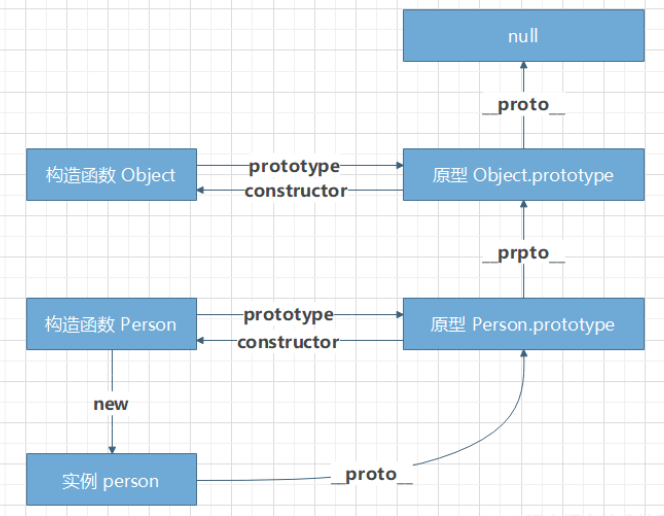

# JavaScript 手写new

## new 做了什么？

首先附上一张原型链图



1. 内存中创建对象
2. 新对象的`__proto__`属性赋值为构造函数的`prototype`属性
3. 构造函数内部的`this`指向新创建的对象
4. 根据构造函数返回值判断返回内容

针对第4点，首先我们看一下构造函数返回值的判断

``` js
// 构造函数返回基本数据类型
function Person(name) {
  this.name = name;
  return 1; // return undefined/NaN/string/null
}

const tom = new Person('Tom');
console.log(tom); // {name: 'Tom'}
```

``` js
// 构造函数返回引用数据类型
function Person(name) {
  this.name = name;
  return {age: 12};
}

const tom = new Person('Tom');
console.log(tom); // {age: 12}
```

结论：
在 `new` 的时候，会对构造函数的返回值做一些判断：

1. 如果返回值是基础数据类型，则忽略返回值；

2. 如果返回值是引用数据类型，则使用 `return` 的返回，也就是 **`new` 操作符无效**

## 实现new

``` js
function myNew(func, ...argArray) {
  // 1. 判断方法体
  if (typeof func !== 'function') {
    throw '第一个参数必须是方法体';
  }

  // 2. 创建新对象
  const obj = {};

  // 3. 这个对象的 __proto__ 指向 func 这个类的原型对象
  // 即实例可以访问构造函数原型（constructor.prototype）所在原型链上的属性
  obj.__proto__ = Object.create(func.prototype);

  // 为了兼容 IE 可以让步骤 2 和 步骤 3 合并
  // const obj = Object.create(func.prototype);

  // 绑定 this 执行并且获取运行后的结果
  const result = func.call(obj, ...argArray);

  // 5. 如果构造函数返回的结果是引用数据类型，则返回运行后的结果
  // 否则返回新创建的 obj
  return result instanceof Object ? result : obj;
}
```

验证

``` js
function fn1(name) {
  this.name = name;
}

fn1.logName = function() {
  return this.name;
}

function fn2(name) {
  this.name = name;
  return 1;
}

function fn3(name) {
  this.name = name;
  return {
    age: 18
  }
}

var f1 = myNew(fn1, 'tom');

var f2 = myNew(fn2, 'tom');

var f3 = myNew(fn3, 'tom');
```

输出

``` output
f1:
fn1 {name: 'tom'}
↪ name: "tom"
  [[Prototype]]: Object
  ↪ constructor: ƒ fn1(name)
    ↪ logName: ƒ ()
      ...
  [[Prototype]]: Object

f2:
fn2 {name: 'tom'}
↪ name: "tom"
  [[Prototype]]: Object

f3:
{age: 18}
↪ age: 18
  [[Prototype]]: Object
```

## 参考文献

[JavaScript深入之new的模拟实现](https://github.com/mqyqingfeng/Blog/issues/13)

[手写 new](https://note.zhangjc.cn/src/1_JS%E5%9F%BA%E7%A1%80/20210224_%E6%89%8B%E5%86%99new.html)
