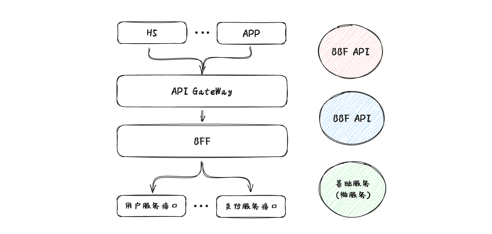

# BFF (Backend For Frontend) & Serverless

## 1. BFF

> **BFF**：Backend For Frontend（服务于前端的后端）
>
> **作用**：`用户体验适配层和API聚合层` : 主要负责快速跟进 UI 迭代，对后 端接口服务进行组合、处理，对数据进行：裁剪、格式化、聚合等

在BFF层下面是各种后端微服务，在BFF上层则是各种前端应用（多端应用），向下调用后端为服务，向上给客户端提供接口服务，后端为BFF层的前端提供的的 RPC (远程过程调用) 接口， BFF 层则直接调用服务端 RPC 接口拿到数据，按需加工数据，来完成整个BFF的闭环（以Node+GraphQL技术栈为主）

### 1.1 BFF 架构

### 1.2 BFF 的优势

- 可以降低沟通成本：后端同学追求解耦，希望客户端应用和内部微服务不耦合，通过引入 **BFF** 这中间层，使得两边可以独立变化

- 多端应用适配：展示不同的（或更少量的）数据，比如PC端页面设计的API需要支持移动端，发现现有接口从设计到实现都与桌面UI展示需求强相关，无法简单适应移动端的展示需求 ，就好比PC端一个新闻推荐接口，接口字段PC端都需要，而移动端呢H5不需要，这个时候根据不同终端在 **BFF** 层做调整，同时也可以进行不同的（或更少的）API调用（聚合）来减少http请求

> 总结：当你在设计 API 时，会因为不同终端存在不同的区分，它们对服务端提供的 API 访问也各有其特点，需要做一些区别处理。这个时候如果考虑在原有的接口上进行修改，会因为修改导致耦合，破坏其单一的职责。

### 1.3 BFF 的痛点

- 重复开发：每个设备开发一个 BFF 应用，也会面临一些重复开发的问题展示，增加开发成本

- 维护问题：需要维护各种 BFF 应用。以往前端也不需要关心并发，现在并发压力却集中到了 BFF 上

- 链路复杂：流程变得繁琐，BFF 引入后，要同时走前端、服务端的研发流程，多端发布、互相依赖，导致流程繁琐

- 浪费资源: BFF 层多了，资源占用就成了问题，会浪费资源，除非有弹性伸缩扩容

### 1.4 有什么方案可以解决传统BFF痛点？

- 包括解决前端需要关心应用的负载均衡、备份冗灾、监控报警等一些列运维部署的操作
- 如何统一管理和运维，提高发布速度、降低运维成本

## Serverless

### 1. 什么是Serverless

Serverless 圈内俗称为“无服务器架构”，Serverless 不是具体的一个编程框架、类库或者工具。简单来说，Serverless 是一种软件系统架构思想和方法，它的核心思想是用户无须关注支撑应用服务运行的底层主机。这种架构的思想和方法将对未来软件应用的设计、开发和运营产生深远的影响。

所谓“无服务器”，并不是说基于 Serverless 架构的软件应用不需要服务器就可以运行，其指的是用户无须关心软件应用运行涉及的底层服务器的状态、资源（比如 CPU、内存、磁盘及网络）及数量。软件应用正常运行所需要的计算资源由底层的云计算平台动态提供。

### 2. Serverless的技术实现

Serverless 的核心思想是让作为计算资源的服务器不再成为用户所关注的一种资源。其目的是提高应用交付的效率，降低应用运营的工作量和成本。以 Serverless 的思想作为基础实现的各种框架、工具及平台，是各种 Serverless 的实现（Implementation）。Serverless 不是一个简单的工具或框架。用户不可能简单地通过实施某个产品或工具就能实现 Serverless 的落地。但是，要实现 Serverless 架构的落地，需要一些实实在在的工具和框架作为有力的技术支撑和基础。

随着 Serverless 的日益流行，这几年业界已经出现了多种平台和工具帮助用户进行 Serverless 架构的转型和落地。目前市场上比较流行的 [Serverless 工具、框架和平台](https://link.juejin.cn?target=https%3A%2F%2Fserverless.com%2F)有：

- AWS Lambda，最早被大众所认可的 Serverless 实现。
- Azure Functions，来自微软公有云的 Serverless 实现。
- OpenWhisk，Apache 社区的开源 Serverless 框架。
- Kubeless，基于 Kubernetes 架构实现的开源 Serverless 框架。
- Fission，Platform9 推出的开源 Serverless 框架。
- OpenFaaS，以容器技术为核心的开源 Serverless 框架。
- Fn，来自 Oracle 的开源 Serverless 框架，由原 Iron Functions 团队开发。

## 参考文献

[Serverless（无服务）基础知识](https://juejin.cn/post/6844903904224903181?searchId=20240124144639C9ACD96EBEBAB309773D)

[万字长文之 Serverless 实战指南](https://juejin.cn/post/6844904008700821511?searchId=20240124144639C9ACD96EBEBAB309773D)

[[微服务/API时代的前端开发] BFF入门--5个实用的BFF使用案例](https://juejin.cn/post/7008840813069205512)
