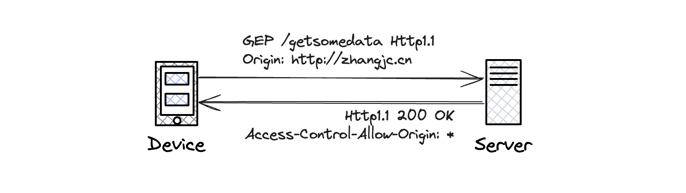
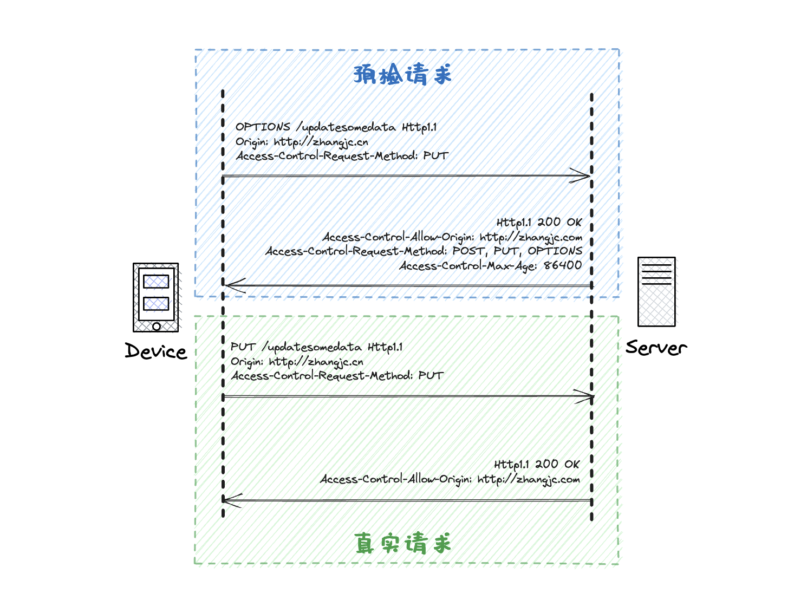

# 前端跨域及解决方案

## 什么是跨域

> **同源策略** 是浏览器中一个极为至关重要的安全机制，可以用来限制某一源内的文档或脚本与另一源内的资源如何进行交互。其目的在于隔离潜在的恶意文档，减少可能存在的攻击。

而对于同源的定义是：**协议、主机名(host)以及端口三者均相同**。

**只要不是同源的，那就是跨域的。**

当存在跨域问题时，浏览器会做出一定的限制措施。主要包括以下三点：

1. Cookie、LocalStorage 和 IndexDB 无法读取。
2. DOM 无法获得。
3. AJAX 请求被拦截。

!> 注：Cookie 获取不检测端口

## 解决方案

### 1. webpack-dev-server 代理

前后端分离：纯前端 + 接口层 (开发模式)

通过 node（dev-server）配置代理转发

``` json
devServer: {
  proxy: {
    '/api': {
      target: 'http://192.168.*.*',
      // 如果转发后的pathname需要改变，可以通过以下方式重写
      // 下面是把api前缀去掉
      pathRewrite: {
        '^/api/': '',
      },
    },
  }
}
```

通过上述方式，我们可以在接口请求发起的时候，统一从当前所在源发起，最后通过 proxy 代理的方式转发到真正的接口层。这样就绕开了调用接口时浏览器的同源限制。

### 2. Nginx 代理转发

前后端分离：纯前端 + 接口层(生产模式)

> 在使用 nginx 作为静态资源服务器时，也可以做一些代理转发。可以将接口请求全部转发到对应接口服务器。

``` bash
location /api {
  proxy_redirect off;
  proxy_set_header Host $host;
  proxy_set_header X-Real-IP $remote_addr;
  proxy_set_header X-Forwarded-For $proxy_add_x_forwarded_for;
  proxy_set_header X-NginX-Proxy true;
  # 转发时重写地址
  rewrite ^/api/(.*)$ /$1 break;
  # 转发目的地
  proxy_pass http://192.168.*.*;
}
```

这种方式其实与第一种类似，只不过是通过不同的方式进行代理。这种方式也是通过绕过浏览器限制的方式解决跨域的。

### 3. 服务器转发 BFF(Backends For Frontends)

前后端分离：纯前端 + BFF + 接口层

BFF 是 `Backend for Frontend` 的缩写，指的是在前端和后端之间增加一个额外的服务层，用于处理前端特定的需求和逻辑。通过BFF，可以将对外部服务端点的调用从前端移至BFF，从而实现前端与后端之间的解耦和灵活性。

> 对于 BFF 层，可以通过添加中间件或者其他的方式对于接口进行拦截。如果是静态资源或者是当前服务所提供的接口，则直接处理。如果是调用 api 的接口请求，将其转发到对应的服务即可。

### 4. CORS 跨域资源共享

跨域资源共享(CORS) 是一种机制，服务端可以通过额外的 HTTP 头来告诉浏览器允许某一源内的 Web 应用访问不同源服务器上的指定资源。

CORS 使用通用的跨域解决方式，需要服务端配合进行实现。

- 简单请求

  对于简单请求，服务端通过简单的设置`Access-Control-Allow-Origin: *`即可允许任意来源进行跨域请求。如果只想允许来自`http://zhangjc.com`的访问，可以设置`Access-Control-Allow-Origin: http://zhangjc.com`。

  通信过程示意图如下：



!> 在发起跨域请求时，浏览器会在请求头字段中自动带上 `Origin` 字段，值为当前所在域。

- #### 预检请求

  对于预检请求，服务端需要额外再多做一些事情。如下步骤：

  1. 首先，发起预检请求，带上真实请求的 `Method`。
  2. 服务端判断是否允许跨域请求，如果允许则返回允许的来源、允许的请求 `Methods` 以及预检请求的有效时长(**有效时间内，同一请求无需再次发送预检请求，不过不可以任意设置，浏览器有最大时长限制**)。
  3. 客户端发起真实的跨域请求。
  4. 服务端返回。

  通信过程示意图如下：



?> 需要注意的是，服务端在处理预检请求时，如果允许跨域，服务端只需要设置对应的响应头，然后直接返回即可，无需其他处理。

## 参考文献

[HTTP/CORS](https://developer.mozilla.org/en-US/docs/Web/HTTP/CORS)