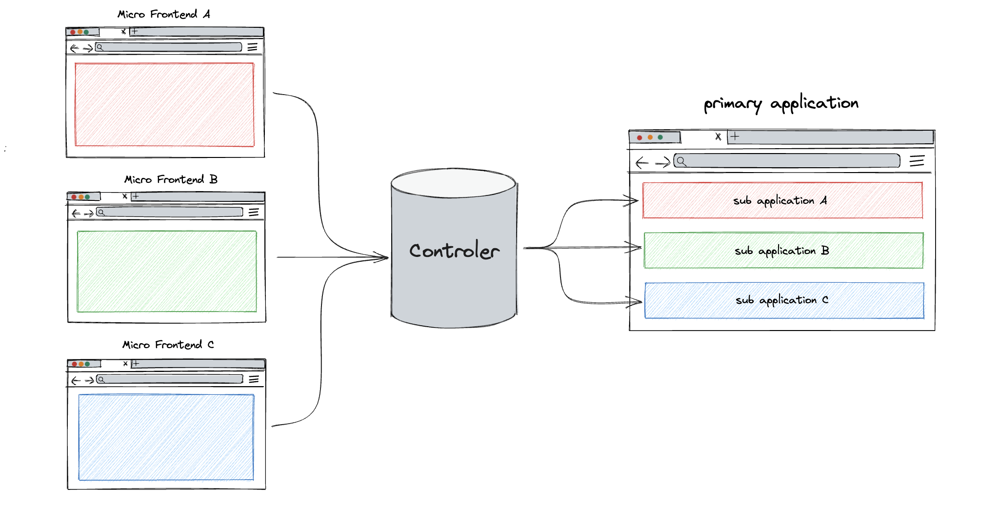

# 微前端

## 背景

**随着SPA大规模的应用，紧接着就带来一个新问题：一个规模化应用需要拆分。**

一方面功能快速增加导致打包时间成比例上升，而紧急发布时要求是越短越好，这是矛盾的。另一方面当一个代码库集成了所有功能时，日常协作绝对是非常困难的。而且最近十多年，前端技术的发展是非常快的，每隔两年就是一个时代，导致同志们必须升级项目甚至于换一个框架。但如果大家想在一个规模化应用中一个版本做好这件事，基本上是不可能的。

最早的解决方案是采用iframe的方法，根据功能主要模块拆分规模化应用，子应用之间使用跳转。但这个方案最大问题是导致页面重新加载和白屏。

那有什么好的解决方案呢？微前端这样具有跨应用的解决方案在此背景下应运而生了！

## 微前端的概念

> 微前端是什么：微前端是一种类似于微服务的架构，是一种由独立交付的多个前端应用组成整体的架构风格，将前端应用分解成一些更小、更简单的能够独立开发、测试、部署的应用，而在用户看来仍然是内聚的单个产品。有一个**基座应用**（主应用），来管理各个**子应用**的加载和卸载。

微前端的核心三大原则就是：**独立运行、独立部署、独立开发**

<https://juejin.cn/post/7113503219904430111>
