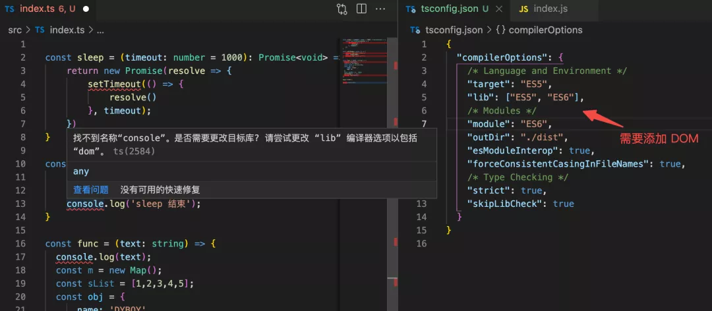

# TypeScript 指北

> 本模块着重记录那些常用却又不那么常用的知识点，一些很常见的只是点会一笔带过甚至忽略，而那些很冷门的点也不会做记录，故名 “指北” 。

主要针对个人尚未完全掌握的基本方法的一次补强。

## 初始化

``` bash
tsc --init
```

## tsconfig

tsconfig 的详细配置：[https://www.typescriptlang.org/tsconfig](https://www.typescriptlang.org/tsconfig)
tsconfig 的协议描述网址：[http://json.schemastore.org/tsconfig](ttp://json.schemastore.org/tsconfig)

汇总

``` json
{ 
  "compilerOptions": { 
    /* 基本选项 */ 
    "target": "es6", // 指定 ECMAScript 目标版本: 'ES3' (default), 'ES5', 'ES2015', 'ES2016', 'ES2017', or 'ESNEXT' 
    "module": "commonjs", // 指定使用模块: 'commonjs', 'amd', 'system', 'umd' or 'es2015' 
    "lib": [], // 指定要包含在编译中的库文件 
    "allowJs": true, // 允许编译 javascript 文件 
    "checkJs": true, // 报告 javascript 文件中的错误 
    "jsx": "preserve", // 指定 jsx 代码的生成: 'preserve', 'react-native', or 'react' 
    "declaration": true, // 生成相应的 '.d.ts' 文件 
    "declarationDir": "./dist/types", // 生成的 '.d.ts' 文件保存文件夹
    "emitDeclarationOnly": false, // 只用 tsc 来编译导出 ts 的 d.ts 类型声明文件 
    "sourceMap": true, // 生成相应的 '.map' 文件 
    "outFile": "./", // 将输出文件合并为一个文件 
    "outDir": "./dist", // 指定输出目录 
    "rootDir": "./", // 用来控制输出目录结构 --outDir. 
    "removeComments": true, // 删除编译后的所有的注释 
    "noEmit": true, // 不生成输出文件 
    "importHelpers": true, // 从 tslib 导入辅助工具函数 
    "isolatedModules": true, // 将每个文件做为单独的模块 （与 'ts.transpileModule' 类似）. 
 
    /* 严格的类型检查选项 */ 
    "strict": true, // 启用所有严格类型检查选项 
    "noImplicitAny": true, // 在表达式和声明上有隐含的 any类型时报错 
    "strictNullChecks": true, // 启用严格的 null 检查 
    "noImplicitThis": true, // 当 this 表达式值为 any 类型的时候，生成一个错误 
    "alwaysStrict": true, // 以严格模式检查每个模块，并在每个文件里加入 'use strict' 
 
    /* 额外的检查 */ 
    "noUnusedLocals": true, // 有未使用的变量时，抛出错误 
    "noUnusedParameters": true, // 有未使用的参数时，抛出错误 
    "noImplicitReturns": true, // 并不是所有函数里的代码都有返回值时，抛出错误 
    "noFallthroughCasesInSwitch": true, // 报告switch语句的fallthrough错误。（即，不允许switch的case语句贯穿） 
 
    /* 模块解析选项 */ 
    "moduleResolution": "node", // 选择模块解析策略： 'node' (Node.js) or 'classic' (TypeScript pre-1.6) 
    "baseUrl": "./", // 用于解析非相对模块名称的基础目录 
    "paths": {}, // 模块名到基于 baseUrl 的路径映射的列表 
    "rootDirs": [], // 根文件夹列表，其组合内容表示项目运行时的结构内容 
    "typeRoots": [], // 包含类型声明的文件列表 
    "types": [], // 需要包含的类型声明文件名列表 
    "allowSyntheticDefaultImports": true, // 允许从没有设置默认导出的模块中默认导入。 
    "esModuleInterop": true, // 支持合成模块的默认导入 
   
    /* Source Map Options */ 
    "sourceRoot": "./", // 指定调试器应该找到 TypeScript 文件而不是源文件的位置 
    "mapRoot": "./", // 指定调试器应该找到映射文件而不是生成文件的位置 
    "inlineSourceMap": true, // 生成单个 soucemaps 文件，而不是将 sourcemaps 生成不同的文件 
    "inlineSources": true, // 将代码与 sourcemaps 生成到一个文件中，要求同时设置了 --inlineSourceMap 或 --sourceMap 属性 
 
    /* 其他选项 */ 
    "experimentalDecorators": true, // 启用装饰器 
    "emitDecoratorMetadata": true // 为装饰器提供元数据的支持 
  }, 
  /* 指定编译文件或排除指定编译文件 */ 
  "include": ["src/**/*"], 
  "exclude": ["node_modules", "**/*.spec.ts"], 
  "files": ["index.ts", "test.ts"], 
  // 从另一个配置文件里继承配置 
  "extends": "@tsconfig/recommended", 
  // 让 IDE 在保存文件的时候根据 tsconfig.json 重新生成文件 
  "compileOnSave": true // 支持这个特性需要Visual Studio 2015， TypeScript 1.8.4 以上并且安装 atom-typescript 插件 
} 
```

### extends

> 用于指明继承已有的 tsconfig 配置规则文件。

该字段可以说是非常有用了，因为我们的 tsconfig 配置其实各个项目之间大同小异，因此完全可以结合自己团队的情况，抽离一个基础且公共的 tsconfig 配置，并将其发包，然后作为 extends 字段的值来继承配置。

tsconfig 推荐默认配置可以参考官方的包：[@tsconfig/recommended](https://www.npmjs.com/package/@tsconfig/recommended)

例如继承一个发包后的 tsconfig 基础配置，并通过显示声明编译的目标代码版本为 ES2016 来覆盖覆盖 `@tsconfig/recommended` 中对应配置项。

``` json
{ 
  "extends": "@tsconfig/recommended/tsconfig.json", 
  "compilerOptions": { 
    "target": "ES2016" 
  } 
}
```

作为一些实践经验，社区也提供了一些常见环境(例如：Nuxt、Vite、Node 等)最佳实践后的基础配置，推荐参阅：[https://github.com/tsconfig/bases](https://github.com/tsconfig/bases/)

## compilerOptions

> `compilerOptions` 是一个描述 TypeScript 编译器功能的“大”字段，其值类型是“对象”，因此包含了很多用于描述编译器功能的子字段

### target

> target 字段指明经过 TSC 编译后的 ECMAScript 代码语法版本，根据 ECMAScript 语法标准，默认值为 ES3。

``` json
{ 
  "compilerOptions": { 
    "target": "ES5", 
  } 
} 
```

>! tsc 的代码降级编译并不能完全处理兼容性。

### lib

> lib 字段是用于为了在我们的代码中显示的指明需要支持的 ECMAScript 语法或环境对应的类型声明文件。

例如我们的代码会使用到浏览器中的一些对象 `window、document`，这些全局对象 `API` 对于 TypeScript Complier 来说是不能识别的：



需要在 lib 字段中如下配置：

``` json
{ 
  "compilerOptions": { 
    "target": "ES5", 
    "lib": ["ES5", "ES6", "DOM"], 
  } 
} 
```

显式引入在 DOM 即浏览器环境下的一些默认类型定义，即可在代码中使用，`window、document` 等浏览器环境中的对象，TS 在运行时以及编译时就不会报类型错误。

> TSC 的编译结果只有部分特性做了 `pollyfill` 处理，ES6 的一些特性仍然被保留，想要支持完全的降级到 `ES5` 还是需要额外引入 `pollyfill`(也就是我们在项目的入口文件处 `import 'core-js'`)，但建议是将 `target` 字段值设置为 `ES6`，提升 TSC 的速度。

>! 不应该将 TSC 作为编译项目的工具，应该**将 TSC 作为类型检查工具**，代码编译的工作尽量交给 Rollup、Webpack 或 Babel 等打包工具!

### module

> module 字段指明 tsc 编译后的代码应该符合何种“模块化方案”，可以指定的枚举值有：none, commonjs, amd, system, umd, es2015, es2020, 或 ESNext，默认值为 none。

在 tsconfig.json 可以设置 `allowSyntheticDefaultImports` 字段为 true，来允许合成默认导入。

### esModuleInterop

> 简单来说，就是支持合成默认导入。

在前端项目开发时，使用 ESM 编写代码引入了 CJS 的模块，由于 CJS 模块没有默认导出内容，因此需要通过我们的工具去自动化合成 CJS 的默认导出，以支持在 ESM 下流畅开发。

当 `esModuleInterop` 字段设置为 `true` 时候，上述提到的 `allowSyntheticDefaultImports` 字段也会自动设置为 `true`。

### moduleResolution

> `moduleResolution` 声明如何处理模块，枚举值：`classic、node`，会根据 `module` 字段决定默认值。

推荐手动设置为 `node`，更符合现在大家的编码认识一些，而且大部分的构建打包工具都是基于 Node。

### emitDeclarationOnly

> 只用 tsc 来编译导出 ts 的 d.ts 类型声明文件

当我们希望 tsc 仅用来编译声明文件，而ts使用babel进行转化时，可使用此配置

### declaration

> 自动生成声明文件（.d.ts）

``` json
{
  "compilerOptions": {
    // ...
    "declaration": true,
  }
}
```

>! 自动生成声明文件时，若存在别名则配置文件别名不会被编译为相对路径，解决方案见下文

### baseUrl & paths

> 配置别名

- `baseUrl`：设置基本目录以解析非绝对模块名称(定义一个根目录，以此进行绝对文件路径解析)
- `paths`：用于设置模块名或路径映射列表，这样就可以简写项目中自定义模块的文件路径。

``` json
{ 
  "compilerOptions": { 
    // 注意：baseUrl 必选，与 paths 成对出现，以 tsconfig.json 文件所在目录开始 
    "baseUrl": ".",  
    "paths": { 
      // 映射列表 
      "@/*": [ 
        "src/*" 
      ], 
      "moduleA": [ 
        "src/libs/moduleA" 
      ] 
    } 
  } 
} 
 
// 代码里这么写 
import Toast from '@/components/Toast.ts' // 模块实际位置: src/components/Toast.ts 
import TestModule from 'moduleA/index.js' // 模块实际位置: src/libs/moduleA/index.js 
```

>! ⚠️ 如果需要自动生成(导出)类型定义文件，**TSC 不会处理路径别名**，需要引入 [typescript-transform-paths](https://www.npmjs.com/package/typescript-transform-paths) 插件，以及 [ttypescript](https://github.com/cevek/ttypescript) 来转换路径别名为相对路径。

由于当前的 TypeScript 不支持 tsconfig.json 中的自定义转换器，且无法使用 tsc 命令使用自定义转换器编译文件，所以引入了 TTypescript 作为包装器

``` json
// tsconfig.json 
{ 
  "compilerOptions": { 
    "baseUrl": "./", 
    // 配置路径别名映射 
    "paths": { 
      "@/*": ["src/*"] 
    }, 
    "plugins": [ 
      // 转换输出 js 文件中的路径 
      { "transform": "typescript-transform-paths" }, 
 
      // 转换输出 .d.ts 文件中的路径 
      { "transform": "typescript-transform-paths", "afterDeclarations": true } 
    ] 
  } 
} 
```

``` js
// rollup.config.js
import typescript from '@rollup/plugin-typescript'; 
import ttypescript from 'ttypescript'; 
 
export default [ 
  { 
    input: './src/index.ts', 
    output: { 
      dir: 'dist', 
      format: 'cjs', 
      entryFileNames: 'index.js', 
    }, 
    plugins: [ 
      typescript({ 
        typescript: ttypescript, 
      }), 
    ], 
  }, 
]; 
```

### rootDir & outDir

- rootDir：指定 TypeScript 识别读取的根目录，用于所有非声明输入文件的最长公共路径

  例如：'"rootDir": "./src"，则 src 目录下的 TS 文件不能引用 src 目录以外的 ts 文件，一般我们会设置为 ./src 或 ./(即 tsconfig.json 所在目录)

- outDir：输出目录，即 tsc 编译后的文件输出的文件夹路径(基于 tsconfig.json 文件的相对路径)

  例如："outDir": "./dist"，及将 TSC 编译输出的 JS 文件，统一输出的 ./dist 目录下。

### jsx

> 如果是有 jsx 语法需要支持的项目，可以设置值 preserve、react 等

### importHelpers

> `importHelpers` 决定是否启用从 `tslib` 库引入语法降级辅助函数，以避免重复冗余的辅助函数声明。

个人建议是设置为 `true` 来启用。

### experimentalDecorators

> `experimentalDecorators` 用于声明是否启实验性用装饰器模式。

TypeScript 和 ES6 中引入了 `Class` 的概念，同时在 [Decorators](https://github.com/tc39/proposal-decorators) 提出了装饰器模式，通过引入装饰器模式，能极大简化书写代码。

当前对于 Decorator 的支持性不太好，如果是一些涉及到使用了装饰器的需要，就需要开启这个属性。

### noEmit

> `noEmit` 设置是否输出 js 文件，一般是设置为 `false`，将打包等工作交给 Webpack 等工具。

## 参考文献

[会写 TypeScript 但你真的会 TS 编译配置吗？](https://www.51cto.com/article/694463.html)

[typescript中paths路径配置的困惑](https://www.miganzi.com/tech/typescript-s-paths-config/)
