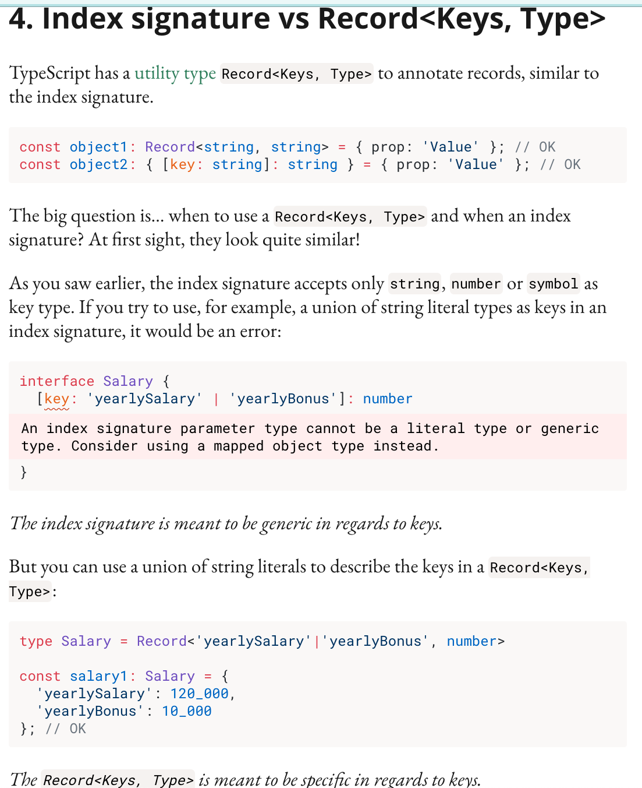

<!--
 * @Author: your name
 * @Date: 2021-09-26 19:00:15
 * @LastEditTime: 2021-10-26 17:55:45
 * @LastEditors: Please set LastEditors
 * @Description: In User Settings Edit
 * @FilePath: \Note\src\4_框架\TypeScript\20210926_朝花夕拾.md
-->

# 朝花夕拾

一些问题

## Record<keys, Type>

  

``` js
interface object1Prop {
  [key: 'a'|'b']: string;
  // 索引签名参数类型不能为文本类型或泛型类型。请考虑改用映射的对象类型。ts(1337)
(parameter) key: "a" | "b"
}

interface object2Prop {
  Record<'a'|'b', string>
  // success
}
```

