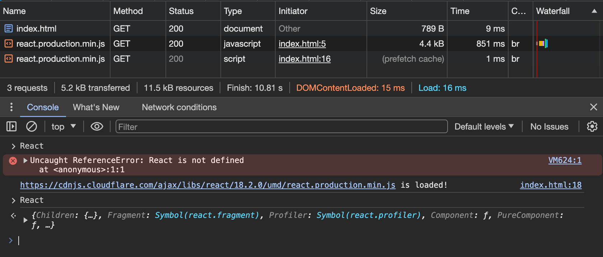

# link 优化

- 预取回 `Prefetch`;
- 预加载 `Preload`;
- 预连接 `Preconnect`;
- DNS 预取回 `DNS-Prefetch`

## 预取回 Prefetch

> 网络资源空闲时，预先下载指定好的资源，在使用的时候进行加载

``` html
<!DOCTYPE html>
<html lang="en">
  <head>
    <meta charset="UTF-8">
    <title>Zhangjicheng's Docs</title>
    <!-- 预取回，此时并不会加载，需要手动触发 -->
    <link rel="prefetch" href="https://cdnjs.cloudflare.com/ajax/libs/react/18.2.0/umd/react.production.min.js" />
  </head>
  <body>
    <button>load react</button>
    <script>
      const btn = document.querySelector('button');

      function loadScript(src) {
        const script = document.createElement('script');
        script.src = src;
        document.body.appendChild(script);
        script.onload = function() {
          console.log(`${src} is loaded!`)
        }
      }

      btn.addEventListener('click', function() {
        // 手动加载资源，此时会直接从预取回好的缓存中获取
        loadScript("https://cdnjs.cloudflare.com/ajax/libs/react/18.2.0/umd/react.production.min.js")
      })
    </script>
  </body>
</html>
```



如上图，页面首次加载，会预取回react资源，但此时访问 `React` 会报错，因为并未加载；
点击按钮，页面还是加载已经预取回的react资源，此时可以正常获取 `React` ;

## 预加载 Prefetch

> 预加载用于提高页面加载的优先级，优先确保资源加载完成

我们经常在一些网站上看到初次加载的时候，字体闪烁，这就是由于字体文件加载的优先级偏低导致的

``` html
<!DOCTYPE html>
<html lang="en">
  <head>
    <meta charset="UTF-8">
    <title>Zhangjicheng's Docs</title>
    <!-- 预加载, 注意此处需要通过as 指定字体文件 -->
    <link as="font" rel="preload" href="*.ttf" />
  </head>
  <body>
    <p>
      hello word!
    </p>
  </body>
</html>
```

## 预连接 Preconnect

> 预连接提示用于提前与目标域名握手，完成DNS寻址，并建立TCP和TLS链接

``` html
<!DOCTYPE html>
<html lang="en">
  <head>
    <meta charset="UTF-8">
    <title>Zhangjicheng's Docs</title>
    <link rel="preconnect" href="*" />
  </head>
  <body>
  </body>
</html>
```

1. DNS 查询
   1. 通过浏览器的DNS对照表去分析域名
   2. 通过电脑的 etc/ 目录下的 dns 文件查找
   3. 通过电脑文件 host 查找
   4. DNS 寻址 OSI 七层参考模型的应用层 -> TCP、UDP、（优先UDP，不可用则使用TCP）
      1. 根域名服务器查找的.
      2. 顶级域名服务器 com
      3. 权威域名服务器
2. TCP 三次握手 seq ack

## DNS 预取回 dns-prefetch

> 这个和 Preconnect 是一样的，只是兼容ie，若要兼容ie则两个都加上

## Ref 属性

| `rel` 值                                                     | 描aaa述                                                         | [\<link>](https://developer.mozilla.org/zh-CN/docs/Web/HTML/Element/link) | [\<a> 和 \<area>](https://developer.mozilla.org/zh-CN/docs/Web/HTML/Element/area) | [\<form>](https://developer.mozilla.org/zh-CN/docs/Web/HTML/Element/form) |
| :----------------------------------------------------------- | :----------------------------------------------------------- | :----------------------------------------------------------- | :----------------------------------------------------------- | :----------------------------------------------------------- |
| [`alternate`](https://developer.mozilla.org/zh-CN/docs/Web/HTML/Attributes/rel#attr-alternate) | 当前文档的替代描述。                                         | 链接                                                         | 链接                                                         | 不允许                                                       |
| [`author`](https://developer.mozilla.org/zh-CN/docs/Web/HTML/Attributes/rel#attr-author) | 当前文档或文章的作者。                                       | 链接                                                         | 链接                                                         | 不允许                                                       |
| [`bookmark`](https://developer.mozilla.org/zh-CN/docs/Web/HTML/Attributes/rel#attr-bookmark) | 到最近祖先章节的永久链接。                                   | 不允许                                                       | 链接                                                         | 不允许                                                       |
| [`canonical`](https://developer.mozilla.org/zh-CN/docs/Web/HTML/Attributes/rel#attr-canonical) | 当前文档的首要 URL。                                         | 链接                                                         | 不允许                                                       | 不允许                                                       |
| [`dns-prefetch` (en-US)](https://developer.mozilla.org/en-US/docs/Web/HTML/Attributes/rel/dns-prefetch) | 告知浏览器为目标资源的来源预先执行 DNS 解析。                | 外部资源                                                     | 不允许                                                       | 不允许                                                       |
| [`external`](https://developer.mozilla.org/zh-CN/docs/Web/HTML/Attributes/rel#attr-external) | 引用的文档与当前的文档不属于同一个站点。                     | 不允许                                                       | 注解                                                         | 注解                                                         |
| [`help`](https://developer.mozilla.org/zh-CN/docs/Web/HTML/Attributes/rel#attr-help) | 链接到上下文相关的帮助。                                     | 链接                                                         | 链接                                                         | 链接                                                         |
| [`icon`](https://developer.mozilla.org/zh-CN/docs/Web/HTML/Attributes/rel#attr-icon) | 代表当前文档的图标。                                         | 外部资源                                                     | 不允许                                                       | 不允许                                                       |
| [`license`](https://developer.mozilla.org/zh-CN/docs/Web/HTML/Attributes/rel#attr-license) | 表示当前文档的主要内容由被引用文件描述的版权许可所涵盖。     | 链接                                                         | 链接                                                         | 链接                                                         |
| [`manifest` (en-US)](https://developer.mozilla.org/en-US/docs/Web/HTML/Attributes/rel/manifest) | Web 应用清单                                                 | 链接                                                         | 不允许                                                       | 不允许                                                       |
| [`me` (en-US)](https://developer.mozilla.org/en-US/docs/Web/HTML/Attributes/rel/me) | 表示当前文档代表拥有链接内容的人。                           | 链接                                                         | 链接                                                         | 不允许                                                       |
| [`modulepreload` (en-US)](https://developer.mozilla.org/en-US/docs/Web/HTML/Attributes/rel/modulepreload) | 告知浏览器预先获取该脚本，并将其存储在文档的模块映射中，以便稍后评估。也可以一同获取该模块的依赖关系。 | 外部资源                                                     | 不允许                                                       | 不允许                                                       |
| [`next`](https://developer.mozilla.org/zh-CN/docs/Web/HTML/Attributes/rel#attr-next) | 表示当前文档是一个系列的一部分，被引用的文档是该系列中的下一个文档。 | 链接                                                         | 链接                                                         | 链接                                                         |
| [`nofollow`](https://developer.mozilla.org/zh-CN/docs/Web/HTML/Attributes/rel#attr-nofollow) | 表示当前文档的原作者或出版商不认可被引用的文件。             | 不允许                                                       | 注解                                                         | 注解                                                         |
| [`noopener` (en-US)](https://developer.mozilla.org/en-US/docs/Web/HTML/Attributes/rel/noopener) | 创建一个顶级浏览上下文。如果该超链接一开始就会创建其中之一，则该浏览上下文不是一个辅助浏览上下文（即有一个适当的 `target` 属性值）。 | 不允许                                                       | 不允许                                                       | 注解                                                         |
| [`noreferrer`](https://developer.mozilla.org/zh-CN/docs/Web/HTML/Attributes/rel#attr-noreferrer) | 不会包含 `Referer` 标头。和 `noopener` 效果类似。            | 不允许                                                       | 注解                                                         | 注解                                                         |
| [`opener`](https://developer.mozilla.org/zh-CN/docs/Web/HTML/Attributes/rel#attr-opener) | 如果超链接会创建一个非辅助浏览上下文的顶级浏览上下文（即以“`_blank`”作为 `target` 属性值），则创建一个辅助浏览上下文。 | 不允许                                                       | 注解                                                         | 注解                                                         |
| [`pingback`](https://developer.mozilla.org/zh-CN/docs/Web/HTML/Attributes/rel#attr-pingback) | 给出处理当前文档 pingback 的 pingback 服务器的地址。         | 外部资源                                                     | 不允许                                                       | 不允许                                                       |
| [`preconnect`](https://developer.mozilla.org/zh-CN/docs/Web/HTML/Attributes/rel/preconnect) | 指定用户代理应预先连接到目标资源的来源。                     | 外部资源                                                     | 不允许                                                       | 不允许                                                       |
| [`prefetch`](https://developer.mozilla.org/zh-CN/docs/Web/HTML/Attributes/rel/prefetch) | 指定用户代理应预先获取并缓存目标资源，因为后续的导航可能需要它。 | 外部资源                                                     | 不允许                                                       | 不允许                                                       |
| [`preload`](https://developer.mozilla.org/zh-CN/docs/Web/HTML/Attributes/rel/preload) | 指定用户代理必须根据 [`as`](https://developer.mozilla.org/zh-CN/docs/Web/HTML/Element/link#attr-as) 属性给出的潜在目的地（以及与相应目的地相关的优先级），为当前导航预先获取和缓存目标资源。 | 外部资源                                                     | 不允许                                                       | 不允许                                                       |
| [`prerender` (en-US)](https://developer.mozilla.org/en-US/docs/Web/HTML/Attributes/rel/prerender) | 指定用户代理应预先获取目标资源，并以有助于在未来提供更快的响应的方式处理它。 | 外部资源                                                     | 不允许                                                       | 不允许                                                       |
| [`prev`](https://developer.mozilla.org/zh-CN/docs/Web/HTML/Attributes/rel#attr-prev) | 表示当前文档是系列的一部分，被引用的文档是该系列中的上一个文档。 | 链接                                                         | 链接                                                         | 链接                                                         |
| [`search`](https://developer.mozilla.org/zh-CN/docs/Web/HTML/Attributes/rel#attr-search) | 给出一个资源的链接，可以用来搜索当前文件及其相关页面。       | 链接                                                         | 链接                                                         | 链接                                                         |
| [`stylesheet`](https://developer.mozilla.org/zh-CN/docs/Web/HTML/Attributes/rel#attr-stylesheet) | 导入样式表。                                                 | 外部资源                                                     | 不允许                                                       | 不允许                                                       |
| [`tag`](https://developer.mozilla.org/zh-CN/docs/Web/HTML/Attributes/rel#attr-tag) | 给出一个适用于当前文档的标签（由给定地址识别）。             | 不允许                                                       | 链接                                                         | 链接                                                         |

## link vs @import

#### 1.加载时机不同

link 是 html 标签加载 dom 时会同步加载 link 标签的内容，@import引入的资源需要等 dom 加载完成之后加载

#### 2.js的可操作性不同

link 标签可以通过 js 动态插入到文档中，@import不可以

#### 3.link方式引入的样式的权重高于@import

## 参考文献

[HTML 属性：rel](https://developer.mozilla.org/zh-CN/docs/Web/HTML/Attributes/rel)
