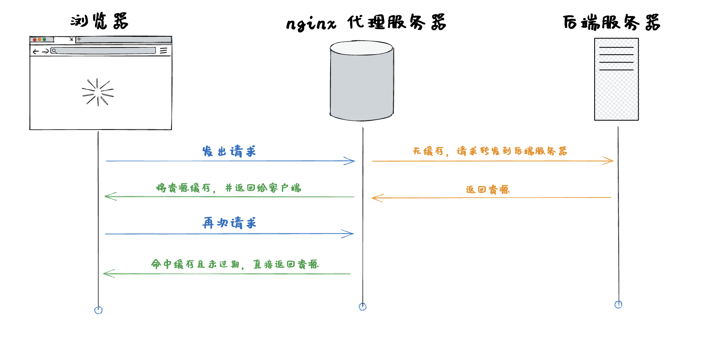

# 缓存优化

## 浏览器缓存

> 浏览器缓存 是浏览器将用户请求过的静态资源（html、css、js），存储到电脑本地磁盘中，当浏览器再次访问时，就可以直接从本地加载了，不需要再去服务端请求了。

缓存流程


缓存规则

缓存规则，就是声明所请求的这个资源，要采取哪种缓存策略？缓存多长时间？等等。。。而这个规则，是在http的header中的返回来的。

缓存类型：

- 强缓存：浏览器不与服务端协商直接取浏览器缓存
- 协商缓存：浏览器会先向服务器确认资源的有效性后才决定是从缓存中取资源还是重新获取资源
- 无缓存：浏览器直接向服务器重新获取资源

三种缓存机制皆通过配置http头`（add_header）`的 `Cache-Control` 来实现。强缓存还可以使用 `Expires`(http1.0的产物，基本淘汰，用于兼用低版本http) 字段实现, `Cache-Control`(http1.1) 优先级大于 `Expires`。
`Cache-Control` 字段枚举值：

- private：私有缓存，禁止中间人(比如CDN等代理缓存)
- public：共享缓存，允许中间人缓存, 即浏览器和代理服务器都可以缓存
- max-age=xxx： 过期时间 秒（重要）
- s-maxage：用于共享缓存，单位：秒，如果在其有效期内，不去访问CDN等。s-maxage会覆盖 max-age 和 Expires
- no-cache： 不进行强缓存，需要重写验证(可以理解为 禁止强缓存，启用协商缓存)
- no-store： 禁止缓存(强缓存和协商缓存),客户端不存储任何值
- immutable： 资源永远不变（防止用户点击刷新按钮去刷新页面）
- must-revalidate： 缓存使用陈旧资源时，必需先验证状态
- stale-while-revalidate=xxx： 指定在缓存内容过期时，允许客户端在获取新内容的同时继续使用旧内容的时间

### 强缓存

> 简单粗暴，如果资源没过期，就取缓存，如果过期了，则请求服务器, **强缓存命中缓存的情况下，请求不会到达后端**


控制强缓存的字段为 `Cache-Control` 和 `Expires`(基本淘汰)，`Cache-Control` 优先级大于 `Expires`

`Cache-Control、Expires` 都是缓存到期时间，`Cache-Control` 是相对值，`Expires` 是绝对值，即再次发送请求时，如果时间没到期，强制缓存生效。

触发条件：

`Cache-Control` 的值为 `max-age=xxx` （强缓存时间 相对时间）
或者 `Cache-Control` 的值为 `Expires=xxx`（强缓存时间 绝对时间）

请求头：


配置：

nginx

``` nginx
server {
  listen       80;
  server_name  xxx;
  index        index.html;
  root         /opt/html;

  # 设置浏览器缓存
  location ~* \.(js|css)$ {
    expires 86400; # 1d
    add_header Cache-Control "max-age=1d, stale-while-revalidate=30";
  }

  # 静态资源缓存 7 天, 资源失效后，可继续使用30s
  location ~* \.(jpg|jpeg|png|gif|ico|svg|ttf|otf|eot|woff|woff2)$ {
    #expires 604800; # 7d
    add_header Cache-Control "max-age=7d, stale-while-revalidate=30";
  }
}
```

node

``` js
// 中间件来设置缓存控制
app.use((req, res, next) => {
  // 设置 Cache-Control 头来控制缓存
  res.setHeader('Cache-Control', 'public, max-age=3600'); // 这里设置缓存 1 小时

  // 设置 Expires 头 (如果需要)
  const expiresDate = new Date(Date.now() + 3600000); // 当前时间 + 1 小时
  res.setHeader('Expires', expiresDate.toUTCString());

  next();
});

```

注意：在HTTP强缓存生效的情况下（即缓存的资源仍在`max-age`规定的有效期内），浏览器会直接使用本地缓存的资源，也就不会对Etag和Last-Modified进行对比验证。

### 协商缓存

> 浏览器在请求资源时会与服务器进行协商，确定是否需要重新获取资源或者直接使用本地缓存的资源。


触发条件：

- `Cache-Control` 的值为 `no-cache` （不强缓存）
- 或者 `max-age` 过期了 （强缓存，但总有过期的时候）

命中情况返回 `304（Not Modified）`

请求头：


协商缓存字段：

- Etag：每个文件有一个，改动文件了就变了，就是个文件 `hash`，每个文件唯一，就像用 webpack 打包的时候，每个资源都会有这个东西，如： `app.js`打包后变为 `app.c20abbde.js`，加个唯一hash，也是为了解决缓存问题。
- Last-Modified：文件的修改时间，精确到秒

每次 http 返回来 `response header` 中的 `ETag` 和 `Last-Modified`，在下次请求时在 `request header` 就把这两个带上（但是名字变了`ETag` --> `If-None-Match`，`Last-Modified` --> `If-Modified-Since`），服务端把你带过来的标识，资源目前的标识，进行对比，然后判断资源是否更改了。 这个过程是循环往复的，即缓存表在每次请求成功后都会更新规则。

配置：

- nginx

  ``` nginx
  server {
    listen       80;
    server_name  xxx;
    index        index.html;
    root         /opt/html;

    # 设置浏览器缓存
    location ~* \.(js|css)$ {
      add_header Cache-Control "max-age=60"; # 当强缓存过期，会自动进行协商缓存
      add_header Cache-Control "max-age=0";  # 强缓存立刻过期，走协商缓存
      add_header Cache-Control "no-cache";   # 不使用强缓存，直接进行协商缓存
    }
  }
  ```

- node

  ``` js
  const http = require('http');
  const fs = require('fs');
  const url = require('url');
  const path = require('path');
  
  const server = http.createServer((req, res) => {
    const filePath = 'path_to_your_file'; // 例如：'public/image.jpg'
    const fileStat = fs.statSync(filePath);
  
    // 设置响应头
    res.setHeader('Content-Type', 'image/jpeg');
    res.setHeader('Last-Modified', fileStat.mtime.toUTCString());
    res.setHeader('Cache-Control', 'public, max-age=3600'); // 设置缓存有效期为1小时
  
    // 协商缓存比较
    const ifModifiedSince = req.headers['if-modified-since'];
    if (ifModifiedSince && new Date(ifModifiedSince) >= fileStat.mtime) {
      res.statusCode = 304; // 文件未修改，返回Not Modified
      res.end();
      return;
    }
  
    // 读取并发送文件
    const fileStream = fs.createReadStream(filePath);
    fileStream.pipe(res);
  });
  ```

注意：在协商缓存的情况下，浏览器会先比较`ETag`和`Last-Modified`这两个字段，通常情况下以`ETag`的值为准。如果`ETag`相同但`Last-Modified`不同，浏览器会认为资源未发生变化，仍然可以使用本地缓存的资源，因为`ETag`被认为比`Last-Modified`更准确和可靠。

### 不缓存

> 即客户端不缓存资源，每次请求都需要到服务器获取最新资源，谨慎使用

触发条件：

`Cache-Control` 的值为 `no-store` （不缓存）

请求头：


配置：

- nginx

  ``` nginx
  server {
    listen       80;
    server_name  xxx;
    index        index.html;
    root         /opt/html;

    # 设置浏览器缓存
    location ~* \.(js|css)$ {
      add_header Cache-Control "no-store"; # 不缓存
    }
  }
  ```

- node

  ``` js
  // 设置响应头
  res.setHeader('Cache-Control', 'no-store'); // 不缓存
  ```

## nginx代理服务器缓存

> Nginx作为反向代理服务器，在接收到客户端请求并向后端服务器转发请求时，将后端服务器返回的响应进行缓存存储，以便在后续相同请求到达时直接返回缓存的响应，而无需再向后端服务器请求数据。



我们可以通过添加请求头来验证缓存是否命中 `add_header X-Cache-Status $upstream_cache_status;  # 添加自定义头字段，显示缓存命中状态`


其中，`X-Cache-Status` 为我们配置的自定义请求头，它有三种值

- HIT 命中缓存
- MISS 未命中缓存
- EXPIRED 缓存过期

通常我们可以同时配置服务器缓存和nginx代理缓存，具体策略根据实际情况而定，当请求命中服务器缓存的时候，不会再处理代理缓存。

配置

``` nginx
http {
  # 指定了缓存路径、缓存区域名称（`my_cache`）、最大缓存容量（10GB）、缓存路径结构
  proxy_cache_path /path/to/cache levels=1:2 keys_zone=my_cache:10m max_size=10g inactive=60m;

  server {
    listen 80;
    server_name example.com;

    location / {
      # 指定使用名为 `my_cache` 的缓存区域来存储响应内容。
      proxy_cache my_cache;
      # 设置缓存的有效时间为 10 分钟，仅对状态码为 200 和 302 的响应进行缓存。
      proxy_cache_valid 200 302 10m;
      # 定义了用于生成缓存键的规则，这里是根据请求的 scheme、host、URI 和参数生成唯一的缓存键。
      proxy_cache_key $scheme$host$request_uri$is_args$args;
      # 将请求代理转发至名为 `backend_server` 的后端服务器。
      proxy_pass http://backend_server;
      add_header X-Cache-Status $upstream_cache_status;  # 添加自定义头字段，显示缓存命中状态
    }
  }
}
```

参数说明：

- `proxy_cache_path` 指令用于配置代理缓存的存储路径和相关参数。它的语法如下：

  ```nginx
  proxy_cache_path /path/to/cache levels=levels keys_zone=cache_name:zone_size [inactive=time] [max_size=size] [use_temp_path=on|off] [loader_files=number] [loader_sleep=time];
  ```

  下面是各个参数的说明：

  - `/path/to/cache`：指定代理缓存的存储路径。
  - `levels=levels`：定义缓存存储的层级结构。
  - `keys_zone=cache_name:zone_size`：定义用于存储缓存键值对的共享内存区域。
  - `inactive=time`（可选）：定义缓存条目在指定时间内未被访问后被认为是不活跃的，默认情况下为10分钟。
  - `max_size=size`（可选）：定义缓存存储路径的最大大小。
  - `use_temp_path=on|off`（可选）：指定是否在磁盘上使用临时文件夹存储缓存数据。
  - `loader_files=number`（可选）：指定在启动时一次性加载到内存中的缓存文件数量。
  - `loader_sleep=time`（可选）：指定加载缓存文件到内存的间隔时间。

- `proxy_cache`：启用或禁用代理缓存。

  - 语法：`proxy_cache cache_name;`
  - 说明：指定要使用的代理缓存的名称。

- `proxy_cache_key`：定义代理缓存的键。

  - 语法：`proxy_cache_key $scheme$proxy_host$request_uri;`
  - 说明：指定了用于生成代理缓存键的变量。通常使用的是请求的URI。

- `proxy_cache_valid`：设置代理缓存的有效期。

  - 语法：`proxy_cache_valid 200 302 10m;`
  - 说明：为指定的HTTP状态码设置缓存的有效期。在示例中，状态码为200和302的响应被缓存10分钟。

- `proxy_cache_use_stale`：设置在后端服务器不可用时是否允许使用过期的缓存。

  - 语法：`proxy_cache_use_stale error timeout updating http_500 http_502 http_503 http_504;`
  - 说明：定义了当后端服务器出现错误或不可用时，是否允许使用过期的缓存来响应请求。

- `proxy_cache_bypass`：设置是否绕过代理缓存。

  - 语法：`proxy_cache_bypass $cookie_nocache $arg_nocache$arg_comment;`
  - 说明：根据条件绕过代理缓存，例如根据请求中的特定参数或Cookie。

- `proxy_cache_methods`：指定哪些HTTP方法可以被缓存。

  - 语法：`proxy_cache_methods GET HEAD;`
  - 说明：指定允许被缓存的HTTP请求方法。

- `proxy_cache_lock`：设置是否启用代理缓存锁。

  - 语法：`proxy_cache_lock on;`
  - 说明：在高并发场景下，启用缓存锁可以防止多个客户端同时请求一个未缓存的资源。

注意：`proxy_cache` 指令用于启用缓存功能并指定缓存的名称，但它需要与 `proxy_pass` 指令一起使用才能实现代理缓存功能。如果没有代理转发到后端服务器，Nginx将无法获取响应内容来进行缓存，因此单独设置 `proxy_cache` 是没有意义的。
