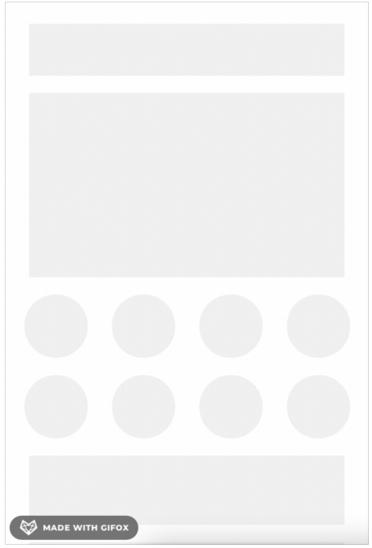

# 骨架屏方案

<!-- <tag>优化</tag> -->

## 一、前言

现在的前端开发领域，都是前后端分离，前端框架主流的都是SPA、MPA；这就意味着，⻚面
渲染以及等待的白屏时间，成为我们需要解决的问题点；而且大项目, 这个问题尤为突出。
webpack 可以实现按需加载，减小我们首屏需要加载的代码体积；再配合上 CDN 以及一些静态代码（框架，组件库等等）缓存技术，可以很好的缓解这个加载渲染的时间过⻓的问题。

但即便如此，首屏的加载依然还是存在这个加载以及渲染的等待时间问题；
目前主流，常⻅的解决方案是使用骨架屏技术，包括很多原生的 APP，在⻚面渲染时，也会使用骨架屏。

---

## 二、什么是骨架屏？

看下边这个图示：



骨架屏就是在⻚面数据尚未加载前先给用户展示出⻚面 的大致结构，直到请求数据返回后再
渲染⻚面，补充进需要显示的数据内容。常用于文章列表、动态列表⻚等相对比较规则的列表
⻚面。 很多项目中都有应用：饿了么 h5 版本，知乎，facebook 等网站中都有应用。

---

## 三、骨架屏实现方案

1. 如果是首屏可以在 `index.html` 模板中手写骨架屏样式；
2. 如果是其他⻚面，可以让 UI 做一个小的 SVG 图；
3. 可以使用组件库中的骨架屏组件；
4. 可以使用饿了么团队开源的根据⻚面样式生成骨架屏的工具。

如果按用途细分可以分为这两类

### 3.1 作为 SPA 中路由切换的 loading

第一类用途需要自己编写骨架屏，推荐两个成熟方便定制的 svg 组件定制为骨架屏的方案

- react-content-loader
- vue-content-loader

### 3.2 作为首屏渲染的优化（自动化方案）

该方案是饿了么在骨架屏的实践中总结出的一套方案：

骨架屏的 `dom` 结构和 `css` 通过离线生成后构建的时候注入模板中的节点下面
如果你的项目是基于 `vue-cli` 脚手架的，那么饿了么团队的 `page-skeleton-webpack-plugin`是你的最佳选择，如果不是，那么你可以选择 `vue- router` 开源的 `vue-server-renderer` 。

`page-skeleton-webpack-plugin` 原理，摘自原文

> 通过 `puppeteer` 在服务端操控 `headless Chrome` 打开开发中的需要生成骨架屏的⻚面，在等待⻚面加载渲染完成之后，在保留⻚面布局样式的前提下，通过对⻚面中元素进行删减或增添，对已有元素通过层叠样式进行覆盖，这样达到在不改变⻚面布局下，隐藏图片和文字，通过样式覆盖，使得其展示为灰色块。然后将修改后的 HTML 和 CSS 样式提取出来，这样就是骨架屏了。

优势

1. 支持多种加载动画
2. 针对移动端 web ⻚面
3. 支持多路由
4. 可定制化，可以通过配置项对骨架块形状颜色进行配置，同事也可以在预览⻚面直接修改骨架
⻚面源码
5. 几乎可以零配置使用

---

## 四、一些具体的实现

### 4.1 在模板中来实现骨架屏

以 `vue` 为例，默认情况下我们的模版 `index.html` 里面有一个 `id` 为 `app` 的 `div` 元素。我们最终的应用程序代码会替换掉这个元素，也就是 `<div id="app"> </div>` 。

利用这个特性，在 `index.html` 中的 `div#app` 中来实现骨架屏，程序渲染后就会替换掉 `index.html` 里面的 `div#app` 骨架屏内容。

如果不手写样式，也可以直接使用 `Base64` 图片来作为骨架屏。

使用图片作为骨架屏；简单暴力，让 UI 同学花点功夫吧；小米商城的移动端⻚面采用的就是这个方法，它是使用了一个 Base64 的图片来作为骨架屏。

直接将这个 `Base64` 的图片写在我们的 `index.html` 模块中的 `div#app` 里面。

### 4.2 使用 .vue 文件来完成骨架屏

> 我们可能不希望在默认的模版（`index.html`）上来进行代码的 coding；想在方案一的基础上，将骨架屏的代码抽离出来，使用一个 .vue 文件来 coding，易于维护。

1）我们在 src 下建一个 skeleton 目录，在里面创建两个文件 （skeleton.vue、
skeleton.entry.js）

skeleton.vue 就是我们的骨架屏⻚面的代码

``` vue
<!-- skeleton.vue -->
<template>
<div class="skeleton page">
<span>骨架屏</span>
</div>
</template>
<style scoped></style>
```

`skeleton.entry.js` 是编译 `skeleton.vue` 的入口文件

``` js
// skeleton.entry.js
import Vue from "vue";
import Skeleton from "./skeleton.vue";
export default new Vue({
  // 根实例简单的渲染应用程序组件
  render: (h) => h(Skeleton),
});
```

2）配置 webpack 打包

专⻔用来进行骨架屏的构建，配合使用 `vue-server-renderer` 将我们的 `skeleton.vue` 文件内容构建为单个的 `json` 格式的文件（这是Vue SSR渲染的策略）

``` js
// webpack.skeleton.conf.js
"use strict";
const path = require("path");
const nodeExternals = require("webpack-node-externals");
const VueSSRServerPlugin = require("vue-server-renderer/server-plugin");
module.exports = {
  target: "node",
  devtool: "#source-map",
  entry: "./src/skeleton/skeleton.entry.js",
  output: {
    path: path.resolve(__dirname, "../dist"),
    publicPath: "/dist/",
    filename: "[name].js",
    libraryTarget: "commonjs2",
  },
  module: {
    noParse: /es6-promise\.js$/, // avoid webpack shimming process
    rules: [
      {
        test: /\.vue$/,
        loader: "vue-loader",
        options: {
          compilerOptions: {
            preserveWhitespace: false,
          },
        },
      },
      {
        test: /\.css$/,
        use: ["vue-style-loader", "css-loader"],
      },
    ],
  },
  performance: {
    hints: false,
  },
  externals: nodeExternals({
    // do not externalize CSS files in case we need to import it from a dep
    whitelist: /\.css$/,
  }),
  plugins: [
    // 这是将服务器的整个输出构建为单个 JSON 文件的插件。
    // 默认文件名为 `vue-ssr-server-bundle.json`
    new VueSSRServerPlugin({
      filename: "skeleton.json",
    }),
  ],
};
```

构建打包后会得到一个 `skeleton.json` 文件。

3）将 `skeleton.json` 内容插入到模板文件 `index.html` 中
在根目录下创建一个 `skeleton.js` 文件

``` js
// skeleton.js
const fs = require("fs");
const { resolve } = require("path");
const { createBundleRenderer } = require("vue-server-renderer");

function createRenderer(bundle, options) {
  return createBundleRenderer(
    bundle,
    Object.assign(options, {
    // recommended for performance
    // runInNewContext: false
    })
  );
}

const handleError = (err) => {
  console.error(`error during render : ${req.url}`);
  console.error(err.stack);
};

const bundle = require("./dist/skeleton.json");
const templatePath = resolve("./index.html");
const template = fs.readFileSync(templatePath, "utf-8");
const renderer = createRenderer(bundle, {
  template,
});

// console.log(renderer)
/**
* 说明：
* 默认的index.html中包含<%= BASE_URL %>的插值语法
* 我们不在生成骨架屏这一步改变模板中的这个插值
* 因为这个插值会在项目构建时完成
* 但是如果模板中有这个插值语法，而我们在vue-server-renderder中使用这个模板，而不传值的
话，是会报错的
* 所以，我们去掉模板中的插值，而使用这个传参的方式，再将这两个插值原模原样返回到模板中
*
*/
const context = {
  title: "", // default title
  meta: `<meta name="theme-color" content="#4285f4">
  <link rel="icon" href="<%= BASE_URL %>favicon.ico">
  <link rel="stylesheet" href="<%= BASE_URL %>css/reset.css">`,
};

renderer.renderToString(context, (err, html) => {
  if (err) {
    return handleError(err);
  }
  fs.writeFileSync(resolve(__dirname, "./index.html"), html, "utf-8");
});
```

4）模板 `index.html` 加上插槽注释 <!--vue-ssr-outlet-->

``` html
<!DOCTYPE html>
<html>
  <head>
    <meta charset="utf-8" />
    <meta name="viewport" content="width=device-width,initial-scale=1.0" />
  <title>vue-for-test</title>
  </head>
  <body>
    <div id="app">
    <!--vue-ssr-outlet-->
    </div>
    <!-- built files will be auto injected -->
  </body>
</html>
```

执行 `node skeleton.js` ，模板 `index.html` 中的内容就会变成我们的骨架屏代码了。

### 4.3 自动生成并自动插入静态骨架屏

这个就是利用饿了么开源的插件或者 `vue-skeleton-webpack-plugin` 这样的插件都可以。

饿了么开源的插件 `page-skeleton-webpack-plugin`，它根据项目中不同的路由⻚面生成相应的骨架屏⻚面，并将骨架屏⻚面通过 `webpack` 打包到对应的静态路由⻚面中。
另外还有个插件 `vue-skeleton-webpack-plugin`，它将插入骨架屏的方式由手动改为自动，原理在构建时使用 Vue 预渲染功能，将骨架屏组件的渲染结果 HTML 片段插入 HTML ⻚面模版的挂载点中，将样式内联到 `head` 标签中。这个插件可以给单⻚面的不同路由设置不同的骨架屏，也可以给多⻚面设置，同时为了开发时调试方便，会将骨架屏作为路由写入 `router` 中，可谓是相当体贴.
